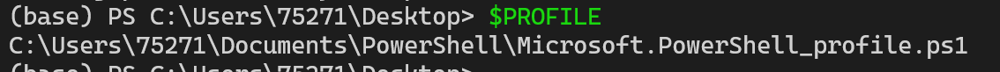
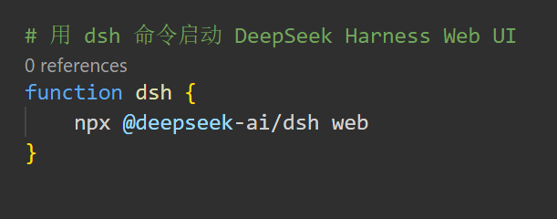
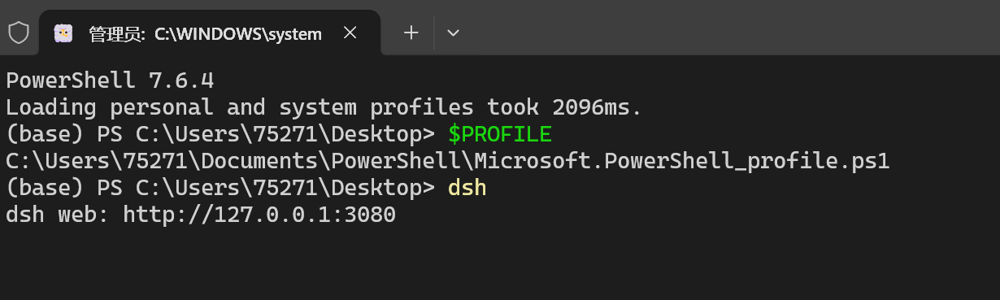

# 工具启动

## DeepSeekHarness

### 通过 npm 运行
```bash
安装 Node.js，然后运行：

npx @deepseek-ai/dsh web
该命令会启动 Web UI，默认地址为 http://127.0.0.1:3080。详见 Web UI 指南。
```

### 从源码运行
如需从仓库源码运行：
```bash
git clone https://github.com/deepseek-ai/deepseek-harness.git
cd deepseek-harness
pnpm install
pnpm run build
pnpm dsh web
```

### 配置终端便捷命令 
在powershell 7 实现 dsh -> npx @deepseek-ai/dsh web



获取终端配置文件，修改添加内容如下：



最终效果：



## CodeX

### 配置deepseek模型

来源： [DeepSeek官网指南](https://api-docs.deepseek.com/quick_start/agent_integrations/codex/)

PowerShell中运行：
```bash
irm https://cdn.deepseek.com/api-docs/codex-deepseek-setup-en.ps1 | iex
```