# 基础课

## 材质
1. 后缀(A)ORM，利用RGB通道来存储相关数据,下面是常规对应关系
    - R: AO-环境光遮蔽
    - G: Roughness-粗糙度
    - B: Metallic-金属度
    
2. UE中使用的材质节点界面
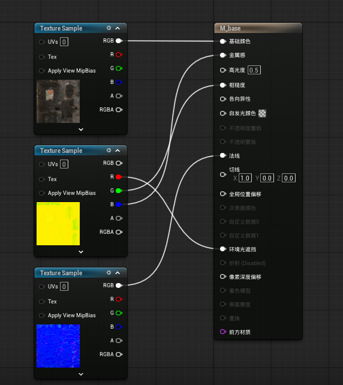

3. 材质实例  
对于材质，可以将某些节点参数化，该参数可能是会改变的值。但材质的参数更改会导致重新编译。而材质实例则是对材质的一种引用，不会重新编译。下图为材质实例，材质中的高光度被参数化
  
下图为材质的参数分组，排序优先级，越小越靠前
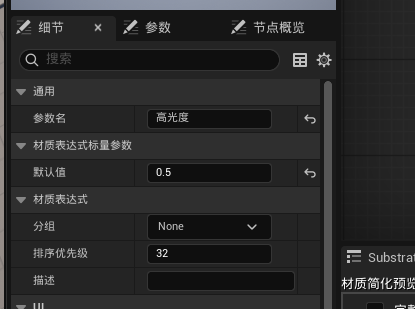

4. 美术资产
在移动时，会在源目录下创建一个重定向器，在过滤器选择重定向器可以查看，右键源资产目录，选择更新重定向器，此时正在移动资产了。

5. 地形材质混合  
    - 创建一个材质，最终实现如下  
    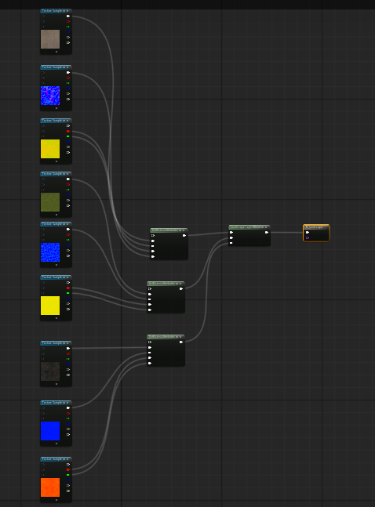  
      
    - 先分别将不同的材质的纹理、法线、高度图导入，通过setMaterialAttribute来设置相关参数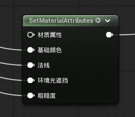
    - 再新建一个Landscape Layer Blender节点,  
      
    在该节点新建图层,索引越小,优先级越高  
    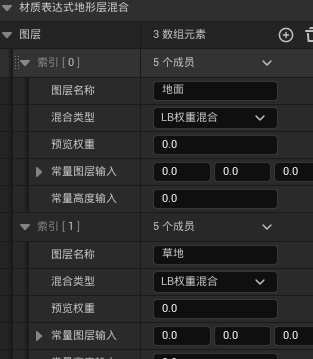
    - 新建材质实例，将材质实例设置为地形的地形材质  
    
    - 左上角选择地形模式，并点击绘制，点击从指定材质创建层  
    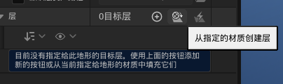
    
    - 右键材质，可选择一个作为最底层的材质，由于优先级，所以一般最大索引作为最底层
    - shift+左键为擦除
    - 权值混合和透明混合的区别，后者将图层分为三层（当前示例）来绘制，并根据优先级显示。前者则是一层，根据绘制顺序来显示。

## 光照
1. 快速添加*定向光源*、*天空*和*体积云*：左上角的快速添加
1. *后期处理体积*中设置曝光，在Exposure中设置，开启*计量模式*(设置为手动)、和*曝光补偿*,可开启*无限范围*
1. 只定向光源下（无lumen即全局光照即间接光照），物体的背光面和影子是纯黑色,地面也是纯黑色  
    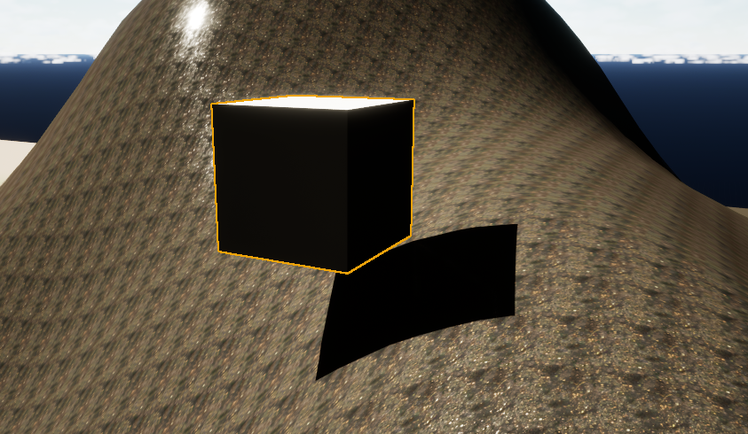
1. 添加天空光照，此时物体被光面的颜色是天空给予的  
    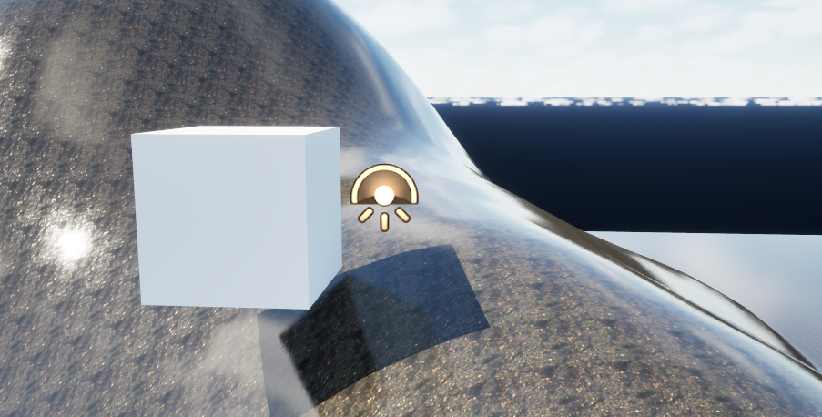  
    修改天空颜色的效果  
    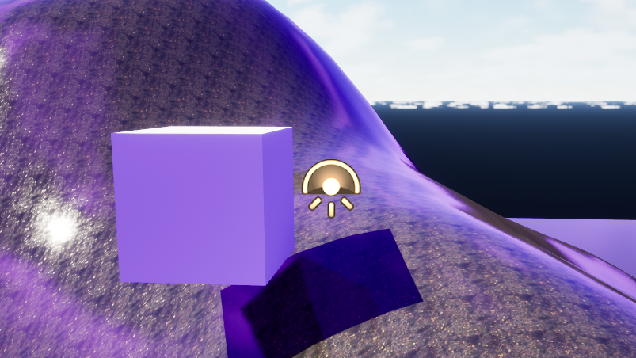
    开启lumen的效果，背面含有地面的颜色
    
    没有lumen实现lumen的方法：将天空光照的较低半球的颜色设置为大地颜色 
    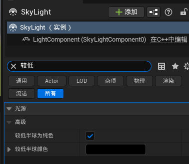
    
    lumen的好处，可以实时捕获场景中的镜像，不用手动设置
    
1. 调整太阳光：关注一下属性  
    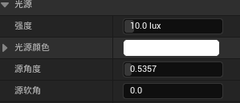
1. 体积云（打开材质实例）  
      
    调整云的大小：
    
    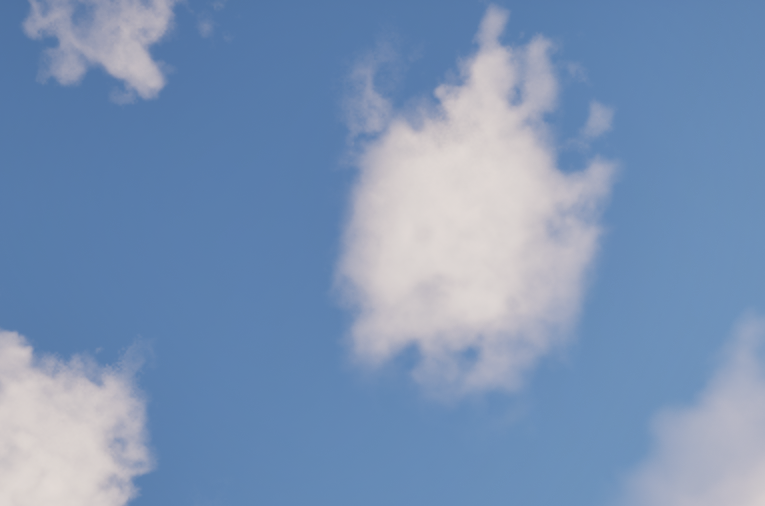
    调整云的数量：  
      
      
    调整云的速度：    
    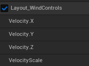  
    调整云的密度：    
    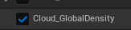

## 植被系统
1. 创建静态网格体植物
    - 右键植被=>创建静态网格体植物
    - 选择一个静态网格体
    - 左上角进入植被模式后，可将刚才的静态网格体添加到植被中  
      
    或者将静态网格体直接拖入上面的地方，会自动创建静态网格体植物
2. 绘制静态网格体植物时的常见参数  
    - 勾选左上角为选中  
    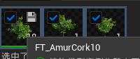  
    - 高级中的计算世界位置偏移：树叶不会随风移动，减少性能开支  
    - 绘制时参数     
    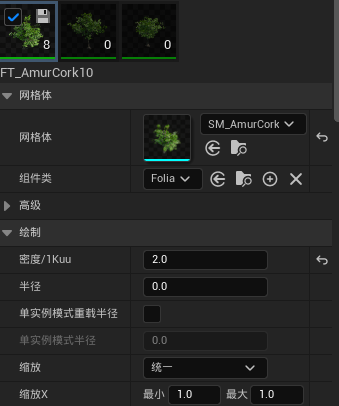  
    密度、半径、缩放X、Z偏移、对齐到法线、对齐到最大角度、随机Yaw
    - 单个时参数  
    单实例重载半径：选择的范围内只创建一个实例，已有则不会绘制  
    地面斜面角度：斜坡角度过大则不会生成
    - 调整单个静态网格体植物的参数只对自己起作用，可以右键拷贝部分属性，用于快捷拷贝到其他植物
    - 单个模式：不要勾选多个静态网格体植物，否则会将多个植物重叠生成在一起   
    循环选中项：循环添加单个植物
    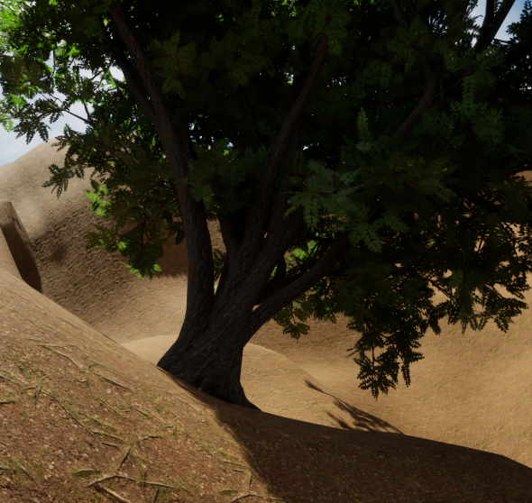  
3. 抹除
    - 只抹除勾选的植物
    - shift+左键为擦除
4. 植物剔除
    - 选中植物（shift+左键连选 ）   
    
    - 找到剔除距离  
    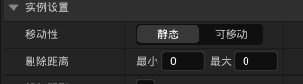  
    - 最大距离设置为1500，虚幻100单位是1米。此效果比较突兀  
    
    - 实现淡出的效果  
    找到植物的静态网格体，进入界面快速定位树叶和树枝的材质  
    
    在各自的材质实例中，勾选 UseSolftCulling使用软剔除    
    
    结合最小剔除距离的设置，实现淡入淡出的效果  
    
    上述是在材质实例节点初实现了相关功能的结果  

    - 在材质实例节点中实现    
    最终实现的逻辑如下：  
    在材质节点的层级处  
    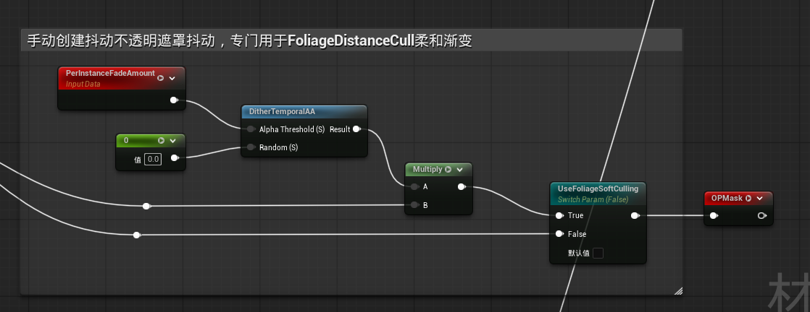  
    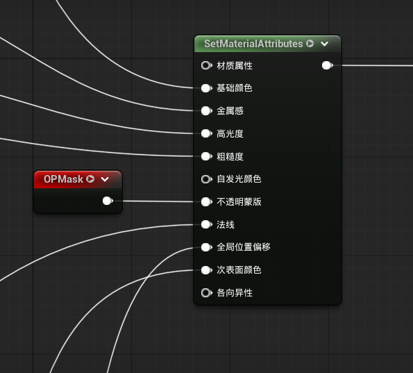  
    - 函数相关的介绍  
        - `PerInstanceFadeAmount` 
        表达式根据应用于实例化静态网格体（例如树叶）的剔除距离，输出一个介于 0 到 1 之间的浮点值。该值是常量，但对于网格体的每个实例，其数值可以不同。该节点通常用于使树叶逐渐淡入淡出，而不是在达到 ` InstancedFoliageActor` 的剔除距离时，树叶突然出现在场景中或消失。  
        将`PerInstanceFadeAmount`的输出取反，输出到材质的基础颜色。颜色越白说明PIFA函数越接近1，距离越远。颜色为1是指三原色的和，所以为白光。
        - 裁剪展示
        这里使用1-x的原因是，当前只改变叶子的颜色，不使用时叶子为白色，但树枝是黑色，会影响展示。
        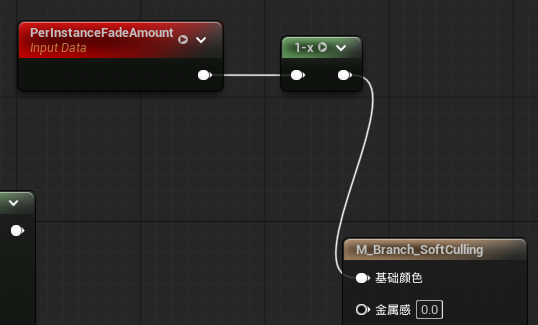
        下面图片可以看出，超过最大剔除距离的为白色，剔除距离之间的为灰色，剔除距离以下的为黑色。因此可以考虑将灰色部分进行透明度调整，而不是直接将灰色部分设为透明。
         
        - 材质结果节点的输入参数显示
        
        取消勾选显示材质属性
        
        结果
        
        - 材质结果节点的不透明蒙版
        不透明蒙版只有两种值：透明和不透明，当给的值超过剪切值时视为1，否则视为0。对于某一个像素，不透明蒙版值>=剪切值，保留像素。勾选颤动不透明蒙版效果更好。
        
        - 材质的不透明遮罩
        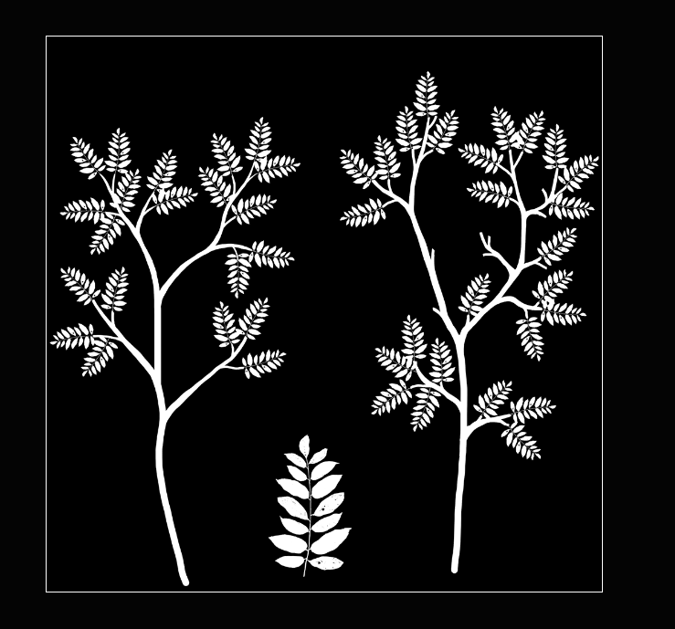
        应该将具体的叶子部分（即白色部分）与PIFA函数进行透明度调整，直接将整个矩形会造成如下结果：叶子旁边本应该是透明的被设置成为了不透明的颜色。
        
        - `StaticSwitchParameter   静态开关参数`函数
        将该值设置为参数，实例化后的材质实例可以选择是否开启软剔除。
        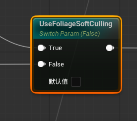
        接受两个输入，参数为True时输出连接True的输入，否则输出连接False的输入。
        这是一个静态方法，在运行时无法改变。将材质实例化为材质实例后，只能在材质实例处修改，以此来开启和关闭使用使用FoliageSoftCulling植被软剔除。
        - `DitherTemporalAA` 
        抖动函数，让值变化。
    - 不剔除 `->` 硬剔除 `->` 软剔除
        1. 不使用软剔除时，是直接将下面的值(A通道)传给不透明蒙版。白色(叶子)部位像素的不透明蒙版值为1，大于不透明蒙版剪切值(0.3333默认),所以叶子保留像素；而黑色部位不透明蒙版值为0，小于剪切值，此部分为透明。
        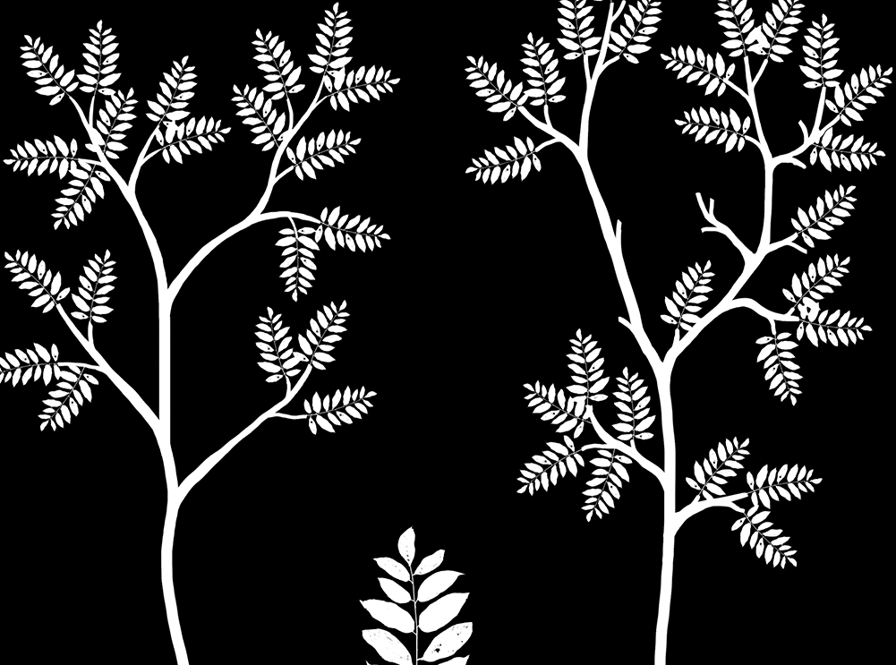
        1. 不设置剔除距离时效果，任何距离植被不会被剔除。
        <video controls src="assets/video_2026-03-31_04-01-17-1.webm" title="Title"></video>
        1. 设置剔除距离，当植被超出剔除距离时，直接剔除，比较突兀。
        
        <video controls src="assets/video_2026-03-31_04-05-44.webm" title="Title"></video>
        1. 使用软剔除：在设置不透明蒙版时，将最小和最大剔除距离之间的像素进行值的抖动，实现淡入淡出的效果。注意的是通过 `PerInstanceFadeAmount`函数获取的值需要与A通道进行乘法运算，以确保非叶子部分的值永远为0，不会让非叶子部分显示。
        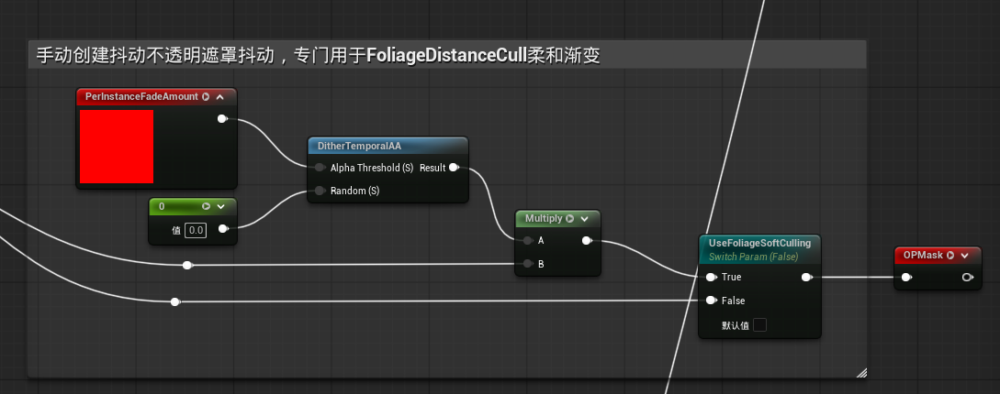
    - 为树干实现软剔除，因为树干不需要镂空，所以不使用软剔除时的默认值为1即可。
    

## 场景

### LOD优化
- LOD即Level of Detail，细节层次。为同一个物体制作多套模型（高模、中模、低模），模型越低，面数越少、纹理越模糊。核心作用，根据物体与屏幕的占比/相机的距离，动态切换不同精度的模型/纹理，保证视觉效果的前提下提升性能。
- UE的Nanite决定游戏的上线，让体验更加经验。LOD守护了游戏流畅运行的下限。

- 进入界面，右上角可以折叠  
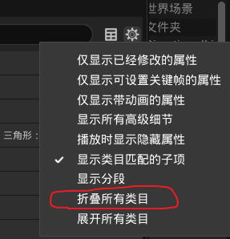
- 勾选LOD选取器的自定义，会自动生成其余LOD
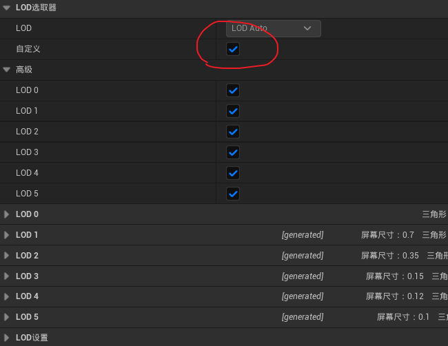
    注意LOD右边的屏幕尺寸，意思是当物体占比屏幕的尺寸小于等于该值时，会使用该LOD。
- LOD设置下可以选择LOD组，里面有一些根据物体类型的预设值
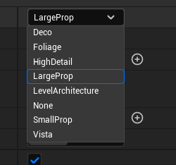
    相关值及含义如下：  
    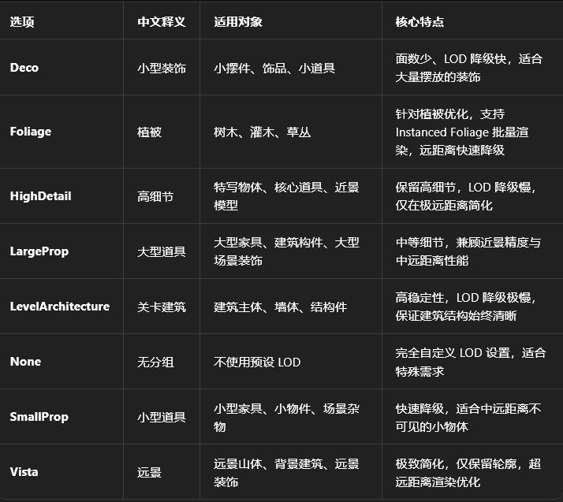
    其中Foliage只会生成LOD0，UE希望植被使用Nanite或者手动设置。

- 拷贝LOD
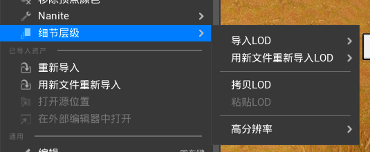
右键选中的静态网格体，可以拷贝其LOD设置，也可以导入已拷贝的LOD设置。需要主要的是如果拷贝的LOD设置有4级，而待导入的静态网格体设置只有3级，待导入的LOD设置只会保留前3级，不会自动创建第4级。同理，待导入的级数多的话，不会删除额外的LOD。

- 和植被剔除结合
    - 光照处选择网格体LOD着色，可以看不同层级网格体的颜色
    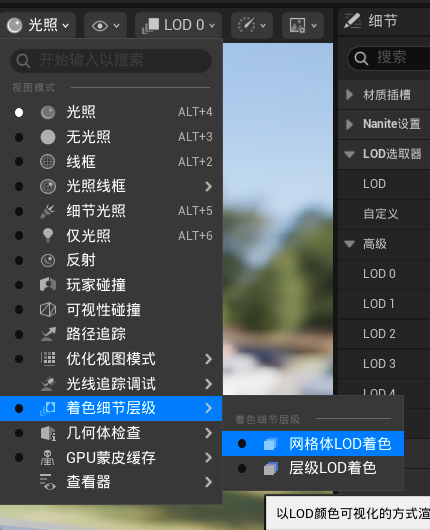
    - 不同着色如下：
    <video controls src="assets/video_2026-04-02_00-33-58.webm" title="Title"></video>
    - 在植被绘制处新绘制一些植被，同时关闭网格体的树叶和树枝的软剔除（否则植被全是黑色），来查看不同层级植被的颜色。
    <video controls src="assets/video_2026-04-02_00-46-33.webm" title="Title"></video>
    可以看到被剔除时，最后的颜色是蓝色，也就是说如何如果设置蓝色之外的层级都是浪费，所以此时可以删除多余的LOD。
    - 确保LOD层级和软剔除协同合作后，此后即可将该植被网格体的LOD导入到其他植被网格体。
    - 特殊场景只使用LOD不使用剔除，比如大世界游戏，确保远处的植被能够正常显示。
    - 单面Billboard:本质是个单面的，始终朝向相机。
    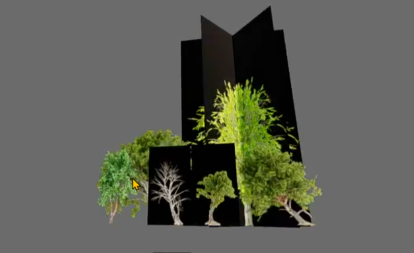

### Nanite体积优化、精度优化

- 启用Nanite，右键选中的静态网格体  
    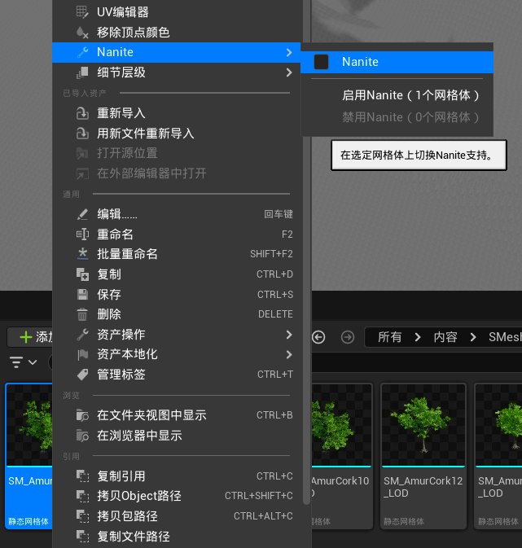
- 进入网格体界面，在设置中设置Nanite的具体参数
    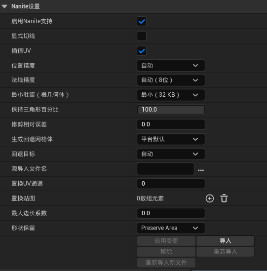
- 重要参数：
    - 保持三角形百分比：Nanite优化后的模型三角形数为原模型的三角形的百分比，降低三角形数。不同模型减少三角形数的效果不同，根据模型的复杂程度和性能需求，选择合适的百分比。
    - 修剪相对误差：保持优化后的与原模型的误差值。如果有很多模型需要修改，比较麻烦，可以使用该选项。
        - 快速设置多个静态网格体的Nanite参数：shift+左键多选，然后右键打开菜单，选中`资产操作`中的`编辑属矩阵中的选择`
        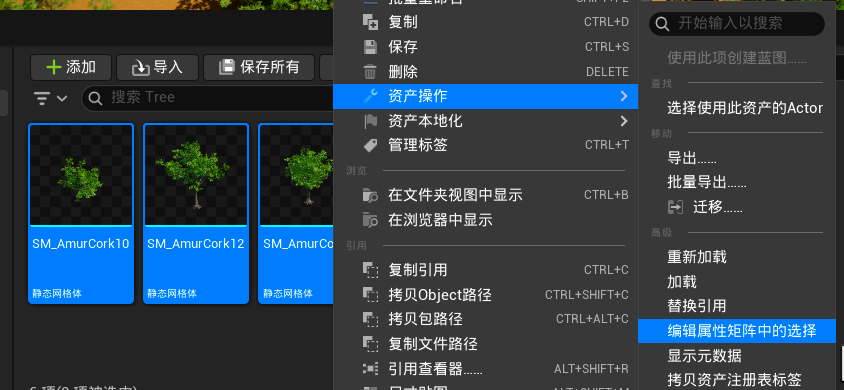
        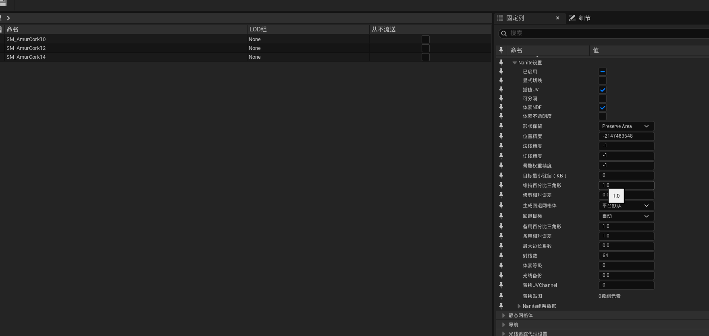
    - 生成回退网格体：如果不支持Nanite，将会执行回退方案。在光照右边的小眼睛选择Nanite回退方案，可以查看回退后的模型。
    回退的原模型是Nanite后的模型，不是面数最多的源模型。
    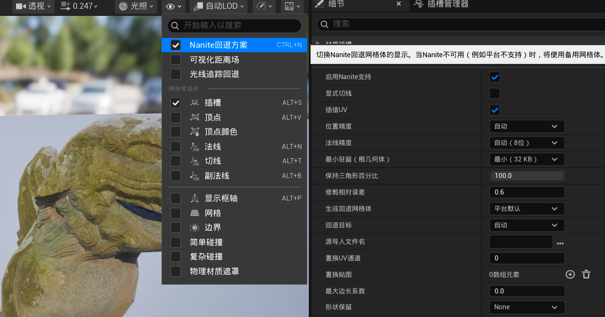
    - 法线精度：如果以后使用Nanite后的模型在光照下有尾影，把位数调高。
    - 显式切线：如果模型表面光滑，出现明显的瑕疵，单独勾选显式切线。
### Nanite性能优化
- 观察Nanite物体（启用Nanite才会显示）
    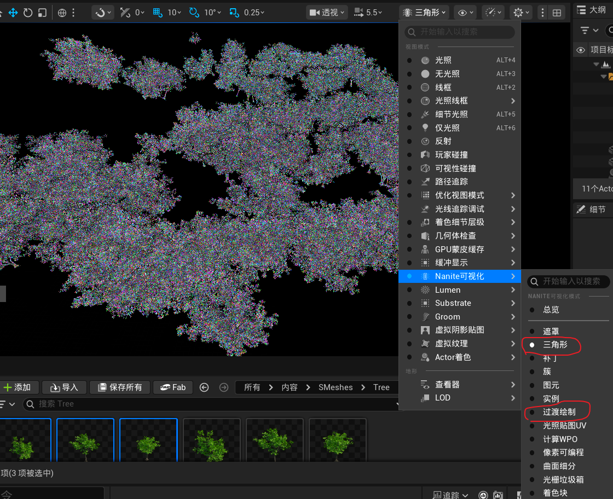
- 过渡绘制
    亮度大的部位存在过渡绘制的问题。
    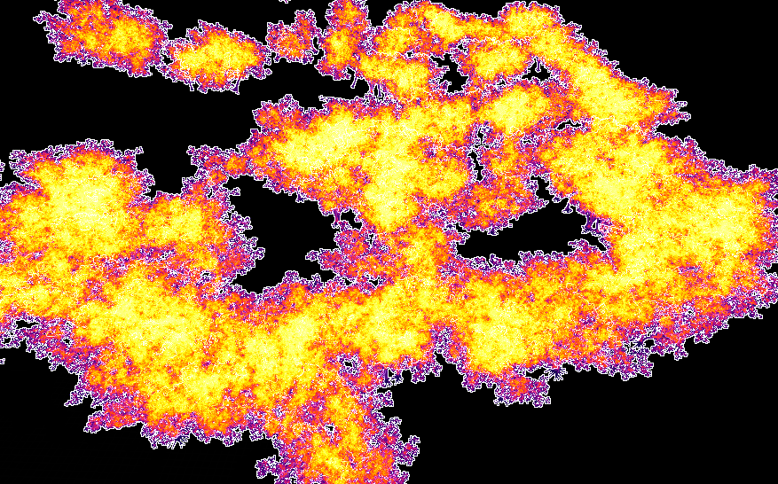
- 遮挡剔除：如果相机观察不到该物体，则不会渲染该物体，但如果物体只有一小部分被相机观察到，仍需要将物体全部渲染。
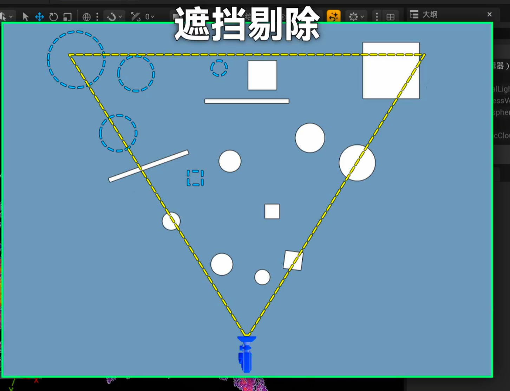
- Nanite的簇
    UE将物体划分为多个簇，每个簇包含多个三角形。UE根据相机位置和物体的距离，决定是否渲染某些簇。
    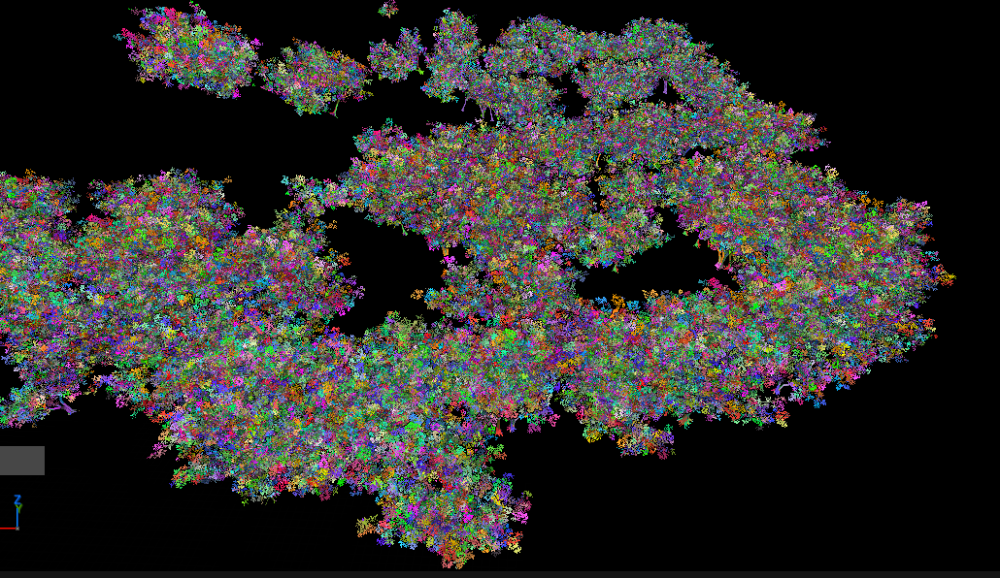
    不同颜色就是不同的簇。
    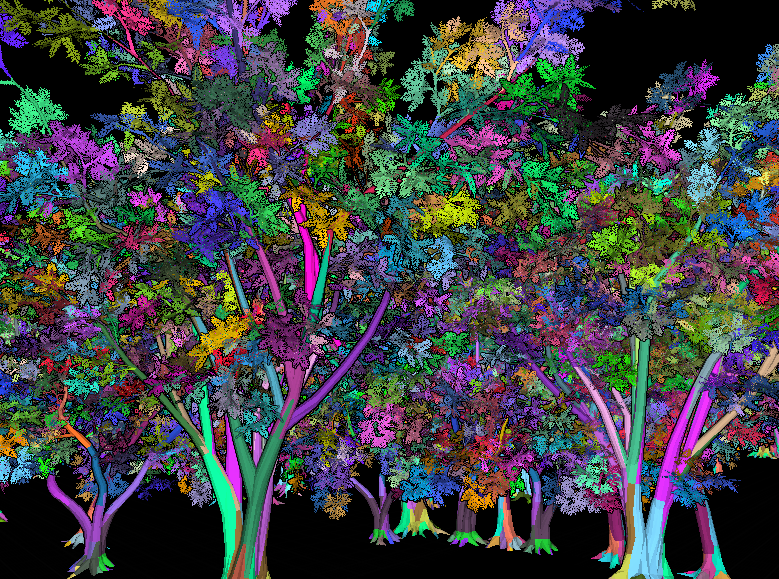
- 过渡绘制产生的原因
    - 未启用Nanite的树叶实现
    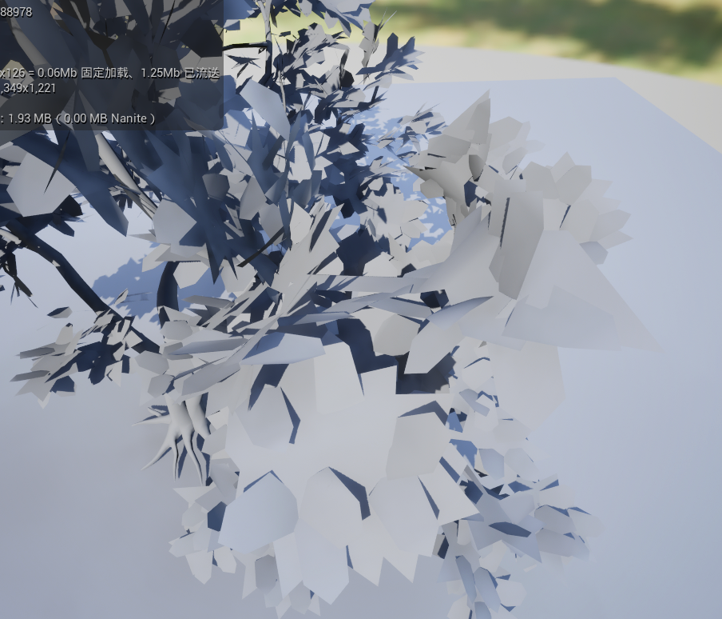
    一片树叶本质是实体的面片，通过只显示叶子的部分，其余为透明来实现叶子。
    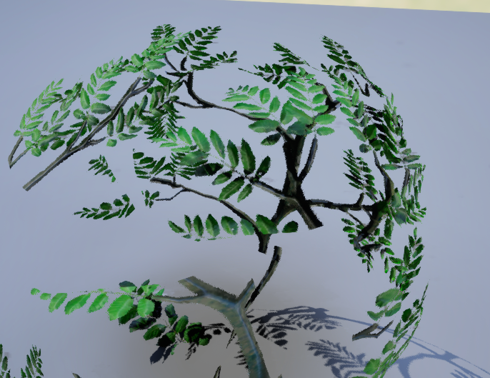
    黑色相框是实际的模型，中间的叶子通过不透明遮罩实际渲染出来的，形成树叶的效果。
    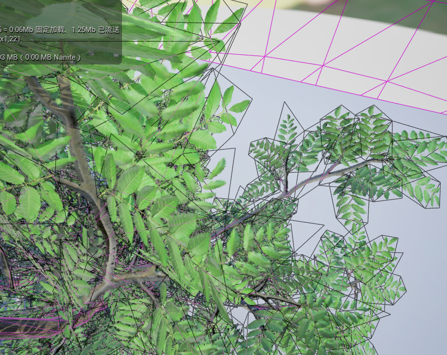
    因此当前场景中存在很多半透明的空隙，渲染管线很难在早起的时候就发现这层关系
    传统工作流可以通过减少远处的模型LOD的层级，强行降低开销。
    Nanite使用树枝树叶是实际的建模。
    
- UE5.7后优化（实验性功能）
    - 开启插件，打开项目设置中的
    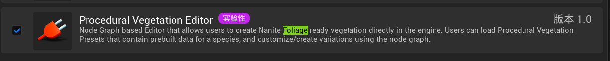
    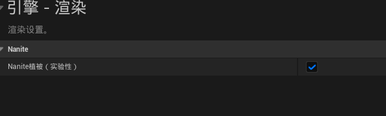
    - 找到插件位置，内容浏览器中搜索PVE，然后Ctrl+B跳转到文件具体目录下
    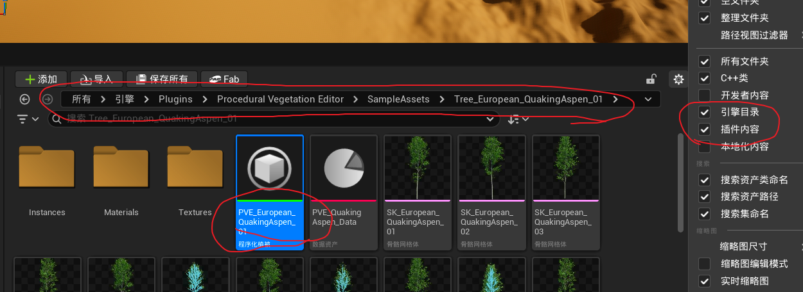
    - 选中第一个导出的节点，在导出设置中，设置导出的位置
    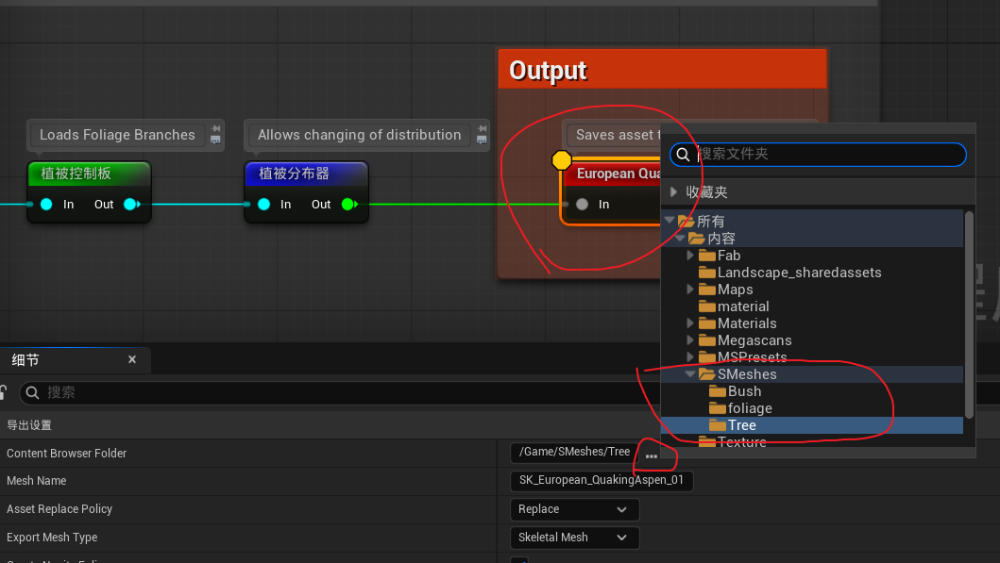
    - 网格体名称前缀可以改为SM，资产替换策略处设置为Append，新增而不是替换原有资产。
    导出Mesh类型为静态网格体，Nanite中的形状保持量先设置为None。
    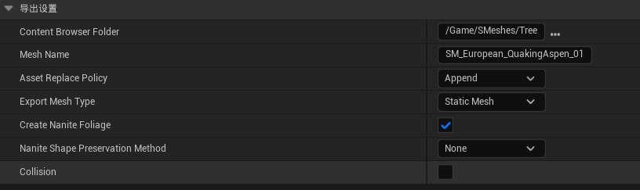
    - 右上角点击保存后点击导出，即可在目标目录下找到
    
    - 打开后光照处选择线框模式，可以看到叶子是实际建模，在Nanite的设置中尽量不要使用减面操作（保持三角形百分比属性），目前正在实验阶段。
    
    - 将其拖入到植被绘制中并保存
    
    - 将其他植被的绘制属性复制到该新植被处，然后在地图上绘制树木
    
    - 相对原先的过渡绘制，效果更好
    
    - 存在的问题：远处树被剔除时，叶子太少，有点秃
    
        - 在网格体界面的Nanite组下的形状保留属性选择Preserve Area
        
        - 枝叶变丰满了
        
        - 但是过渡绘制又变多了
        
        - 形状保留属性选择体素化
        
        - 性能、画面表现都变好了，甚至比属性选择None，枝叶秃的解决情况更好
        
        
    - 体素的样子
        - 在命令cmd处输入
        
        - 查看体素的样子
        
        - 光照处设置nanite三角形显示
        
    - 目前发现的问题，不知道是不是nanite本身造成的结果还是需要再处理。大概率是后者，因为用的不是一种树。
        <video controls src="assets/video_2026-04-07_00-50-59.webm" title="Title"></video>

### 非Nanite植被WPO(世界位置偏移)优化

