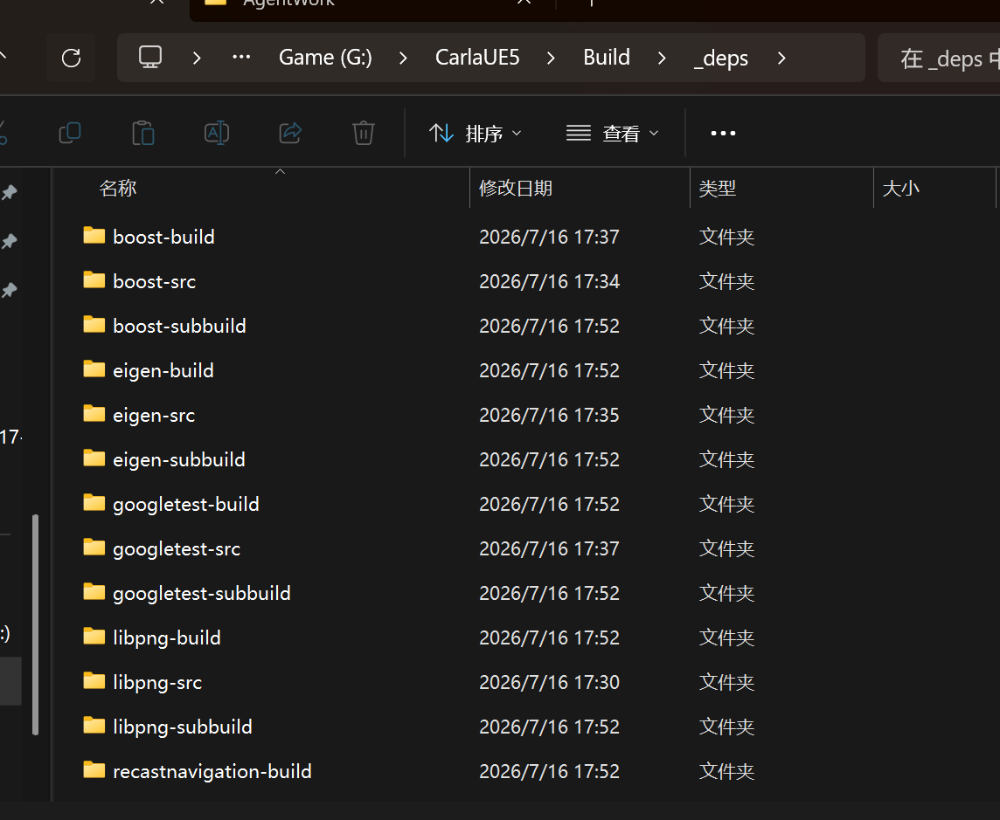

# CMake配置

CMake configure 阶段做的事情可以用一句话概括：读项目配置、检查编译器、下载依赖、生成构建文件。它本身不编译任何代码，只是为后续的 cmake --build 准备好一切。

官方运行命令：
```bat
echo Configuring the CARLA CMake project...
cmake ^
    -G Ninja ^
    -S . ^
    -B Build ^
    --toolchain=CMake/Toolchain.cmake ^
    -DPython_ROOT_DIR=%python_root% ^
    -DPython3_ROOT_DIR=%python_root% ^
    -DCMAKE_BUILD_TYPE=Release ^
    -DCARLA_UNREAL_ENGINE_PATH=%CARLA_UNREAL_ENGINE_PATH% || exit /b
```

**CMake 配置阶段：**

| 参数                                | 作用                                                |
| ----------------------------------- | --------------------------------------------------- |
| `-G Ninja`                          | 使用 Ninja 构建系统（比 MSBuild 更快的并行构建）    |
| `-S .`                              | 源码目录为当前目录（`G:\CarlaUE5`）                 |
| `-B Build`                          | 构建输出目录为 `Build`                              |
| `--toolchain=CMake/Toolchain.cmake` | 使用 CARLA 自定义的工具链文件（指定编译器、SDK 等） |
| `-DPython_ROOT_DIR`                 | Python 根目录（用于构建 Python API）                |
| `-DPython3_ROOT_DIR`                | 同上（兼容 CMake 不同版本的变量名）                 |
| `-DCMAKE_BUILD_TYPE=Release`        | Release 模式，启用优化                              |
| `-DCARLA_UNREAL_ENGINE_PATH`        | UE5 引擎路径，让 CMake 找到引擎                     |
、、让我读一下 CARLA 源码里 CMake 配置阶段实际用到的文件。
CMake configure 阶段做的事情可以用一句话概括：**读项目配置、检查编译器、下载依赖、生成构建文件**。它本身不编译任何代码，只是为后续的 `cmake --build` 准备好一切。

## 用到哪些文件

配置的入口是 `CMakeLists.txt`，它按顺序 `include` 了 4 个模块文件：

| 文件 | 作用 |
|------|------|
| `CMake/Util.cmake` | 工具函数。定义了 `carla_message`（输出日志）、`carla_option`（定义选项）等宏。你截图里所有 `-- CARLA: xxx` 的消息都来自这里 |
| `CMake/Options.cmake` | 所有构建选项 + 依赖版本号。读环境变量 `CARLA_UNREAL_ENGINE_PATH`、定义 `BUILD_LIBCARLA_TESTS=ON`、定义 boost-1.84.0、eigen-3.4.0 等版本 |
| `CMake/Common.cmake` | 编译器设置。设 C++20 标准、检查 `/EHsc`（异常处理）、`/GR`（RTTI）、设 `/utf-8`、检测 Win64/Linux |
| `CMake/Dependencies.cmake` | 下载依赖。用 `FetchContent` 从远程下载 11 个第三方库的源码 |
| `CMake/Toolchain.cmake` | 工具链。Windows 上基本不做事，Linux 上设置 UE5 自带的 clang 编译器 |

## 配置干了 5 件事

**1. 项目定义**（`CMakeLists.txt` 第 37-58 行）

设定 CARLA 版本 `0.10.0`，声明项目语言为 C/C++/ASM。

**2. 读取选项**（`Options.cmake`）

```cmake
cmake_path(CONVERT "$ENV{CARLA_UNREAL_ENGINE_PATH}" ... CARLA_UNREAL_ENGINE_PATH_INFERRED)
```

从环境变量读取 UE5 引擎路径。

同时定义所有默认选项：`BUILD_LIBCARLA_TESTS=ON`、`BUILD_PYTHON_API=ON`、`ENABLE_OSM2ODR=OFF` 等，以及每个依赖的版本号（boost-1.84.0、zlib-v1.3.1 等）。

**3. 检查编译器能力**（`Common.cmake` 第 94-150 行）

```cmake
check_cxx_compiler_flag(/EHsc HAS_EXCEPTIONS_FLAG)  ← 你截图里的 "Checking for /EHsc support"
check_cxx_compiler_flag(/GR HAS_RTTI_FLAG)          ← 你截图里的 "Checking for /GR support"
```

这两个 `check_cxx_compiler_flag` 会编译一个空的测试文件，看 MSVC 是否接受这些标志。你截图里看到的那两行就是这么来的。

**4. 下载依赖**（`Dependencies.cmake`）

这是最耗时的部分。每个依赖通过 `FetchContent_Declare` + `FetchContent_MakeAvailable` 从远程下载：

| 依赖 | 下载来源 | 条件 |
|------|---------|------|
| sqlite3 | sqlite.org | 总是 |
| zlib | github.com/madler/zlib | 总是 |
| libpng | github.com/pnggroup/libpng | 总是 |
| boost | github.com/boostorg/boost | 总是 |
| eigen | gitlab.com/libeigen/eigen | 总是 |
| rpclib | github.com/carla-simulator/rpclib | 总是 |
| recastnavigation | github.com/carla-simulator/recastnavigation | 总是 |
| StreetMap | github.com/carla-simulator/StreetMap | `BUILD_CARLA_UNREAL AND ENABLE_STREETMAP` |
| googletest | github.com/google/googletest | `BUILD_LIBCARLA_TESTS=ON` 时才下 |
| PROJ / xerces-c | github.com | `ENABLE_OSM2ODR=ON` 时才下 |

你截图里的 `Downloading sqlite3...` 和 `Downloading zlib...` 就是在执行这一步。卡在 zlib 是因为代理没生效。

**5. 添加子目录**（`CMakeLists.txt` 第 93-111 行）

根据选项决定编译哪些模块：

```cmake
if (BUILD_CARLA_CLIENT OR BUILD_CARLA_SERVER)
  add_subdirectory(LibCarla)      ← C++ 核心库
if (BUILD_PYTHON_API)
  add_subdirectory(PythonAPI)      ← Python API
if (BUILD_CARLA_UNREAL)
  add_subdirectory(Unreal)         ← UE5 插件
```

每个 `add_subdirectory` 会进入对应目录，读取那里的 `CMakeLists.txt`，定义具体的编译目标（`.lib`、`.exe`、`.pyd` 等）。

## 最终输出

configure 完成后，`Build/` 目录下会生成：

| 文件/目录 | 作用 |
|----------|------|
| `build.ninja` | Ninja 构建脚本，`cmake --build` 读这个文件决定编译什么 |
| `CMakeCache.txt` | 缓存所有配置变量，重跑 configure 时读取避免重复检测 |
| `_deps/` | 所有下载的依赖源码 |
| `LibCarla/`、`Unreal/`、`PythonAPI/` | 各模块的中间文件 |

**一句话总结：** configure 不编译代码，它读选项 → 查编译器 → 下依赖 → 写 `build.ninja`。真正编译是 `cmake --build` 干的。

## 运行过程

```bash
**********************************************************************
** Visual Studio 2022 Developer Command Prompt v17.14.36
** Copyright (c) 2025 Microsoft Corporation
**********************************************************************
[vcvarsall.bat] Environment initialized for: 'x64'

C:\Program Files\Microsoft Visual Studio\2022\Community>g:

G:\>cd CarlaUE5

G:\CarlaUE5>set HTTP_PROXY=http://127.0.0.1:11888

G:\CarlaUE5>set HTTPS_PROXY=http://127.0.0.1:11888

G:\CarlaUE5>cmake -G Ninja -S . -B Build --toolchain=CMake/Toolchain.cmake -DPython_ROOT_DIR=C:/Users/75271/.conda/envs/carla10 -DPython3_ROOT_DIR=C:/Users/75271/.conda/envs/carla10 -DCMAKE_BUILD_TYPE=Release -DCARLA_UNREAL_ENGINE_PATH=G:/UnrealEngineCarla
-- CARLA: Using G:/UnrealEngineCarla as Unreal Engine root path.
-- CARLA: Checking for /EHsc support
-- CARLA: Checking for /GR support
-- CARLA: Downloading sqlite3...
-- CARLA: Downloading zlib...
-- CARLA: Downloading libpng...
CMake Deprecation Warning at Build/_deps/libpng-src/CMakeLists.txt:33 (cmake_minimum_required):
  Compatibility with CMake < 3.10 will be removed from a future version of
  CMake.

  Update the VERSION argument <min> value.  Or, use the <min>...<max> syntax
  to tell CMake that the project requires at least <min> but has been updated
  to work with policies introduced by <max> or earlier.


CMake Deprecation Warning at Build/_deps/libpng-src/CMakeLists.txt:34 (cmake_policy):
  Compatibility with CMake < 3.10 will be removed from a future version of
  CMake.

  Update the VERSION argument <min> value.  Or, use the <min>...<max> syntax
  to tell CMake that the project requires at least <min> but has been updated
  to work with policies introduced by <max> or earlier.


-- CARLA: Downloading boost...
-- CARLA: Downloading eigen...
-- CARLA: Downloading rpclib...
-- CARLA: Downloading recastnavigation...
-- CARLA: Downloading StreetMap...
-- CARLA: Downloading googletest...
-- Boost: Release build, static libraries, MPI OFF, Python ON, testing OFF
-- Boost: libraries included: asio;iterator;python;date_time;geometry;container;variant2;gil
-- Boost.Context: architecture x86_64, binary format pe, ABI ms, assembler masm, suffix .asm, implementation fcontext
CMake Deprecation Warning at Build/_deps/boost-src/libs/filesystem/CMakeLists.txt:10 (cmake_minimum_required):
  Compatibility with CMake < 3.10 will be removed from a future version of
  CMake.

  Update the VERSION argument <min> value.  Or, use the <min>...<max> syntax
  to tell CMake that the project requires at least <min> but has been updated
  to work with policies introduced by <max> or earlier.


-- Boost.Math: standalone mode OFF
-- Boost.Multiprecision: standalone mode OFF
-- Boost.Python: using Python 3.10.20 with NumPy at C:/Users/75271/.conda/envs/carla10/Lib/site-packages/numpy/core/include
-- Boost.Thread: threading API is win32
CMake Deprecation Warning at Build/_deps/eigen-src/CMakeLists.txt:2 (cmake_minimum_required):
  Compatibility with CMake < 3.10 will be removed from a future version of
  CMake.

  Update the VERSION argument <min> value.  Or, use the <min>...<max> syntax
  to tell CMake that the project requires at least <min> but has been updated
  to work with policies introduced by <max> or earlier.


-- Performing Test COMPILER_SUPPORT_std=cpp03
-- Performing Test COMPILER_SUPPORT_std=cpp03 - Failed
-- Standard libraries to link to explicitly: none
-- Found unsuitable Qt version "" from NOTFOUND
-- Qt4 not found, so disabling the mandelbrot and opengl demos
--
-- Configured Eigen 3.4.0
--
-- Available targets (use: cmake --build . --target TARGET):
-- ---------+--------------------------------------------------------------
-- Target   |   Description
-- ---------+--------------------------------------------------------------
-- install  | Install Eigen. Headers will be installed to:
--          |     <CMAKE_INSTALL_PREFIX>/<INCLUDE_INSTALL_DIR>
--          |   Using the following values:
--          |     CMAKE_INSTALL_PREFIX: C:/Program Files (x86)/CARLA
--          |     INCLUDE_INSTALL_DIR:  include/eigen3
--          |   Change the install location of Eigen headers using:
--          |     cmake . -DCMAKE_INSTALL_PREFIX=yourprefix
--          |   Or:
--          |     cmake . -DINCLUDE_INSTALL_DIR=yourdir
-- doc      | Generate the API documentation, requires Doxygen & LaTeX
-- blas     | Build BLAS library (not the same thing as Eigen)
-- uninstall| Remove files installed by the install target
-- ---------+--------------------------------------------------------------
--
CMake Deprecation Warning at Build/_deps/rpclib-src/CMakeLists.txt:1 (cmake_minimum_required):
  Compatibility with CMake < 3.10 will be removed from a future version of
  CMake.

  Update the VERSION argument <min> value.  Or, use the <min>...<max> syntax
  to tell CMake that the project requires at least <min> but has been updated
  to work with policies introduced by <max> or earlier.


CMake Deprecation Warning at Build/_deps/recastnavigation-src/CMakeLists.txt:1 (cmake_minimum_required):
  Compatibility with CMake < 3.10 will be removed from a future version of
  CMake.

  Update the VERSION argument <min> value.  Or, use the <min>...<max> syntax
  to tell CMake that the project requires at least <min> but has been updated
  to work with policies introduced by <max> or earlier.


-- Found Python3: C:/Users/75271/.conda/envs/carla10/python.exe (found version "3.10.20") found components: Interpreter
-- Found Python3: C:/Users/75271/.conda/envs/carla10/python.exe (found version "3.10.20") found components: Interpreter Development.Module Development.Embed Development.SABIModule
-- CARLA: Found Numpy 1.26.4 for Python 3.10.20 (C:/Users/75271/.conda/envs/carla10/python.exe).
-- CARLA: CARLA Building C++ EXAMPLE CLIENT
-- Configuring done (7.4s)
-- Generating done (1.1s)
-- Build files have been written to: G:/CarlaUE5/Build

```

## 依赖

在build的_deps目录下会保存下载好的依赖，后续构建过程大概率出错，但是查资料，往往会建议把build目录删除，这时又要重新下依赖了，
所以可以提前保存。

