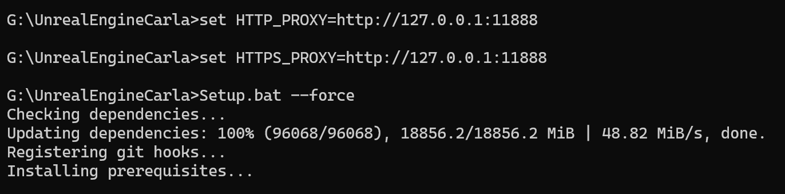
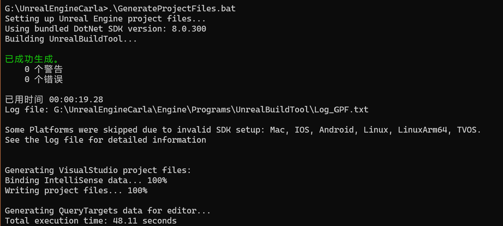
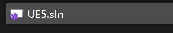
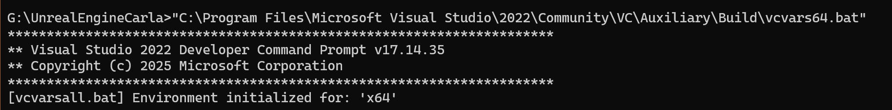
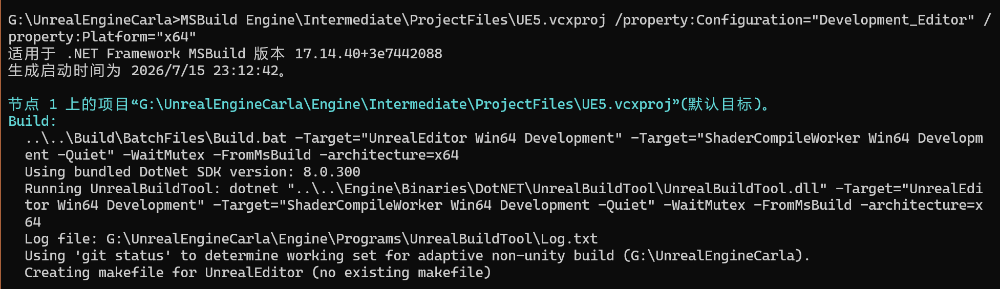
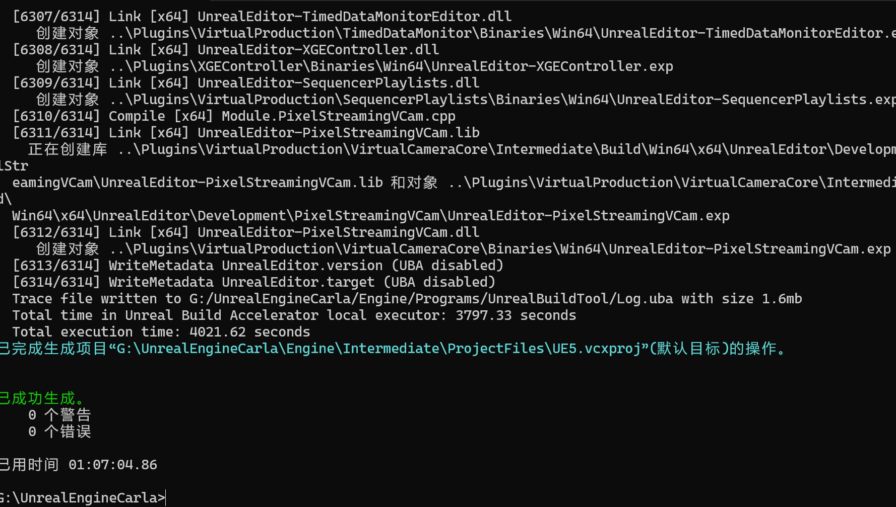

# 检查/下载/编译 UE5 引擎

**第一优先级：** 检查环境变量 `CARLA_UNREAL_ENGINE_PATH` 指向的路径是否存在。如果存在，直接跳过整个 UE5 下载编译流程。

**第二优先级：** 检查上级目录（`..`）下有没有 `UnrealEngine5_carla` 文件夹。如果有，假设已编译完成，跳过。

**第三优先级（都没有时）：** 

- `pushd ..` — 切换到上级目录（CARLA 源码的父目录，即 `G:\`）。
- 从 GitHub 克隆 CARLA fork 的 UE5 仓库（`ue5-dev-carla` 分支）到 `UnrealEngine5_carla` 目录。

```bat
    pushd UnrealEngine5_carla
    set CARLA_UNREAL_ENGINE_PATH=!cd!
    setx CARLA_UNREAL_ENGINE_PATH !cd!
```

- `pushd UnrealEngine5_carla` — 进入刚克隆的引擎目录。
- `set CARLA_UNREAL_ENGINE_PATH=!cd!` — 设置当前 shell 的环境变量（用 `!cd!` 而非 `%cd%` 因为需要延迟扩展取到实时值）。
- `setx CARLA_UNREAL_ENGINE_PATH !cd!` — 持久化设置环境变量到注册表，下次开机仍然有效。

```bat
    echo Running Unreal Engine pre-build steps...
    call Setup.bat || exit /b
    call GenerateProjectFiles.bat || exit /b
```

- `Setup.bat` — UE5 的前置准备脚本，下载依赖文件（如第三方库、Android NDK 等）。
- `GenerateProjectFiles.bat` — 生成 VS 解决方案文件（`.sln`）。

```bat
    echo Building Unreal Engine 5...
    msbuild ^
        Engine\Intermediate\ProjectFiles\UE5.vcxproj ^
        /property:Configuration="Development_Editor" ^
        /property:Platform="x64" || exit /b
    popd
    popd
)
```

- 用 MSBuild 编译 UE5 引擎本身，配置为 `Development_Editor`，平台 `x64`。
- **这一步极其耗时**（官方文档说 1 小时+，需要 225GB 磁盘空间）。
- 两个 `popd` — 分别从 `UnrealEngine5_carla` 目录和上级目录退回，恢复到原始工作目录（`G:\CarlaUE5`）。

# 实操

第 1 步：进入引擎目录下，执行setup.bat，下载依赖
```bash
Setup.bat --force
```

建议使用梯子：  


第 2 步：生成项目文件
```bash
GenerateProjectFiles.bat
```






第 3 步：编译引擎

MSBuild 是 Visual Studio 的构建工具，不在系统 PATH 里。它只有在你激活了 VS 开发环境后才可用。

方法一（推荐）：用 x64 Native Tools Command Prompt

开始菜单搜索 "x64 Native Tools Command Prompt for VS 2022"，打开它。

方法二：在当前 PowerShell 里先激活 VS 环境：

```powershell
"C:\Program Files\Microsoft Visual Studio\2022\Community\VC\Auxiliary\Build\vcva
```



```bash
MSBuild Engine\Intermediate\ProjectFiles\UE5.vcxproj /property:Configuration="Development_Editor" /property:Platform="x64"
```




