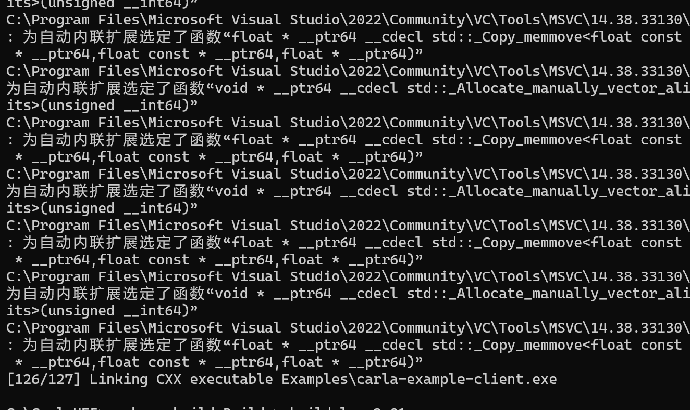

# 构建

## googletest 编译错误原因
googletest 用了 /Wall（所有警告）+ /WX（警告视为错误）编译选项。新版 MSVC 14.38 对 googletest 1.14.0 的代码报了一堆 warning（C4710 函数未内联、C4668 宏未定义、C4820 字节填充等），全部被 /WX 转成 error：

```bash
gtest_main.cc(62): error C2220: 以下警告被视为错误
gtest_main.cc(62): warning C4710: "printf": 函数未内联

gtest-port.h(830): error C2220: 以下警告被视为错误
gtest-port.h(830): warning C4668: 没有将"GTEST_LINKED_AS_SHARED_LIBRARY"定义为预处理器宏
解决方法
```

## 解决办法
重新 configure 时加上 -DBUILD_LIBCARLA_TESTS=OFF，跳过 googletest 的下载和编译。
```bash
G:\CarlaUE5>cmake -G Ninja -S . -B Build --toolchain=CMake/Toolchain.cmake -DPython_ROOT_DIR=C:/Users/75271/.conda/envs/carla10 -DPython3_ROOT_DIR=C:/Users/75271/.conda/envs/carla10 -DCMAKE_BUILD_TYPE=Release -DCARLA_UNREAL_ENGINE_PATH=G:/UnrealEngineCarla
```

## 运行build命令

```bash
echo Building CARLA...
cmake --build Build || exit /b
echo Installing Python API...
cmake --build Build --target carla-python-api-install || exit /b
echo CARLA Python API build+install succeeded.

rem -- POST-BUILD STEPS --

if %launch%==true (
    echo Launching Carla Unreal Editor...
    cmake --build Build --target launch || exit /b
)
```

## build成功

