## 实现玩家移动功能{#1}
### 创建游戏模式和游戏角色
UE官方推荐使用增强输入操作（Enhanced Input Actions）和输入映射上下文（Input Mapping Context）来实现玩家移动功能。


实现前需要先将创建一个自己的游戏模式和游戏角色（蓝图类），使用默认配置即可。

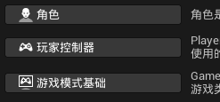

将游戏模式中的默认pawn类设置为游戏角色  


### 创建输入操作和输入映射情景
通过右键在输入处创建输入操作IA和输入映射情景IMC  
  
### 配置输入操作
IA中将值类型修改为Vecotr2D，二维向量(x,y)，其中x可以用来前后移动，y可以用来左右移动。
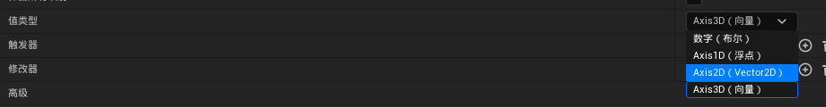
IMC中在Mappings处新增一个元素，选中创建的IA  
  
### 配置输入映射情景
然后新增W\S\A\D，其中S和A需要在修改器中添加一个否定修改器。
  
S/A之所以使用否定修改器，原因是我们可以获取角色的向前、向右、向上的空间方向向量，所以W\A的单位向量的对应X/Y为正，与空间方向向量的X/Y相乘也是正。  
   

### 最后：在角色蓝图中实现移动逻辑
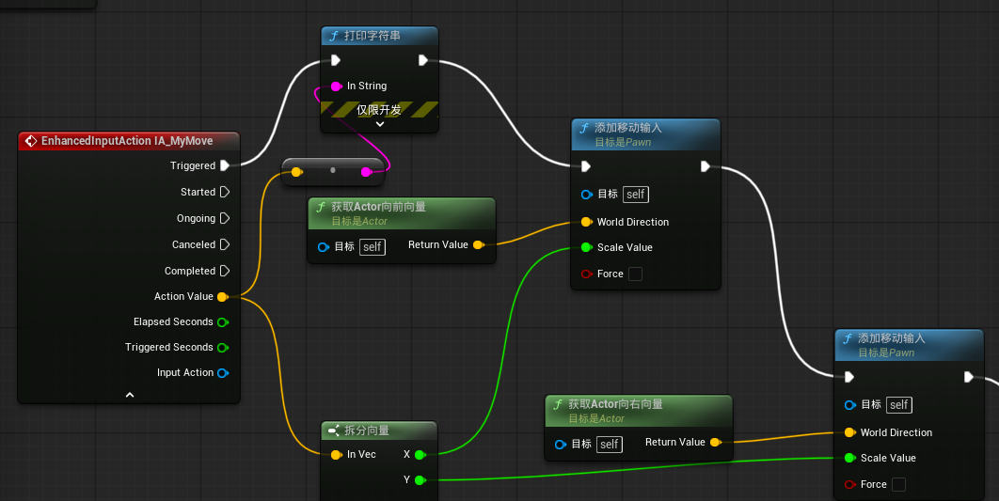  

最终效果：  
<video controls src="assets/video_2026-04-20_22-48-05.webm" title="Title"></video>

### 进阶1：增加飞行和下降
IA中设置3维向量Axis3D  

角色蓝图中在右上角的组件中选择角色移动，然后在右侧细节面板找到默认陆地运动模式，设置为正在飞行  
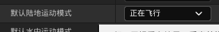
在角色蓝图中实现移动，在原有基础上添加向上向量的移动


### 进阶2：按Shift加速
- 首先创建一个输入操作IA_SpeedUp，设置为一维即可。
- 角色的移动控制都在移动组件中处理
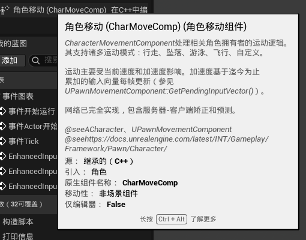
- 实现思路：当角色按下Shift键时，将最大行走速度设置为行走速度（如300），当按下结束后移动速度设置为奔跑速度（如600）。
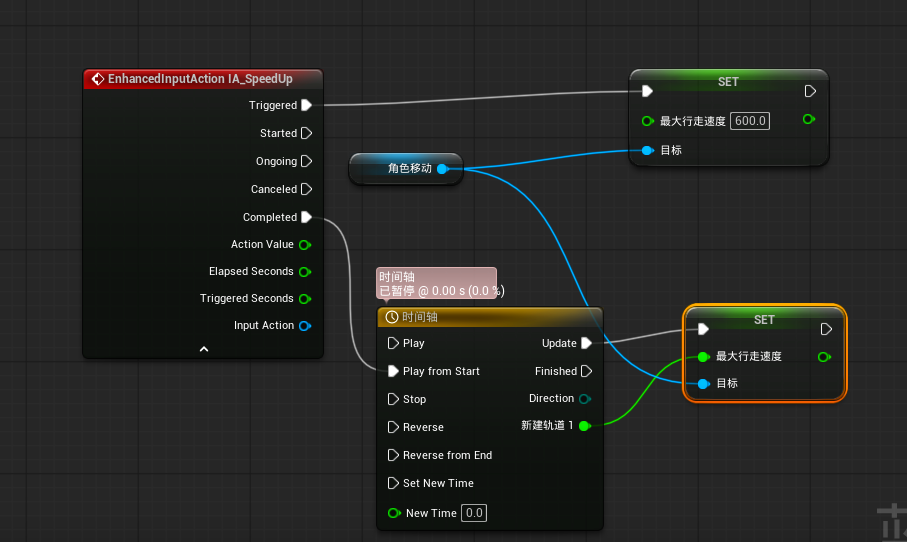
- 目前实现较为简陋，使用时间轴来防止骤停。
- 实现效果：在学习后面的动画后更明显展示
<video controls src="assets/video_2026-04-22_22-45-44.webm" title="Title"></video>


## 实现玩家视角旋转功能{#2}
### 理解Yaw和Pitch和Roll
进入角色蓝图，在视口可以看到角色的朝向是对应坐标轴的x的。
- Yaw偏航角：即绕Z轴旋转，改变方向如左右摇头。    
- Pitch俯仰角：即绕Y轴旋转，改变方向为上下点头。  
- Roll翻滚叫：  即绕X轴旋转，改变方向为做翻跟头。

  
如果想实现视角的左右上下旋转视角，则需要使用yaw和pitch两个角度。

### 虚幻引擎中Yaw和Pitch输入值的效果：
- Yaw输入为正向右，Pitch输入为正向下。  
- 对于鼠标，向右滑动为正，向上滑动为正。  
因此，使用默认值会导致鼠标上移而视角低头。

### 创建输入操作IA_MyLook
设置为2D向量，X用来yaw，Y用来Pitch。
### 在IMC中的Mappings添加IA_MyLook 
选择 旋转鼠标XY 2D轴  
  
修正鼠标上下滑动和视角pitch为相反的情况：
- 在角色蓝图中获得Y后取反
- 在IMC中设置否定修改器，取反Y

推荐第二中：  
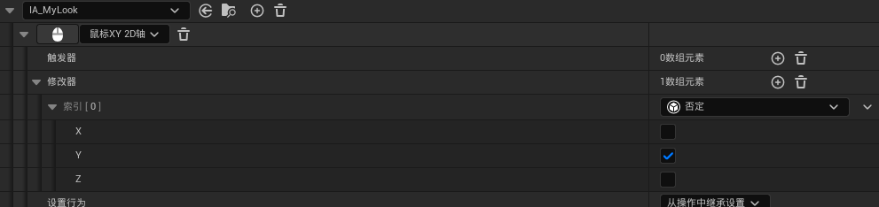  
实现效果：
<video controls src="assets/video_2026-04-20_23-36-56.webm" title="Title"></video>  

## 添加注释功能
框选节点，然后按C即可。  
  

## 门的正反开门实现{#3}
### 获取门的资产
在fab中获取wooden door资产  
  
因为获取的都是静态网格体，而我们需要的是一个动态的，因此创建蓝图将门和门框加入。
### 创建门的蓝图
左上角的添加按钮处可以添加静态网格体和碰撞。  
此时可以注意到当前的actor的向右向量和门向右开是一个方向。
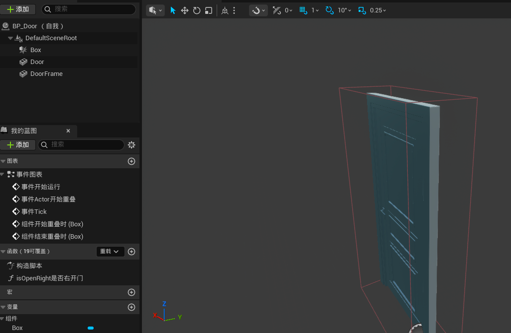

### 门旋转的逻辑
通过一同Z轴可以发现，z从0到90度即可实现向右开门，同理从0到-90度即可实现向左开门。  


### 通过时间轴实现丝滑开门
实践轴的update和新建轨道1链接到Door的设置相对旋转函数，即可实现控制门的z轴数值持续变化。  
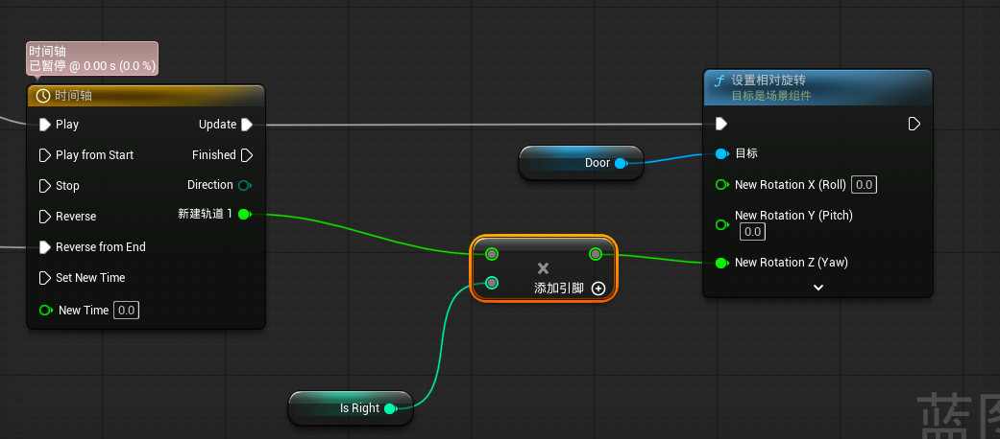  
双击进入时间轴，可以右键设置两个关键帧，每个帧可以设置时间和值，此时设置(0.0s,1.0)和(1.0s,1.0)来表示0秒到1秒实现值从0到1的变化。左上角的长度设置为1。  
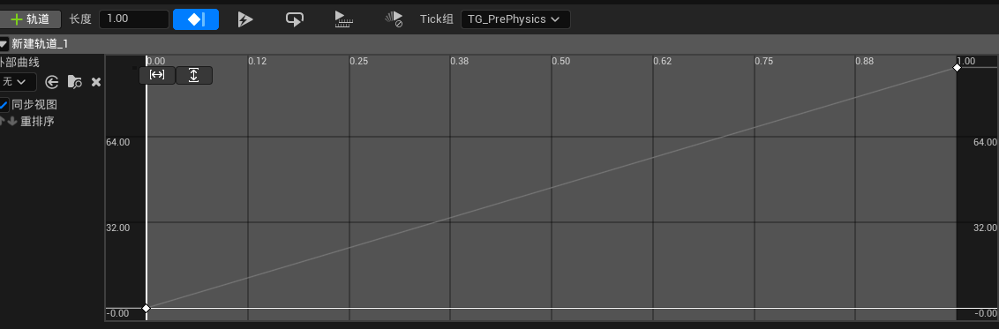  

### 向左开还是向右开门？
二维向量(x,y)，两个向量的点积：
- 为0，说明垂直。
- 为正，说明同向。
- 为负，说明反向。
通过玩家与门的世界位置相减，得到门指向玩家的向量，再与门的向右向量进行点积，如果结果为正，说明玩家在门的右侧，开左门。


### 实现效果
<video controls src="assets/video_2026-04-21_23-57-38.webm" title="Title"></video>

## 常用流程控制
- 分支：根据condition，为正执行一个分支，为负执行另一个分支。
- Flip Flop：轮流切换器，轮流执行两个分支。
- 序列：顺序执行多个分支。
- for loop：根据索引范围，执行多次。
- Do Once：只能执行一次，通过执行reset可以开启执行。
- 延迟：延迟一定时间后执行。
- Gate：门控，只有当门打开时才能执行。其中Toggle执行时，如果是open则切换为close，如果为close则切换为open。


## 第三人称运动系统{#4}
### 添加摄像头和弹簧臂
骨骼网格体处设置为UE官方默认的人物骨骼。在右上角添加处进行添加，并将摄像头设置为弹簧臂的子级，设置好相应的距离。    
弹簧臂的作用：如果不添加，摄像机会保持和角色固定距离，移动到特殊视角后会出现摄像机穿模到墙壁外面的情况。加了之后，摄像机会与墙壁碰撞，而不会穿模。
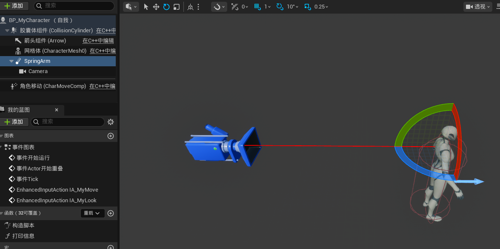

### 设置相机的视角旋转
点击弹簧臂，勾选是用Pawn控制旋转。意思是为相机可以接受控制器输入，比如旋转视角。如果不勾选，相机永远在固定位置。
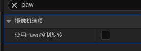
Actor、Pawn、角色的区别：  
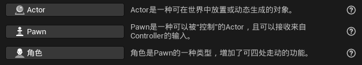

### 实现角色的移动方向和摄像机绑定
原有逻辑是获取角色的向前向量，然后进行移动，但现在加入摄像头后，希望角色的移动方向，应该和摄像头有关，比如向前是指朝摄像头的前方运动，而不是角色的前方。  
核心实现逻辑：获取摄像机在xy平面的向前向量，然后将该方向给角色即可。对于前后获取向前向量，对于左右获取向右向量。
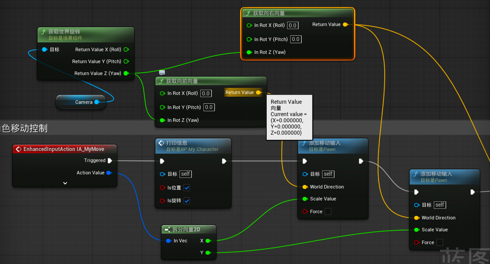

### 相关细节解释
如何获取摄像机在xy平面的方向：
- 首先获取摄像机的旋转，旋转包括yaw、pitch、roll，他们本质是[-180,180]的范围小数。
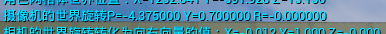
- 添加移动输入的输入值是一个三维方向向量，因此需要做相应的转化。
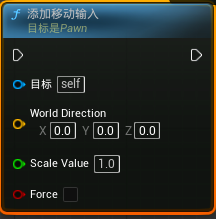
- 因此摄像机通过```获取世界旋转```函数获取yaw的值，然后将yaw的值传入```获取向前向量```这个函数，该函数就会将yaw的值(如45.0)转换为一个三维向量(1,1,0)。
- 将摄像头在xy平面的方向传给角色，即可实现角色的移动方向和摄像机绑定。同理将上述的```获取向前向量```替换为```获取向右向量```即可实现左右移动。

## 制作第三人称角色动画{#5}
### 创建动画蓝图和混合空间
当前是建立在已有动画序列的基础上，且能适配需要选择相同的骨骼网格体。
- 混合空间：可以将不同的动画序列进行混合，如站立和跑步混合后实现跑步动画，然后设置一个值（速度）来控制站立到跑步的比例。
- 动画蓝图：可以被蓝图Actor设置，动画蓝图内可以获取actor的对象，进而做相应的动画控制。如获取角色移动速度，然后给混合空间。
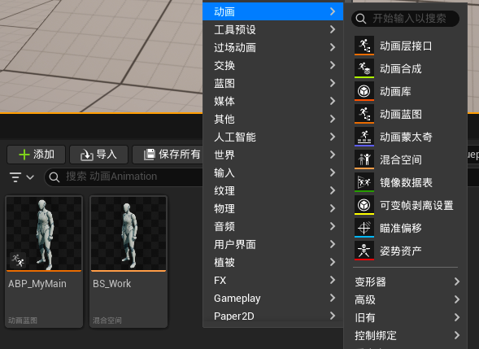

动画序列如下：

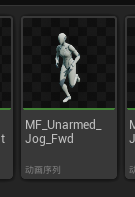

### 配置混合空间
右上角可切换混合空间和动画蓝图来快速查看效果。能切换到的动画蓝图都是使用了当前混合空间的。 

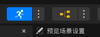

对水平坐标进行相应的设置：
- 命名为speed
- 轴值设置为0-600，对应站立和跑步的速度变化。
- 网格划分，将600划分为2等分，即有0、300、600三个点可以快速设置。
- 与网格对齐，更好的显示拖入到动画序列。
- 平滑时间是指动画结束后，有0.2秒来结束当前动画，防止跑步停止时生硬。

对垂直坐标进行相应的设置：
- 开启网格对齐

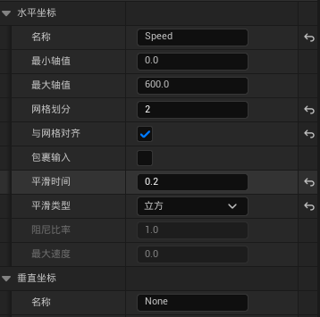

将站立idel和跑步jos分别放在0和600处，然后按住Ctrl移动鼠标即可看到不同speed的值动画的效果。

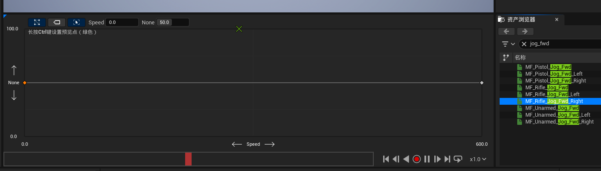

### 配置动画蓝图
在AnimGraph中，右键搜索添加或者在右下角的资产拖入混合空间，然后将输出连接到输出姿势。

同时设置一个变量speed，将其传给混合空间。

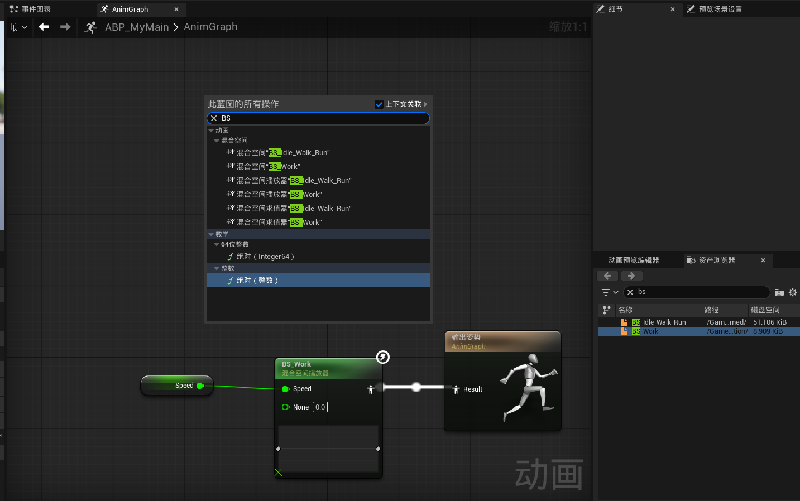

在时间图表中，利用```尝试获取Pawn拥有者```获取角色的移动组件，然后获取移动速度（是一个向量，包含方向）的向量长度，将其设置给speed变量，在每次蓝图更新动画时设置速度。

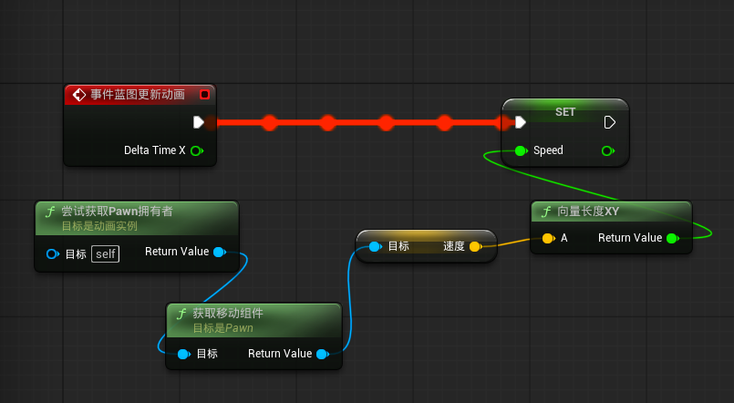

### 实现效果
在角色蓝图中设置已实现的动画蓝图即可看到效果：

<video controls src="assets/video_2026-04-22_23-10-54.webm" title="Title"></video>


