# 视频链接
[FPS游戏开发教程 | UE5制作第一人称射击游戏 | 虚幻引擎5.7 零基础入门](https://www.bilibili.com/video/BV1aw9jBeEHr?p=4&vd_source=5d0525b6127592d0599bf5f5308fa0e6)

## 一、配置游戏模式和输入：玩家按键配置
游戏模式：蓝图类 -> 游戏模式基础

输入：输入 -> 输入操作和输入映射情景（Move、Look、Run、Aim）

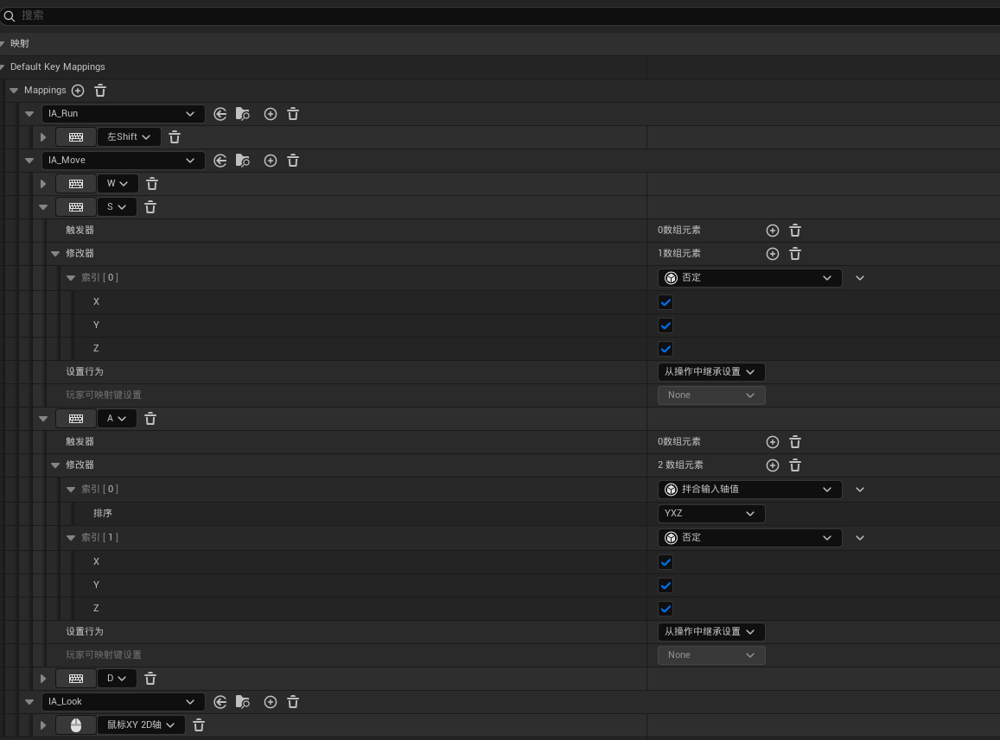

注意事项：想象二维坐标系，向右和向上是x和y轴的正向，针对游戏中就是角色的向前和向右向量，所有A和S进行向后和向左移动时，使用否定修改器。此外W、S和A、D使用不同的轴，所以在A、D上添加拌合输入轴值来对应不同的轴。

## 二、实现基础移动能力（视角旋转、前后左右移动）

实现鼠标控制视角旋转和WSAD控制角色水平移动。

### 绑定输入映射上下文(IMC 也翻译为输入映射情景)

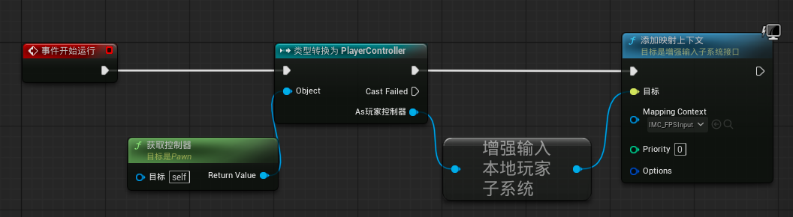

对于多人游戏来说，应该先获取自身控制器，然后将其转换为玩家控制器来绑定IMC。

### 实现视角旋转

虚幻中鼠标上滑默认是视角向下旋转的。处理方式是在IMC中在设置IA_Look时，添加一个否定修改器，来讲Y轴取反。

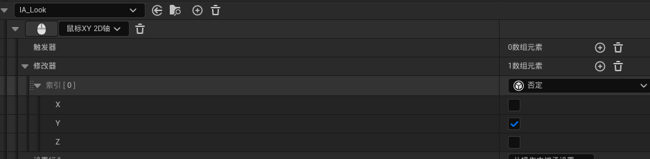

Pitch：绕X轴旋转，即鼠标上下滑动实现视角的抬头和低头。

Yaw：绕Z轴旋转，即鼠标左右滑动实现视角的左右水平旋转。

Roll：绕X轴旋转，如翻跟头。

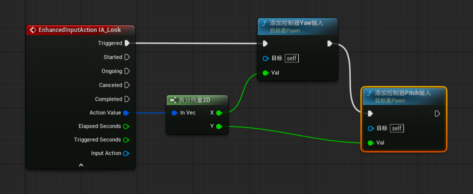

### 实现基础移动

玩家的移动应该是按视角的旋转来旋转移动方向，所以应该从控制器旋转获取其向前、向右向量。

我们要实现玩家水平移动，应该只获取控制器在XY面上的方向，即只获取其XY平面（Yaw）的方向，如果把Pitch加入，玩家的移动会随着抬头减慢移动，最终随着角度增大会停止移动。

Q1：如果获取XY平面的方向，玩家抬头后，方向向量是(0,0,1)，获取Yaw也是(0,0)，按理说应该也是不能移动。

A1:如果我们抬起头看天，随着旋转，其实下巴指向的方向也是会变的，类似这种。 

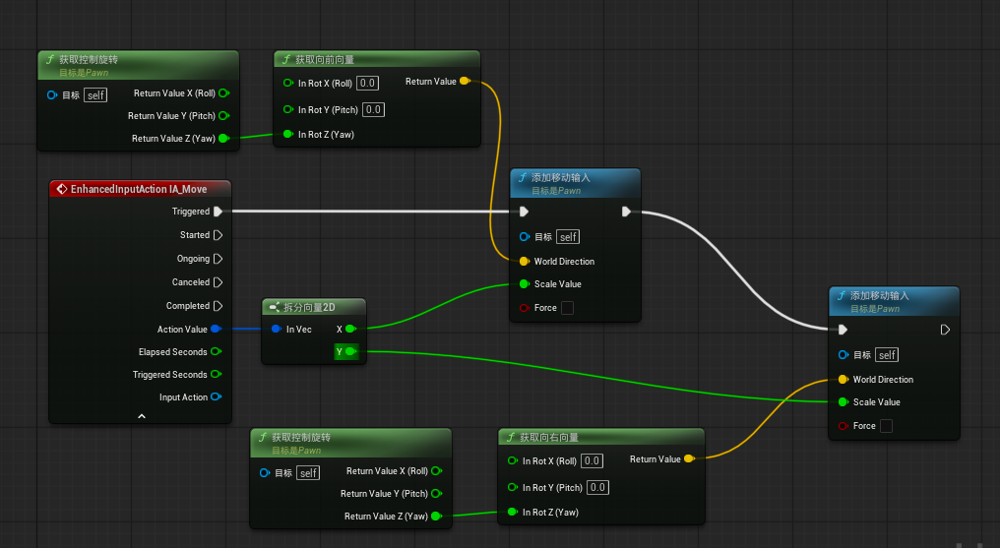

## 三、完善角色细节（添加相机、手臂、枪）
完成手臂、枪（基础枪身、枪管、弹夹、枪托等骨骼绑定）

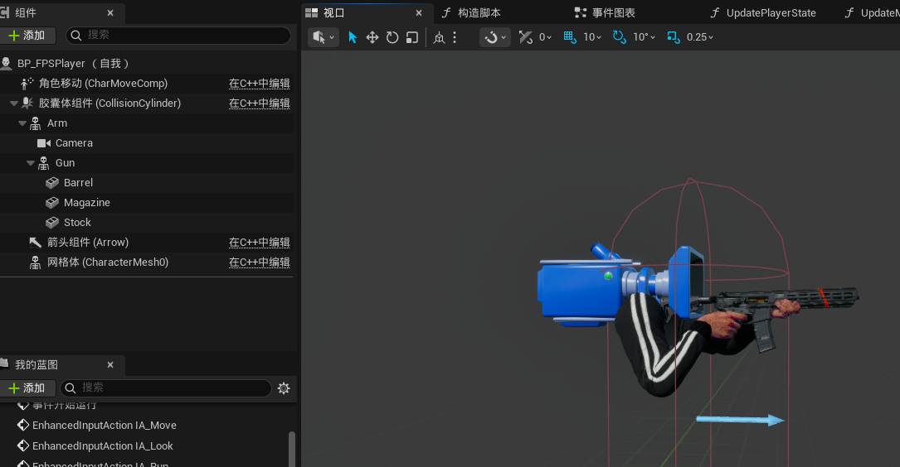

### 实现枪和手臂贴合
目前使用动画资产，实现简单的效果，直接设置手臂和墙身对应的动画资产即可。

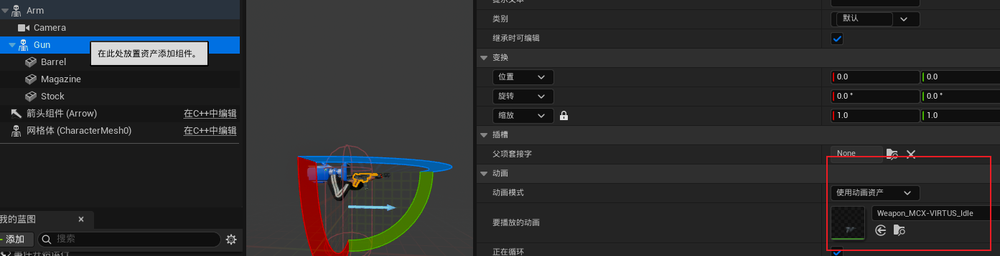

### 实现枪管、弹夹、枪托与墙身绑定。

在插槽处选择对应的插槽即可。

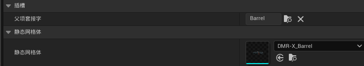

## 四、角色行动能力系统（run、walk、aim）

### 角色状态枚举

创建一个枚举蓝图类，设置角色的四个行为（idle、walk、run、aim）

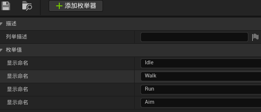

### 角色状态变量设置

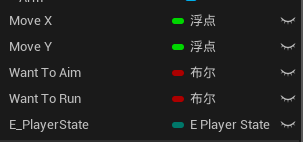

- Move XY 是角色的前后左右移动

- Want to Aim Run 是角色的瞄准和跑

- E_PlayerState 是角色的当前状态枚举值

### 角色状态变量更新逻辑(函数)

对于run和aim，在按相应按键后，设置一个变量保存

- Move XY
    此时X>0时可用于判断是否向前移动，目前Y没有用  
    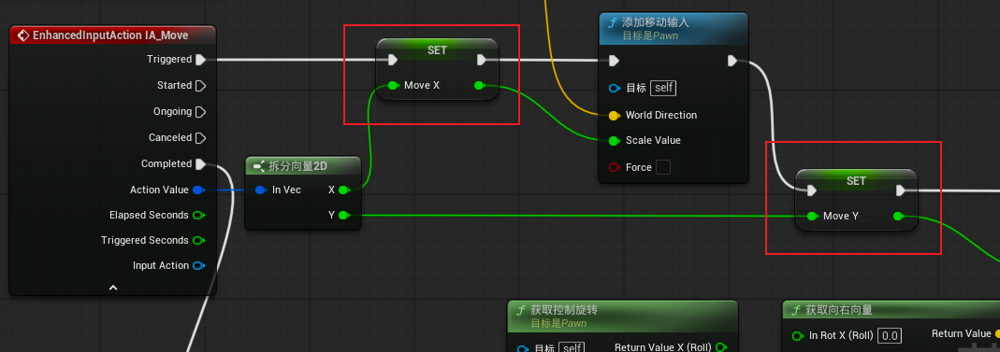

- Want to Aim Run 是角色的瞄准和跑
    无需多言
    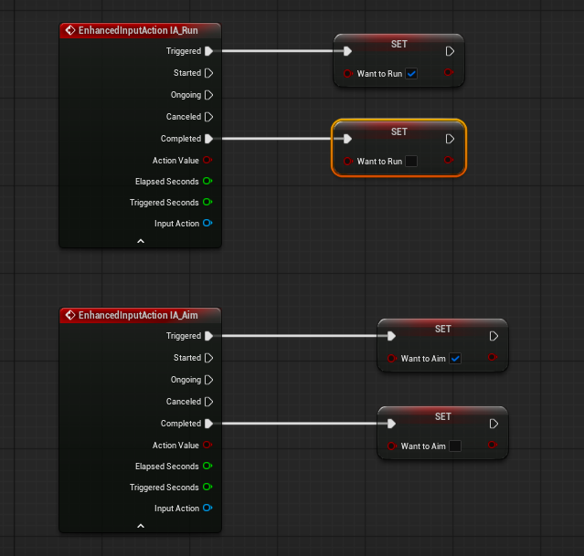

- E_PlayerState 是角色的当前状态枚举值
    根据前面的变量和角色移动组件的移动速度来设置，目前设置的状态优先级：瞄准aim > 跑步run > 行走walk > 空闲idle
    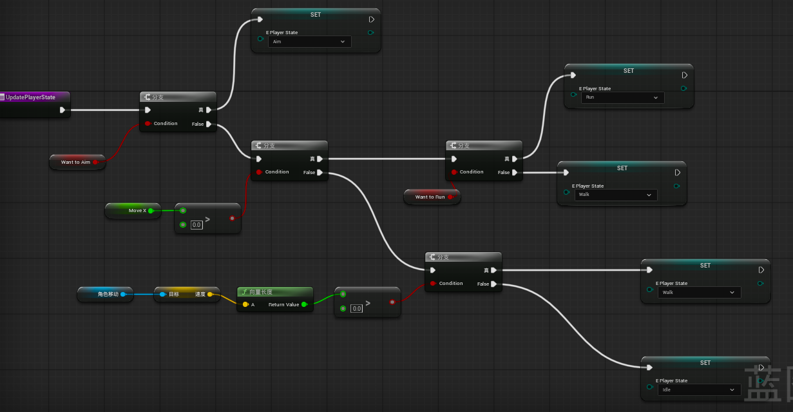

- update move行走速度更新函数
    根据E_PlayerState设置玩家的最大行走速度，实现移动速度随状态变化
    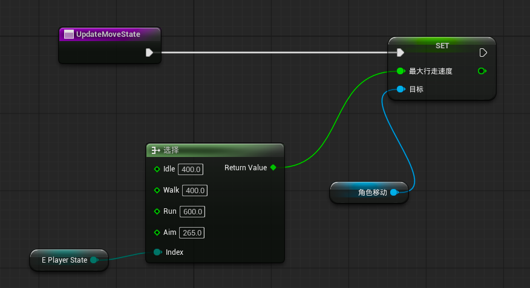

### 事件Tick中更新状态

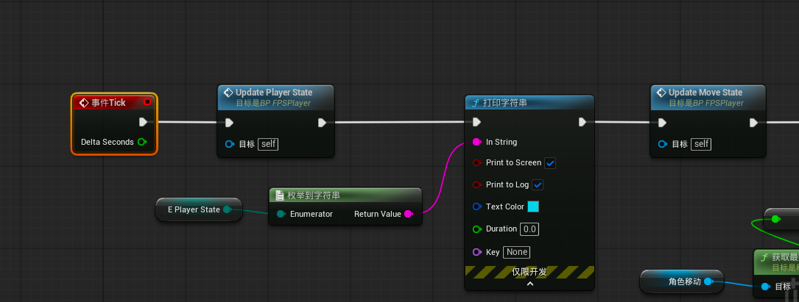

## 实现效果

左上角会显示速度和状态
<video controls src="assets/stg_2026-05-06_00-02-26.mp4" title="Title"></video>

