# 视频链接
[FPS游戏开发教程 | UE5制作第一人称射击游戏 | 虚幻引擎5.7 零基础入门](https://www.bilibili.com/video/BV1aw9jBeEHr?p=4&vd_source=5d0525b6127592d0599bf5f5308fa0e6)


## 一、配置游戏模式和输入：玩家按键配置
游戏模式：蓝图类 -> 游戏模式基础

输入：输入 -> 输入操作和输入映射情景（Move、Look、Run、Aim）

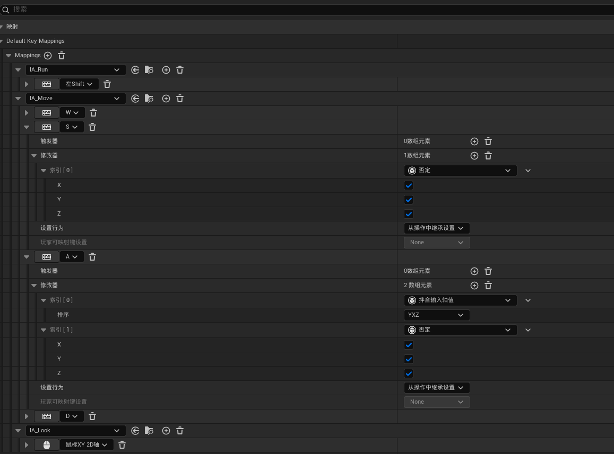

注意事项：想象二维坐标系，向右和向上是x和y轴的正向，针对游戏中就是角色的向前和向右向量，所有A和S进行向后和向左移动时，使用否定修改器。此外W、S和A、D使用不同的轴，所以在A、D上添加拌合输入轴值来对应不同的轴。


## 二、实现基础移动能力（视角旋转、前后左右移动）

实现鼠标控制视角旋转和WSAD控制角色水平移动。

### 1 绑定输入映射上下文(IMC 也翻译为输入映射情景)

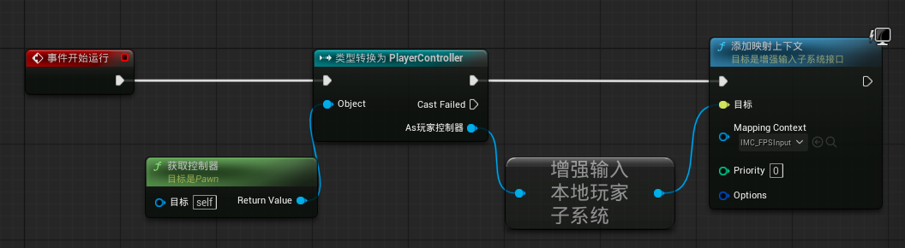

对于多人游戏来说，应该先获取自身控制器，然后将其转换为玩家控制器来绑定IMC。

### 2 实现视角旋转

虚幻中鼠标上滑默认是视角向下旋转的。处理方式是在IMC中在设置IA_Look时，添加一个否定修改器，来讲Y轴取反。

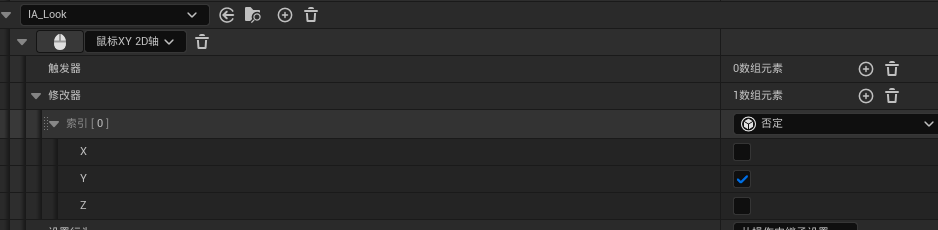

Pitch：绕X轴旋转，即鼠标上下滑动实现视角的抬头和低头。

Yaw：绕Z轴旋转，即鼠标左右滑动实现视角的左右水平旋转。

Roll：绕X轴旋转，如翻跟头。

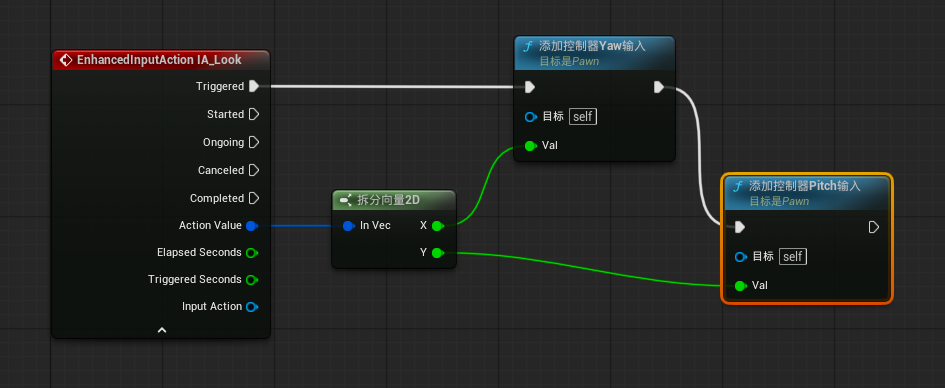

### 3 实现基础移动

玩家的移动应该是按视角的旋转来旋转移动方向，所以应该从控制器旋转获取其向前、向右向量。

我们要实现玩家水平移动，应该只获取控制器在XY面上的方向，即只获取其XY平面（Yaw）的方向，如果把Pitch加入，玩家的移动会随着抬头减慢移动，最终随着角度增大会停止移动。

Q1：如果获取XY平面的方向，玩家抬头后，方向向量是(0,0,1)，获取Yaw也是(0,0)，按理说应该也是不能移动。

A1:如果我们抬起头看天，随着旋转，其实下巴指向的方向也是会变的，类似这种。 

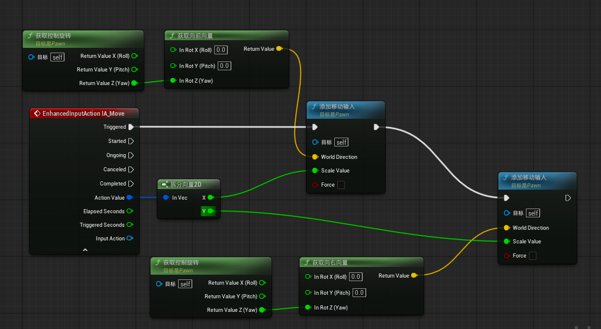


## 三、完善角色细节（添加相机、手臂、枪）
完成手臂、枪（基础枪身、枪管、弹夹、枪托等骨骼绑定）

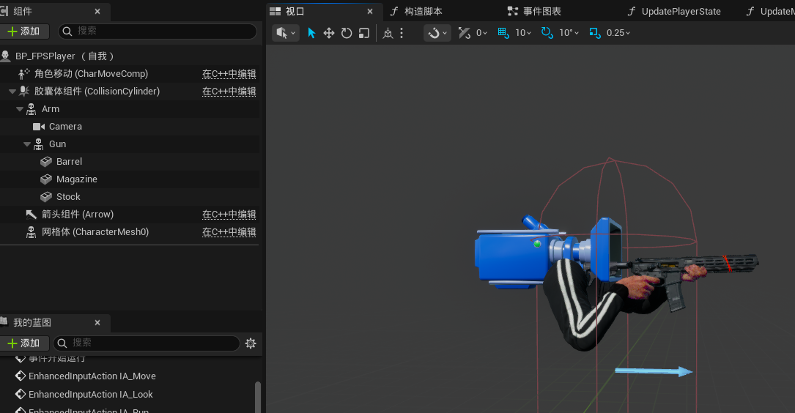

### 1 枪和手臂贴合
目前使用动画资产，实现简单的效果，直接设置手臂和墙身对应的动画资产即可。

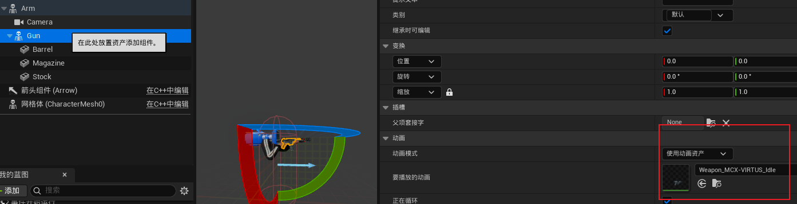

### 2 枪管、弹夹、枪托与墙身绑定。

在插槽处选择对应的插槽即可。

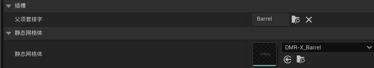

## 四、角色行动能力系统（run、walk、aim状态变量设置）

### 1 角色状态枚举

创建一个枚举蓝图类，设置角色的四个行为（idle、walk、run、aim）

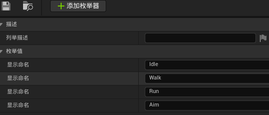

### 2 角色状态变量设置

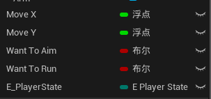

- Move XY 是角色的前后左右移动

- Want to Aim Run 是角色的瞄准和跑

- E_PlayerState 是角色的当前状态枚举值

### 3 角色状态变量更新逻辑(函数)

对于run和aim，在按相应按键后，设置一个变量保存

- Move XY
    此时X>0时可用于判断是否向前移动，目前Y没有用  
    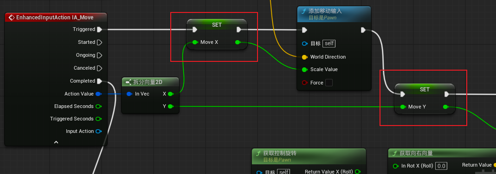

- Want to Aim Run 是角色的瞄准和跑
    无需多言
    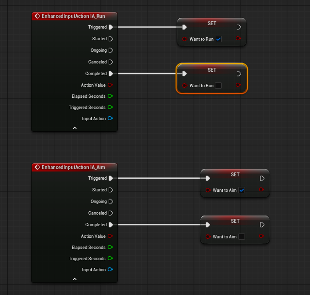

- E_PlayerState 是角色的当前状态枚举值
    根据前面的变量和角色移动组件的移动速度来设置，目前设置的状态优先级：瞄准aim > 跑步run > 行走walk > 空闲idle
    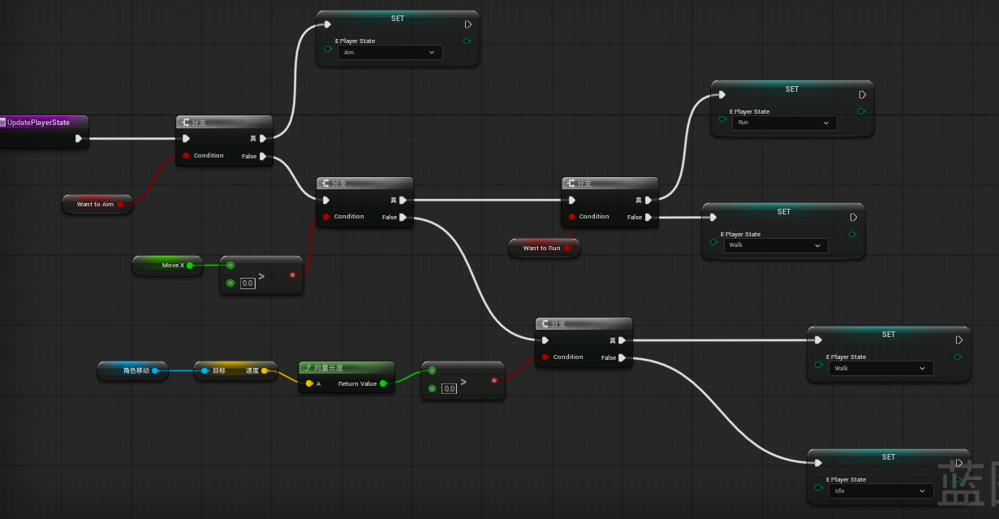

- update move行走速度更新函数
    根据E_PlayerState设置玩家的最大行走速度，实现移动速度随状态变化
    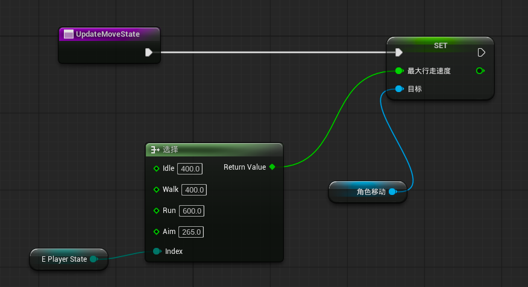

### 4 事件Tick中更新状态

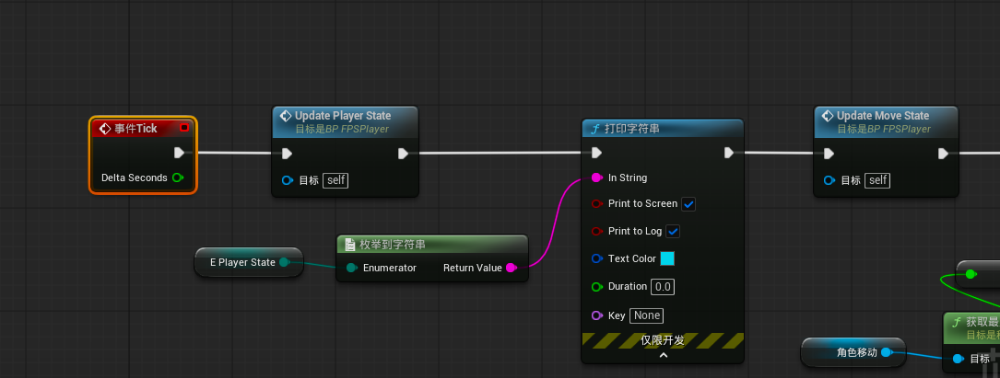

## 实现效果

左上角会显示速度和状态  
<video controls src="assets/stg_2026-05-06_00-02-26.mp4" title="Title"></video>


## 五、动画系统（walk、idle、run、aim等持枪动画与转换）

本节实现手臂动画和枪的动画一致性，并且支持动画在idle、walk、run、aim丝滑切换，不卡手。由于角色的动画和枪的动画实现逻辑一致，后续讲解不涉及枪了。

### 1 相关资产介绍

代码存放目录

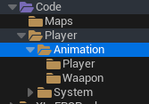

使用动画蓝图和混合空间进行动画系统开发：

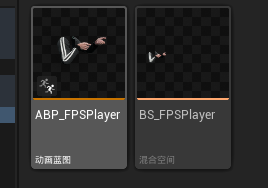

- 动画蓝图：使用状态机来控制动画切换逻辑
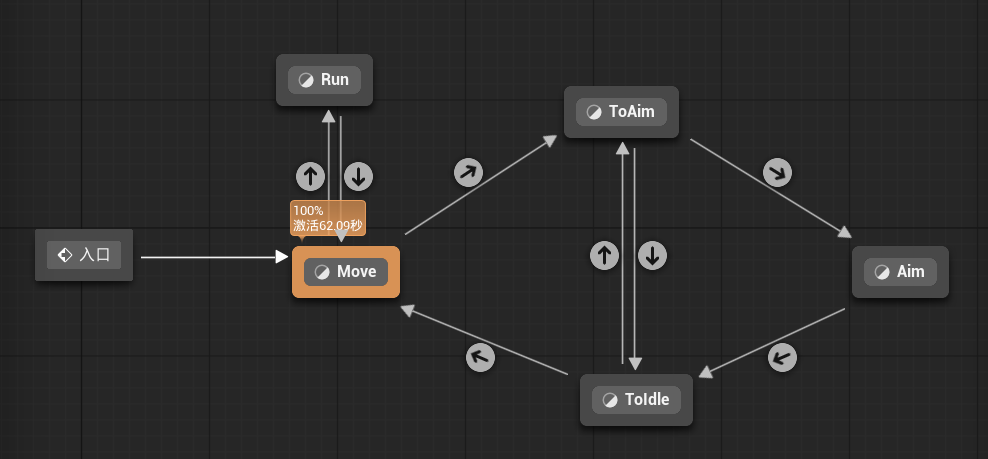
- 混合空间：可以使用二维坐标系，来将不同的动画进行混合播放
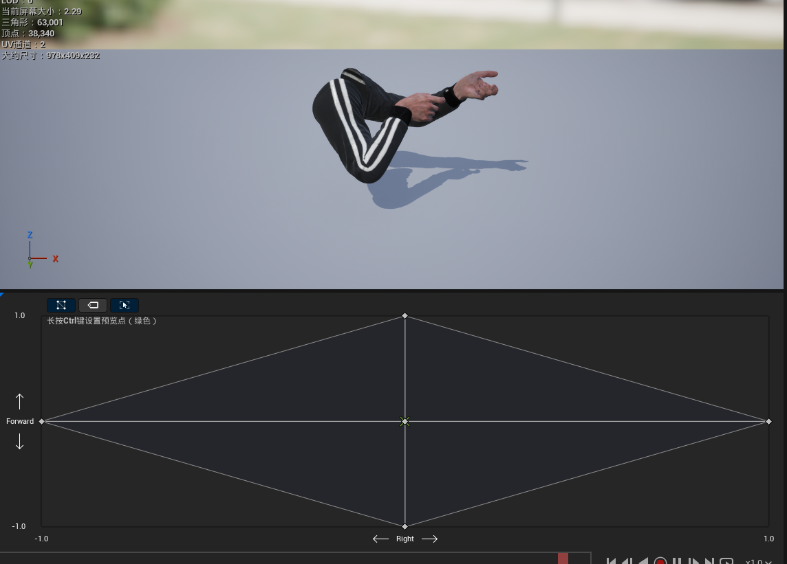


### 2 实现流程概述
1. 对于稍微复杂的，创建BS混合空间处理Move(Idle、前后左右Walk)，可以适当参考我们创建的IA输入操作，每个操作基本上就是一个单独的动画，而且还需要考虑操作直接的过度动画。
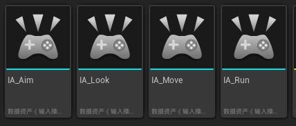
2. 创建动画蓝图，实现不同状态的动画以及状态切换。
3. 将动画蓝图实装到角色蓝图中。

### 3 混合空间 Move实现
使用混合空间，设置每个轴代表的含义：
- X轴（水平坐标）代表左右移动动画
- Y轴（垂直坐标）代表前后移动动画
- 网格分化为2即可，一共三个点，中间的点代表idle站立即可。

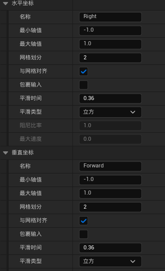

知识回顾：在实现角色移动时，我们使用了一个IA_Move是一个二维向量(X,Y)，每个值可以为-1,0,1。其中对于X轴，设置为W/S进行前后移动，对于Y轴，设置A/D进行左右移动。
那么为什么不是X代表左右、Y代表前后呢？

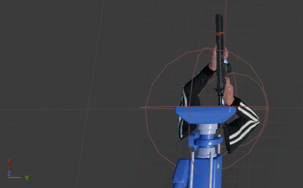

打开角色蓝图，可以发现，X轴正方向就是角色的向前方向。结合引擎提供获取角色的向前和向右向量，可以得知UE引擎底层设计就是向前和向右分别是X，Y轴的正方向，且默认X的右手是Y轴正方向。可能是这种符合人类直觉，因为在将WS/AD作为角色前后/左右移动时，确实X/Y轴可以直接对应。但正常人逻辑（或者说最常见的XY坐标系是X正方方是向右、Y的正方向是向前）可能会角色反直觉，正常人应该想的是俯视看角色，角色的坐标系应该为X左右，Y上下的。

服了，豆包绝了，问个问题给我颠倒黑白的。

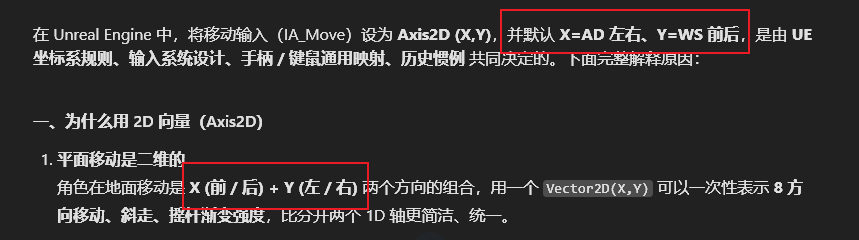

将不同的资产动画拖入，X轴是左右，Y轴是前后，记得中间别忘了Idle动画。可以注意这里我们X轴是左右，和设计角色移动时的X是前后是相反的。这里原则上也可以设置为X为前后，Y为左右，但现在这种设计比较符合直觉（通常坐标系是X是左右）。

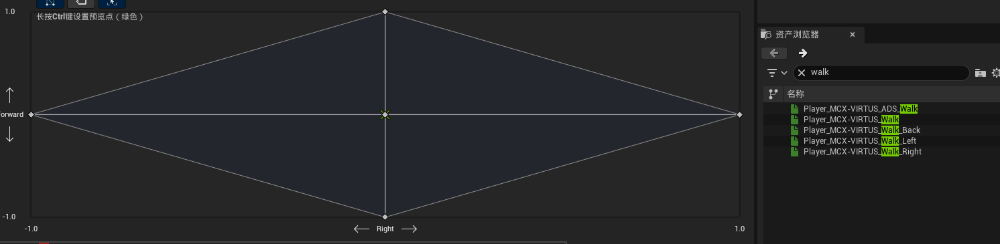

目前实现了Move的动画设置。

### 4 动画蓝图实现动画切换

获取实装到的角色蓝图，将需要的变量获取，可提前获取，也可在编写状态机时按需获取。

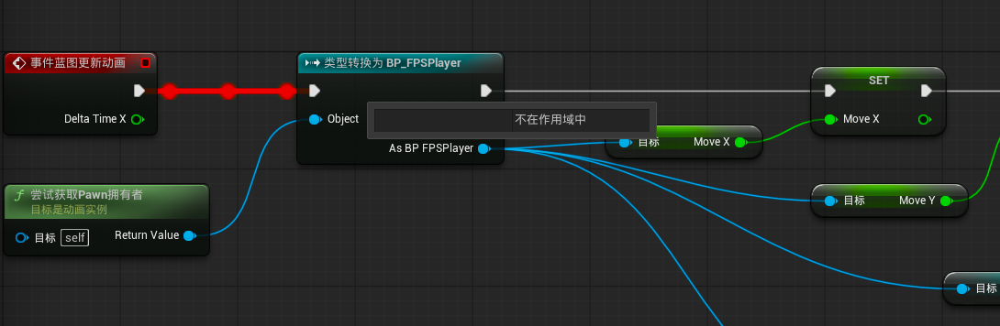

创建一个basic状态机

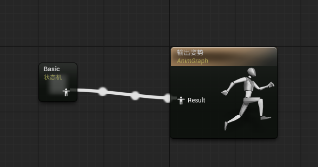

设计不同状态的切换逻辑，利用角色蓝图中保存的相关表示状态的变量实现不同状态之间的跳转。

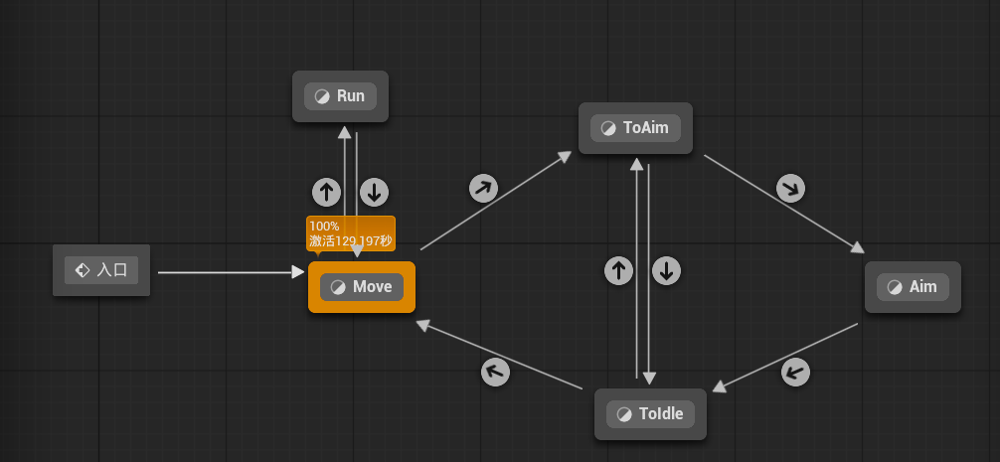

- 对于Move，将Move Y作为X轴（左右）变量，Move X作为Y轴（前后）变量
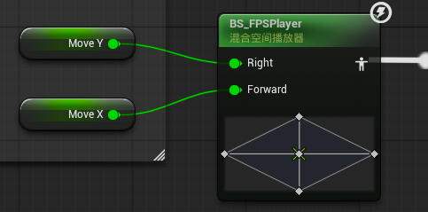
- 对于Aim，需要考虑是站立瞄准还是walk时瞄准
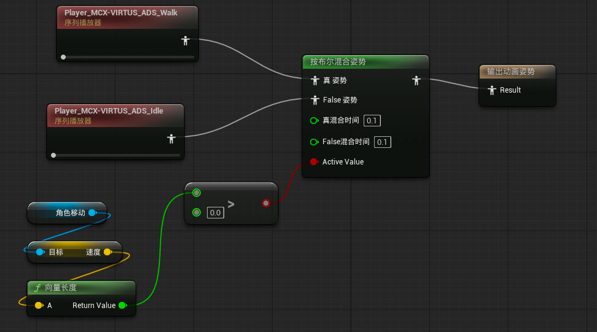
- 对于ToAim和ToIdle需要有相关动画资产才可以实现，且该状态是为了让操作丝滑跟手。如果不设置，用户快速点击aim瞄准键，会出现，枪前瞄准，等瞄准动画完成后再做瞄准动作，会有一种停顿感。

### 角色蓝图中实装效果
角色和武器的动画蓝图实现逻辑相同，且要保持里面使用到的一些关键参数需要保存一致（判断动画剩余时间>x时，x在两者中保持一致）。

<video controls src="assets/stg_2026-05-12_22-19-12.mp4" title="Title"></video>

## 六、模块化设计+Bug

### 1 强耦合关系

角色与武器强耦合

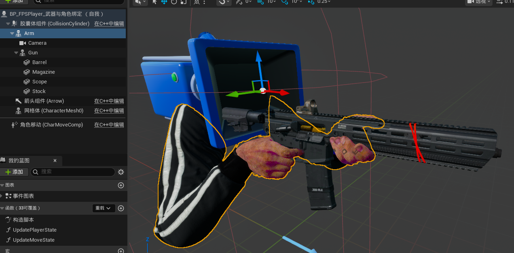

### 2 解耦合

创建一个强的基类（有通用变量，如子弹数，弹夹数等），在创建一个卡宾枪的类基础该基类。

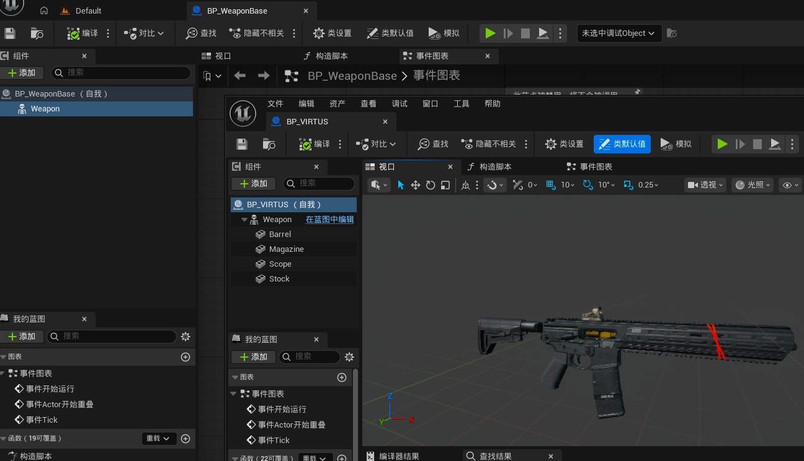

在角色蓝图中，创建一个函数，用来加强的蓝图类绑定为自己的组件，然后在角色蓝图的时间开始运行后执行该函数。

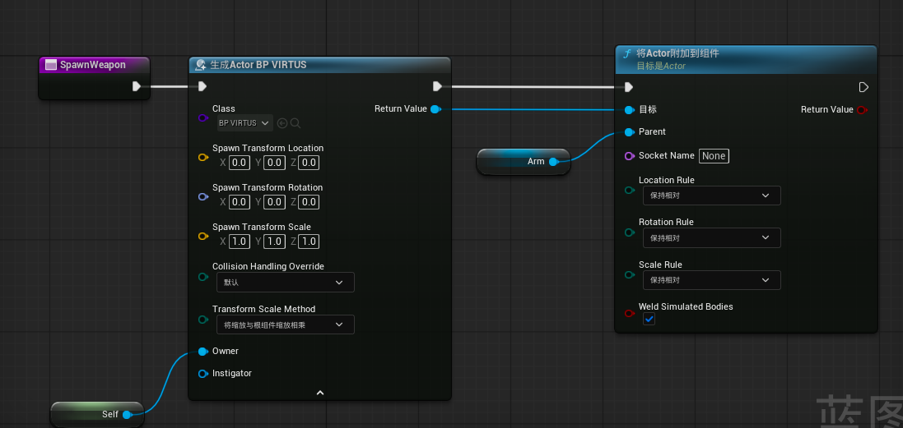

### 3 模块化设计前、设计后都存在的bug

cast to 是比较费时和费内存的操作，为了提升性能，将其在动画蓝图初始化时就将其获取，保存为自身的变量，就不需要反复cast to了。

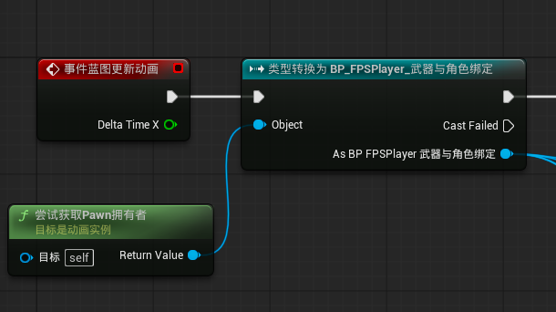

我们保存的是玩家角色的对象引用，当动画更新时时手臂和枪是同时向玩家角色对象获取状态信息的，此时就可能出现他们获取的时间不是同一帧。

处理思路：可以让武器直接获取手臂的动画蓝图对象，使用其保存的状态信息，可以保证武器的动画始终是在手臂之后执行的，与手臂对其。

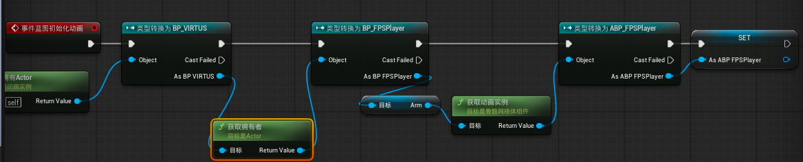

bug演示：run时疯狂aim

<video controls src="assets/stg_2026-05-13_00-55-12.mp4" title="Title"></video>

修改后：

<video controls src="assets/stg_2026-05-13_00-55-12-1.mp4" title="Title"></video>


## 七、完善的瞄准系统

### 1 当前问题
1. 瞄准时，摄像头没有进入瞄准位置（倍镜准心不在中间）
2. 当快速滑动鼠标时，准心变成一条线
3. 瞄准时没有倍率

<video controls src="assets/stg_2026-05-18_23-25-33.mp4" title="Title"></video>


- 枪械骨骼设置aim插槽，记录位置
- 在枪械父类实现函数：保存aim插槽的位置（变量），同时该函数返回该变量的值。子类在重载函数中查找
- 当触发aim时，函数执行流程：动画蓝图->角色蓝图->武器蓝图。因此对应蓝图需要保留对应的变量。
- 在角色蓝图中保留武器实例的对象。
- 保存状态机为缓存姿势，类似于引用，可以多次使用，如果直接复制一个状态机，相当于创建两个状态机实例
- 使用混合姿势节点，对aim的姿势进行骨骼的修改。修改骨骼节点中平移模式为替换现有项，平移空间为世界场景空间。因为在武器基类中，获取aim插槽函数是获取世界空间的。
- 角色动画蓝图中使用了角色蓝图中的武器变量，有可能出现角色蓝图对象已经加载了，但武器对象没加载，所以角色蓝图中使用时，可以在对武器变量进行有效判断

- 倍镜的材质3，半透明通道改为动态模糊后

### 2 解决摄像头未在瞄准位置
#### 1 实现思路
- 摄像头需要设置的位置：

    在武器的骨骼中设置一个aim插槽，在武器蓝图基类实现获取aim插槽的世界空间位置函数，并返回该位置。
- 变量的传输：

    角色蓝图中保存武器实例，动画蓝图通过角色实例获取武器实例，此处有角色实例和武器实例加载顺序问题，在使用角色实例中的武器实例变量前，使用isValid来判断武器是否已经加载。
- 瞄准动画的设置：

    将basic状态机设置为缓存姿势，以便可以多次引用。使用根据E_Player_State的混合姿势，将basic直接设置为默认姿势。然后右键创建一个aim姿势引脚，将basic姿势后执行一个变换骨骼函数，实现head摄像头骨骼移动到aim插槽的位置。

#### 2 aim插槽和武器蓝图基类
找到武器的骨骼，并在body下设置aim骨骼，调整好位置。

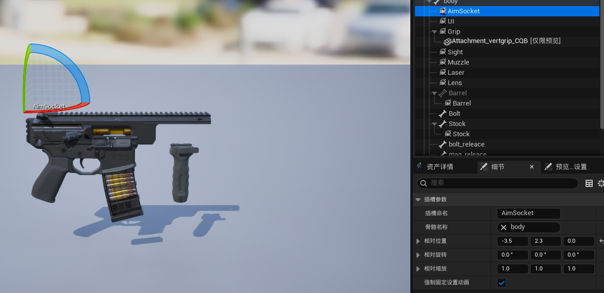

在武器基类实现```获取aim插槽位置```函数

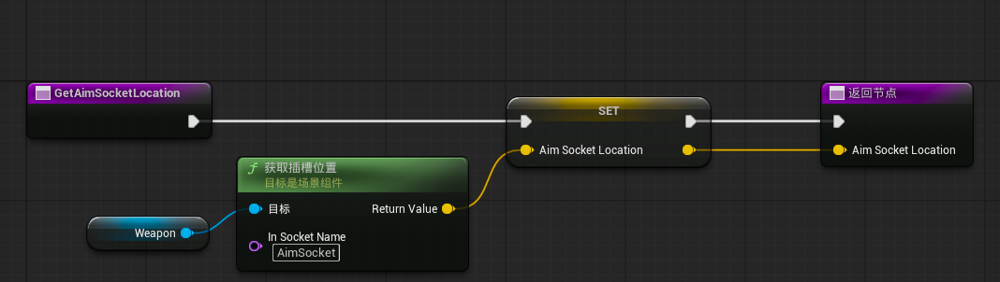

#### 3 角色蓝图中保存武器变量

在原先的```生成武器```函数中，将武器变量保存。

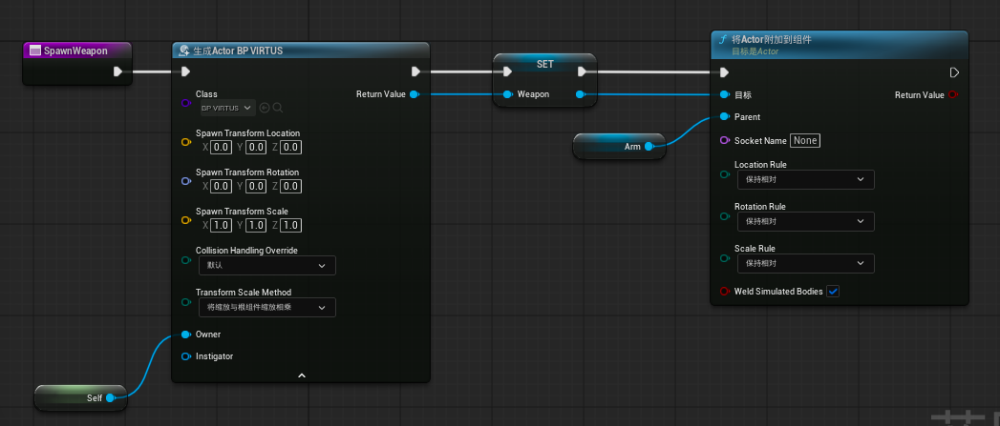


#### 4 角色动画蓝图实现aim

角色蓝图设置aim插槽位置变量，在事件蓝图更新动画节点处通过角色实例更新该变量。

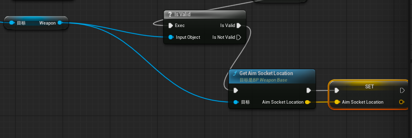

将basic状态机保存为缓存姿势，然后可以多次使用。创建混合姿势，添加aim引脚，在aim姿势处，使用变换骨骼函数，将缓存姿势中的head骨骼位置修改。

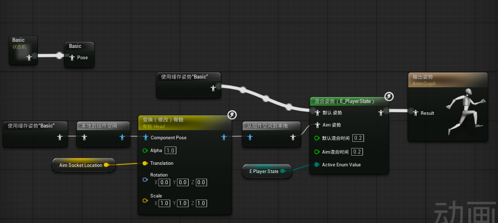

变换骨骼函数节点的细节设置：

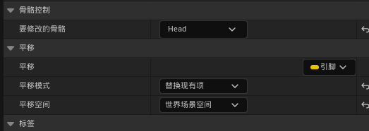


### 3 解决瞄准点快速移动成为一条线

找到武器瞄准镜scope骨骼的材质

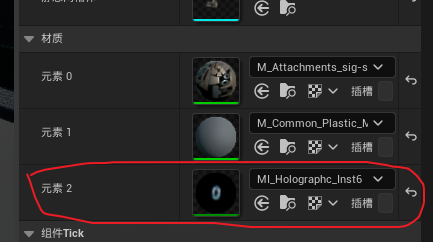


找到其材质，不是材质实例。将半透明通道修改为动态模煳后，简单理解就是原先渲染的点支持模糊渲染，导致点的滑动存在轨迹。

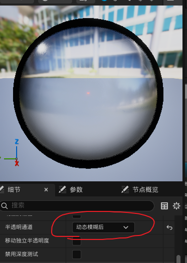


### 4 解决开镜后没有倍率

目前使用的方法是设置相机的视场FOV(Filed of view)

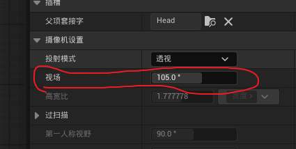

#### 1 角色蓝图的变量
保存DefaultFOV和AimFOV来存储默认和瞄准时的fov。

一般不建议算法没写就设计好变量及其类型，除非流程很固定且熟悉，可以在事后进行设计。

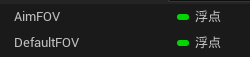

#### 2 DefaultFOV初始化

在角色蓝图的开始运行事件后执行

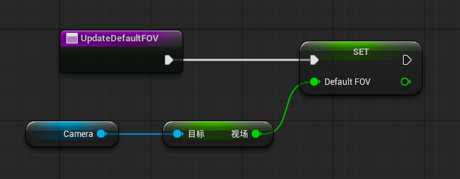

#### 3 aim按键触发执行代码

执行逻辑：在一帧内将当前的FOV向目标AimFOV移动一步。由于aim按键松开（完成）后的执行逻辑中有一个定时器，需要将其关闭。
解决的是用户快速按右键，导致从AimFOV移动到DefaultFOV的时间段还没结束，需要立刻停止aim按键松开的事件。

F插值到：根据当前值current尝试给出一个接近值来到达目标值target，给出的接近值根据时间DeltaTime和速度InterpSpeed。
- DeltaTime（▲t） *  InterpSpeed（v） =  路程（s即target-current）。所以current到达的target受时间和速度的影响。
- DeltaTime通常是帧的时间差量，确保每帧都丝滑增加。但是否可以制作变速，来实现其他效果？
- InterpSpeed是插值速度，越大到达的越快。

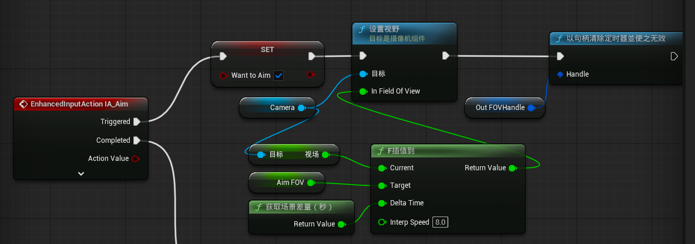

#### 4 aim按键松开执行代码

执行逻辑：设置一个定时器，不断将当前FOV从AimFOV变为DefaultFOV。

使用定时器的原因：aim按键触发Triggered是按下时连续执行的，但按键松开completed后起后续节点只执行一次，所以需要一个定时器来连续执行。FOV值改变逻辑和触发时相同。

需要将定时器作为变量以为触发Triggered时将该定时器关闭clear，同时需要添加当当前FOV到达AimFOV时将定时器关闭clear。

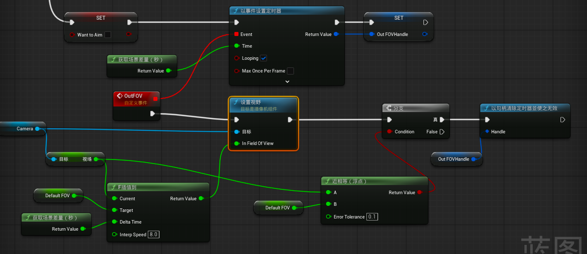

## 八、完善瞄准时的灵敏度

本能认为在IA_Aim处设计，但目前看在IA_Look实现更简洁。

实现思路：将键盘输入的值[-1,1]的值进行缩放即可。

创建一个函数，根据玩家状态来让aim时为正常的0.4倍。

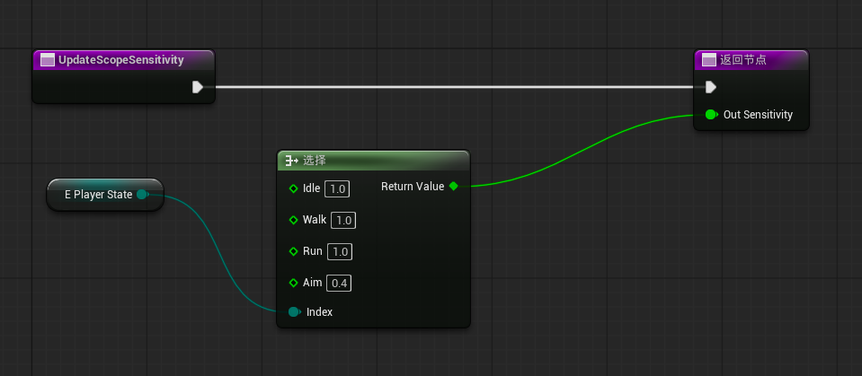

对IA_Look的输入x和y进行缩放，其中的MouseSensitivity则可以动态设置正常的灵敏度。

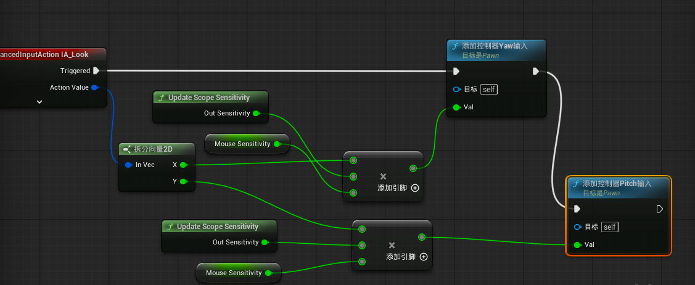


## 九、角色设置武器可动态化

最初的生成武器函数中使用了```生成actor```是指定了class为BP_VIRTUS，游戏运行后就无法改变。

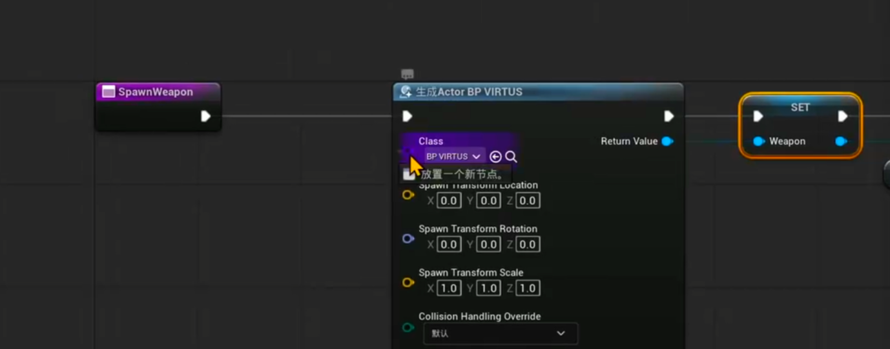

因此需要将其提升为变量，来运行时指定。同时由于原先将Weapon作为变量保存给动画蓝图等使用，weapon变量是BP_VIRTUX，因此应该将其作为武器基类BP_WeaponBase来保存。所以需要后续角色蓝图等中使用该变量时，只能使用基类的函数、变量。

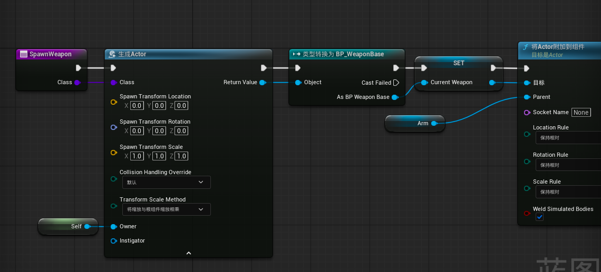

动画蓝图使用的变量需要及时更改。

Ctrl+鼠标左键点击，可以将两条线合并拖出，然后再连到需要的地方。

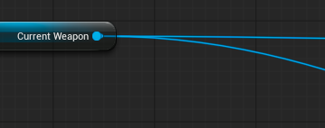


## 十、开火蒙太奇动画


### 1 键盘输入设置

创建IA_Fire，为数字（布尔），在IMC中设置设置鼠标左键

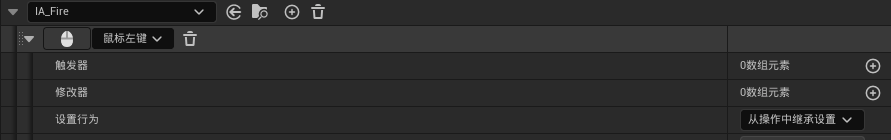


### 2 判断是否允许开火

只有在角色不处于正在开火、死亡、run的时候才可以开火，也就是isFiring or isDead or isRun 为 true都不能开火。

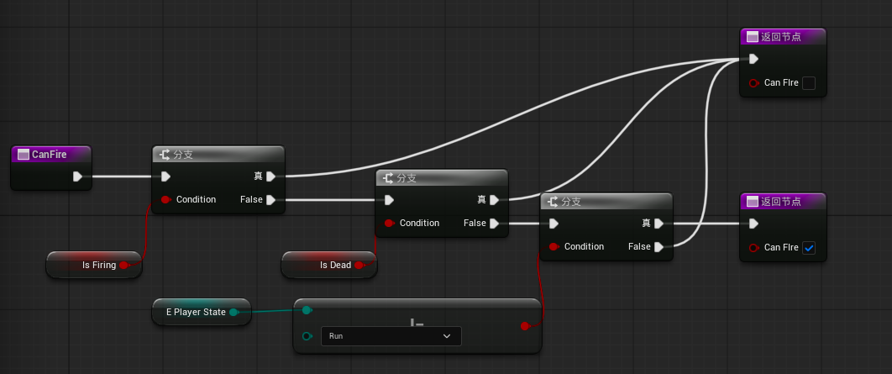

优化性能：

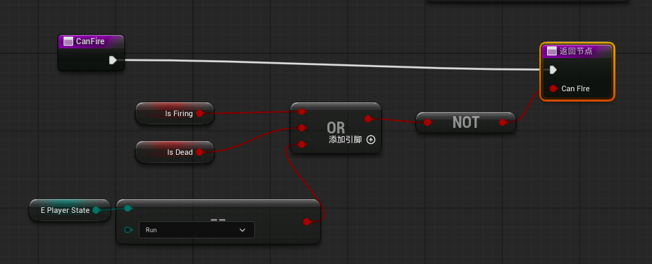

### 3 蓝图接口：角色向武器组件发送开火消息

当前实现逻辑：武器实现蓝图接口，角色判断可以开火后向武器发送消息，执行在武器蓝图中实现的接口。武器蓝图中负责播放角色和武器的动画，且保存了要播放的资产。

q：为什么是角色向武器发送信息，而不是直接在角色中直接直接执行动画？
a：首先武器不能向角色发送开火。对于当前角色蓝图保存的是武器基类，如果是直接在角色蓝图中执行，则需要额外保存武器类本身而不是基类，不然会存在cast to的资源浪费。其余好像都可以实现。
目前没发现不在角色中使用的坏处。
目前觉得好处：武器与角色解耦，角色只负责输入，武器处理行为。且如果执行逻辑在武器，如果有多个角色蓝图，可以直接调用武器的开火逻辑。但武器蓝图中就需要支持能不同角色蓝图调用。

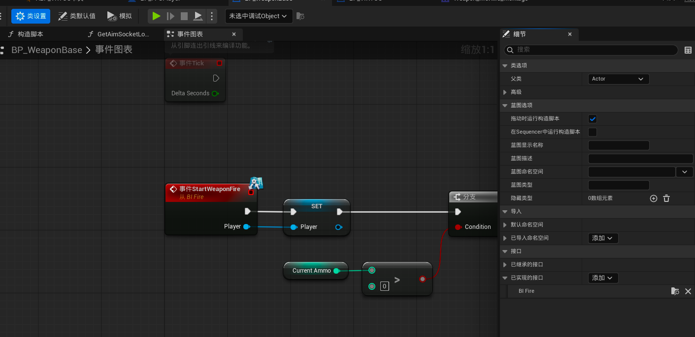

角色蓝图判断可以发火后调用武器的蓝图接口

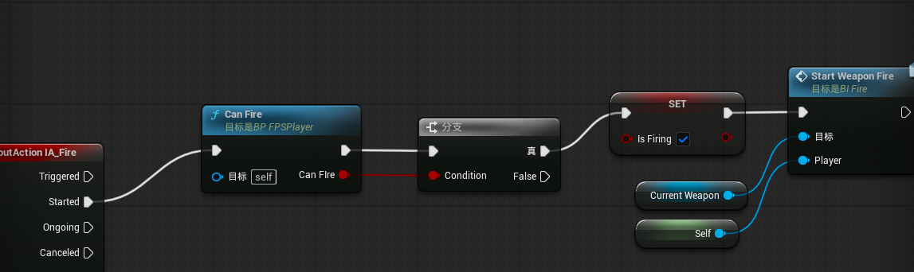

需要注意的时，实现该接口的开火函数需要将角色对象传入。

### 4 武器开火接口实现


使用播放蒙太奇函数，指定武器的骨骼和角色的骨骼。

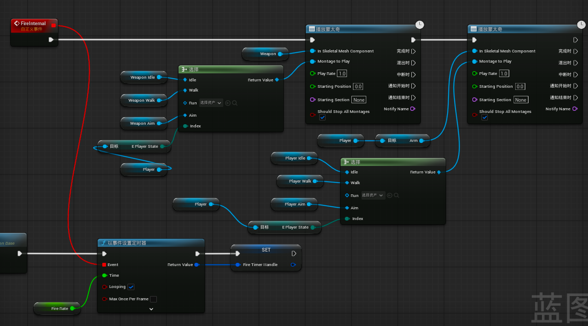

由于定时器会先等待Time参数才开始循环执行事件，所以可以先执行一次事件，再执行定时器。

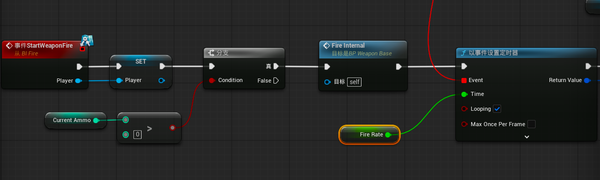

### 5 开火结束

武器基类创建停止定时器函数

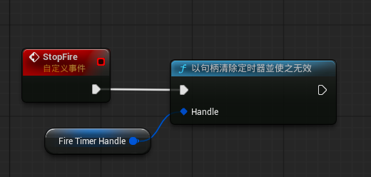

IA_Fire事件完成后执行停止开火

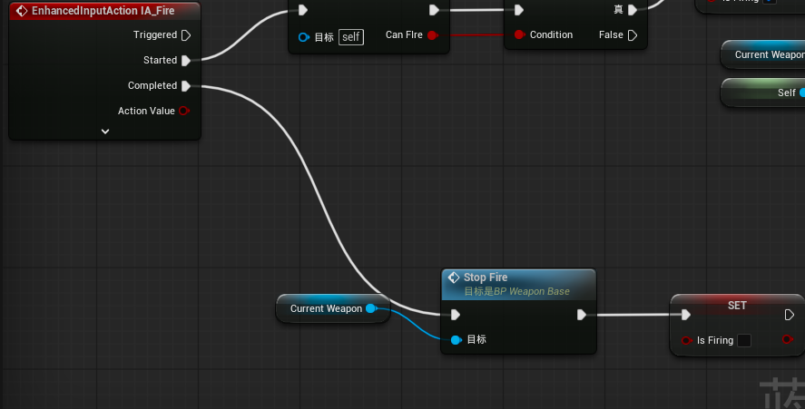

### 5 解决开火枪身抖动小

找到动画蒙太奇设置为下面的。

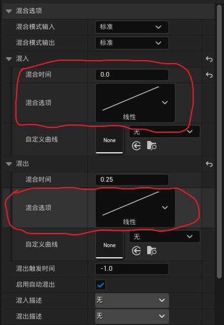

### 6 效果

<video controls src="assets/stg_2026-05-23_02-48-24.mp4" title="Title"></video>


## 十一、bug

奔跑时可开火：当前开火逻辑是在点击左键后判断是否为run，但当用户一直点击开火时，用户可以奔跑。

<video controls src="assets/stg_2026-05-24_20-22-32.mp4" title="Title"></video>

目前简单解决方法：奔跑时判断是否为开火

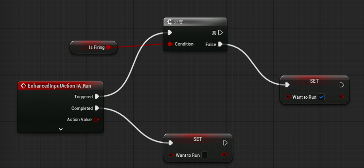

后续想法：利用状态机机制，相应动作事件开始时（如IA_Run），先使用状态更新函数，然后判断更新后是否为想要的状态来执行相应动作。

## 十二、MetaSound实现音效

创建音效文件：右键 -> 音效 -> MetaSound源

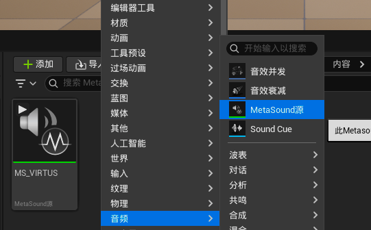

获取一个随机值，从0.9到1.1。

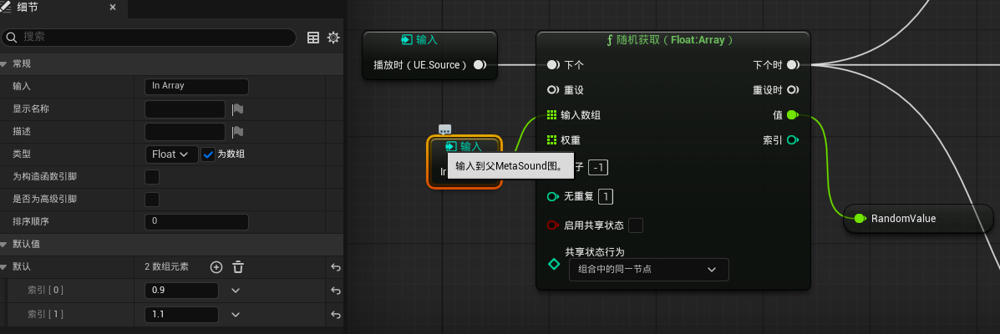

使用随机获取函数：从输入数组中随机选择一个音效。

选择三个音效进行播放，复杂一点。

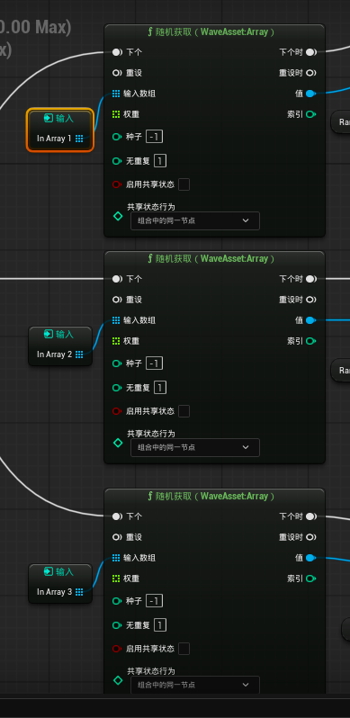

使用声波播放器进行音效资产播放，音高频移偏移是指音量的高低，使用原先的随机值来让声音变化丰富一点。

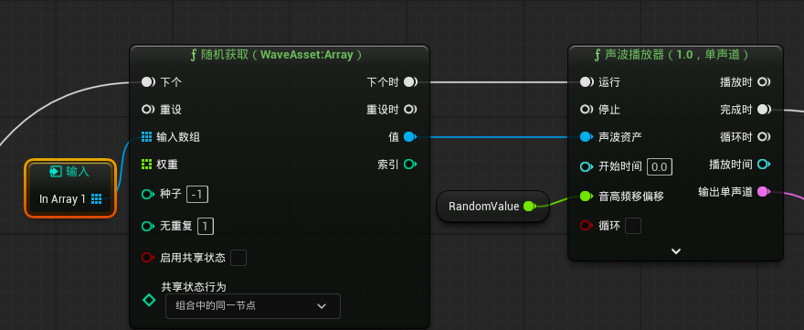

使用单声道混音器，将三个音效混合输出，由于第一个音效资产中的时间最长，可以将其作为整个音效结束时间点。

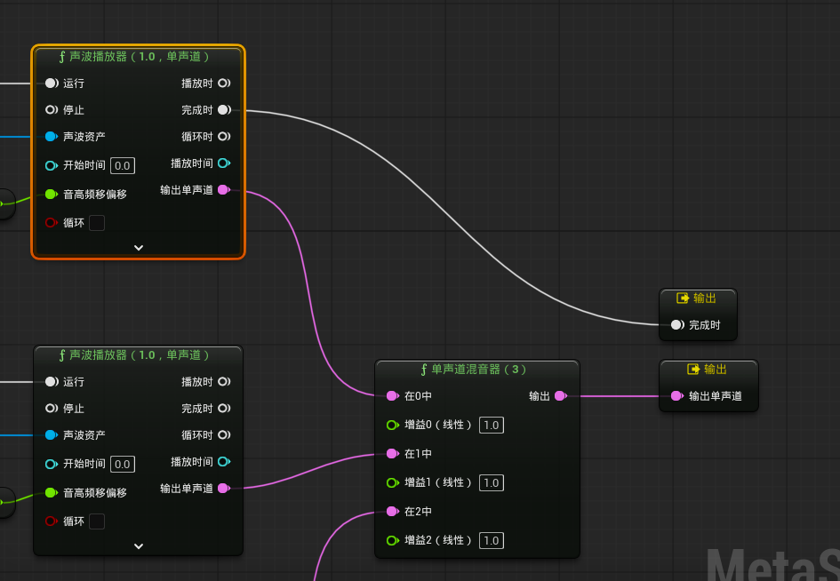

开火播放动画后执行音效，选择相应的资产。

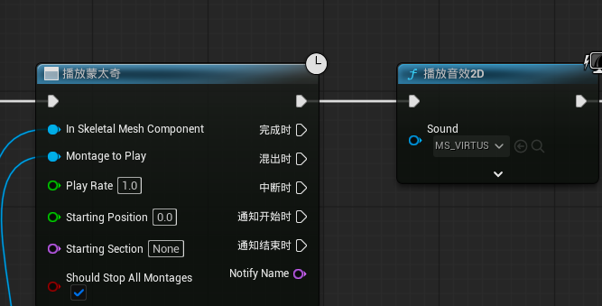


## 十三、Niagara开火特效

在BP_VIRTUX中找到barrel枪管的静态网格体，然后添加一个插槽叫做枪口Muzzle来指定特效播放位置。

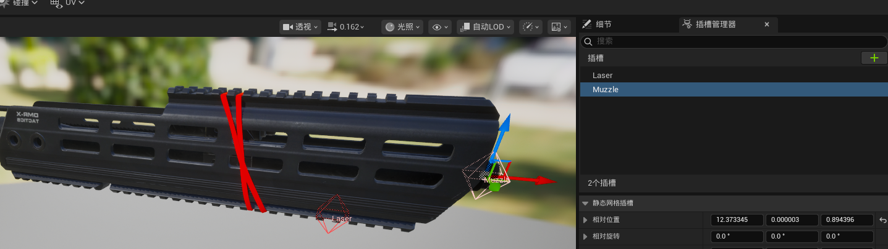

武器基类开火逻辑中使用Spawn System Attached来添加特效。

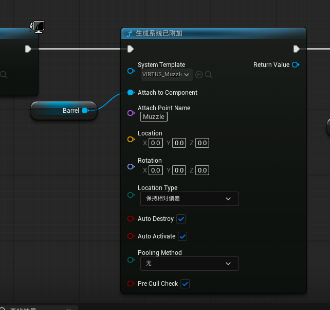

特效相关属性设置

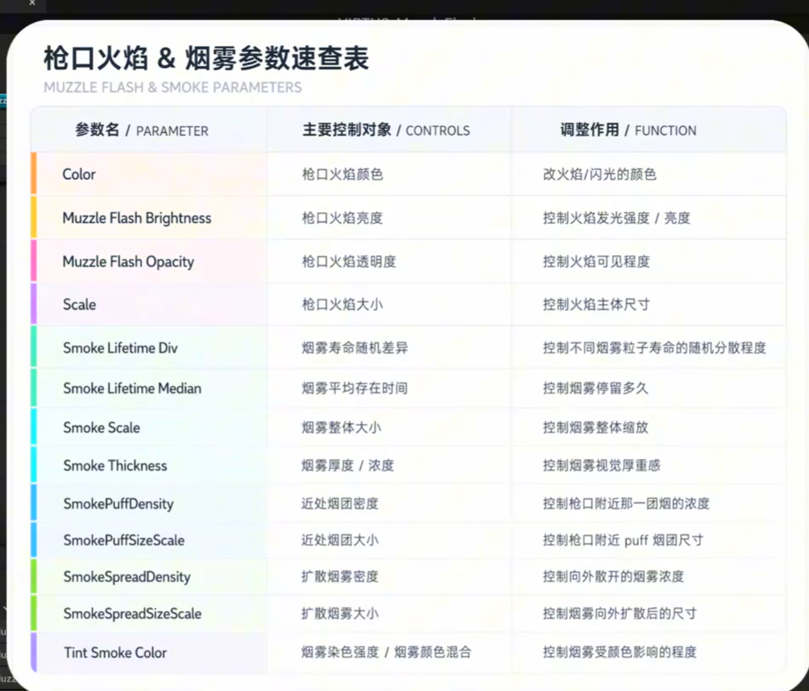


## 十三、开火时生成弹壳

创建BP_Casing弹壳蓝图，添加静态网格体、发射物移动组件、旋转移动组件。
- 静态网格体选择弹壳
- 发射物负责给物体的初始速度
- 旋转负责给物体旋转速率

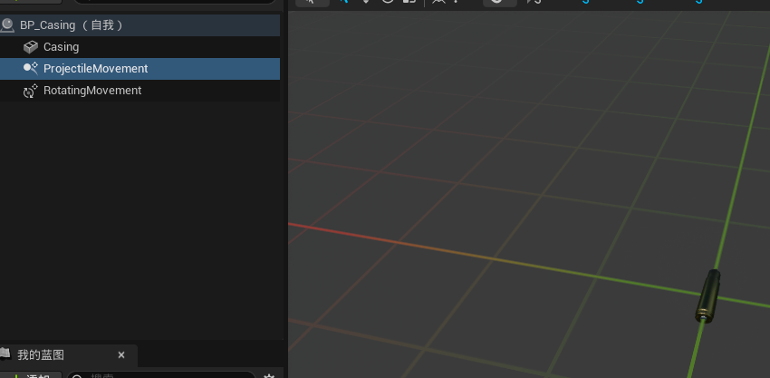

发射物设置初始速度。

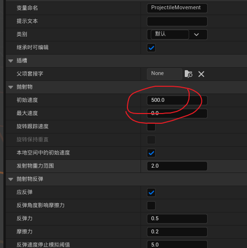

弹壳创建后设置旋转速率（即每秒旋转的角度）。

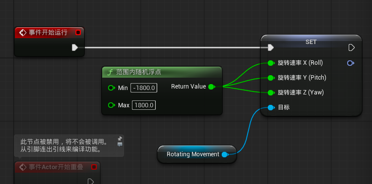

当组件与其他物体重叠时，生成音效，然后去除旋转速率。

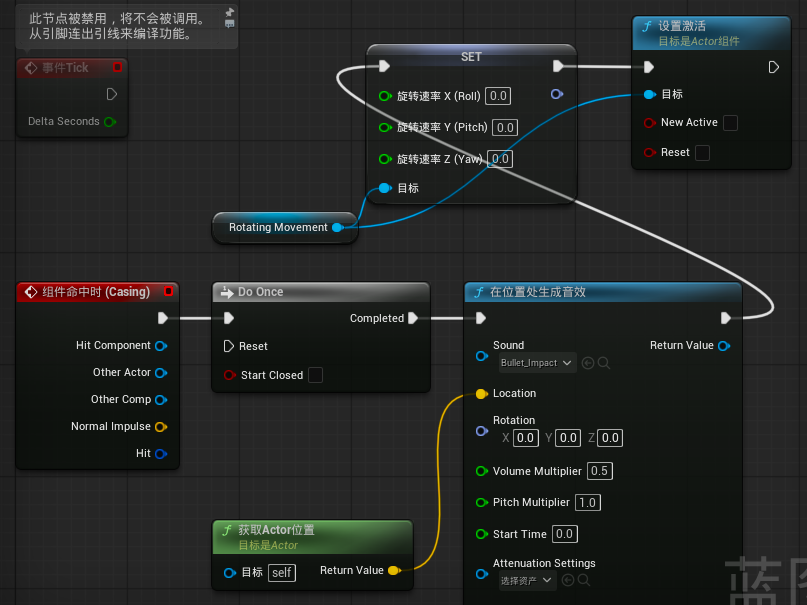

弹壳网格体打开质量、重力、线性阻尼，来实现真实落地效果。
同时使用once来只执行一次音效播放。
重叠需要屏蔽玩家。

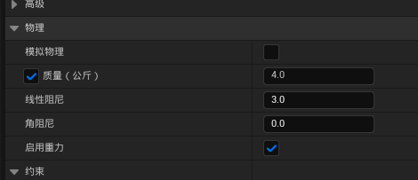


## 十四、武器后坐力系统

在武器基类的开火逻辑中：使用pitch实现视角上漂，yaw实现视角左右摇摆。

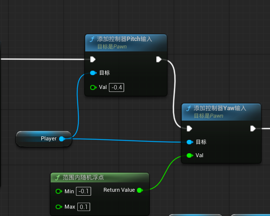


## 十五、击中特效和音效

先发射射线追踪，以屏幕中心所在的世界位置为起点，向前发送单位10000米的射线，该函数的outhit会返回第一个发送碰撞的目标，记得勾上Ignore Self屏蔽自身。

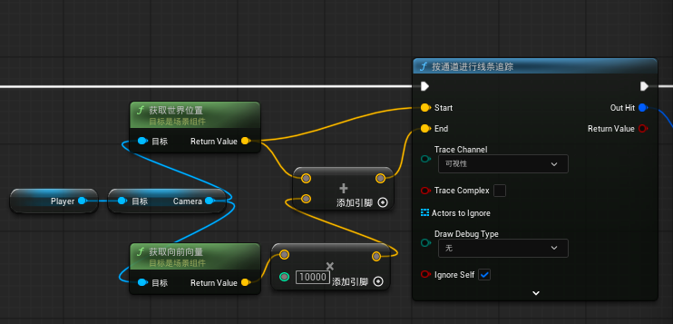

命中结果解析：
- BlockingHit：是否击中
- Location：击中点的位置
- Normal：入射方向的反方向，即从击中点指向发出点
- PhysMat：被击中物体的物理材质，可为actor指定一个预设的物理材质
    

    在项目设置的物理处设置

    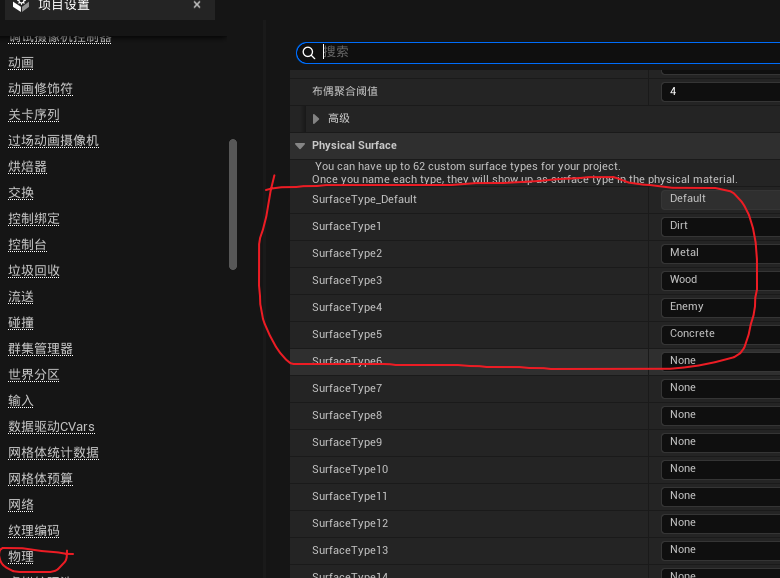


通过BlockingHit判断是否击中，保留被击中的世界位置。

将法向量通过 利用X创建旋转，得到一个旋转使得物体本地坐标系的X轴和法向量一个方向。

通过物理材质获取表面类型，切换EPhysicalSurface，会为每一种物理材质创建一个执行引脚，如添加新的物理材质后未更新执行引脚，右键刷新节点更新。

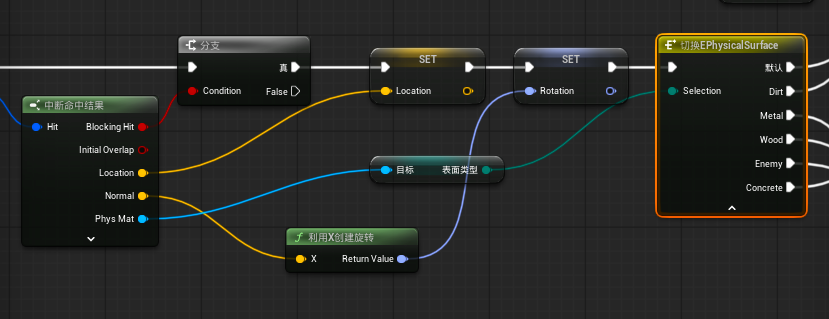

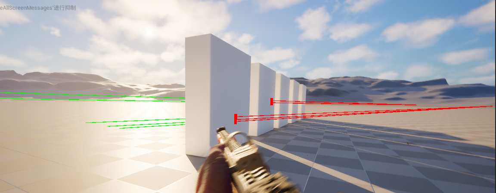

对于每一种材质，使用 在位置处生成系统 来生成击中特效，同时指定位置和旋转，确保击中特效符合射击角度。

然后播放音效。

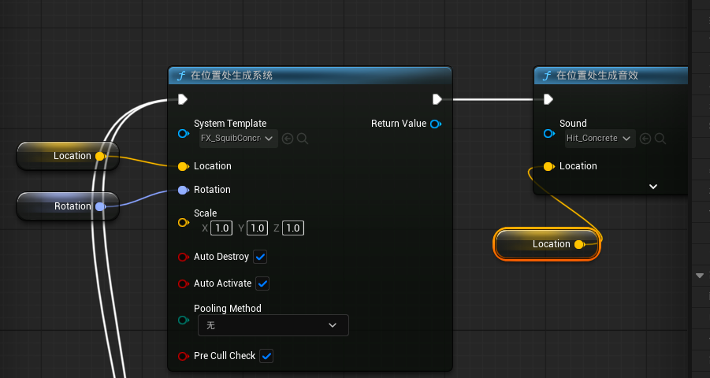

最终效果：

<video controls src="assets/stg_2026-05-29_02-00-19.mp4" title="Title"></video>


