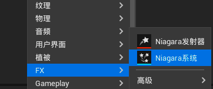
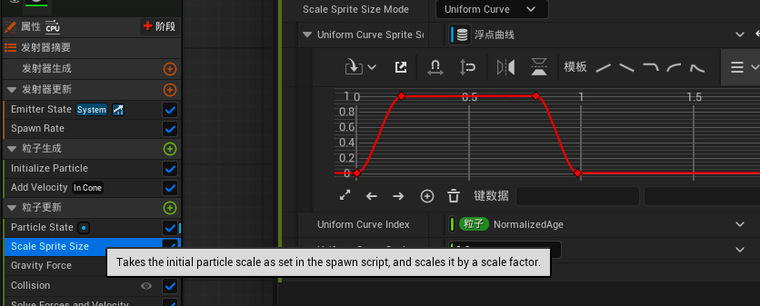
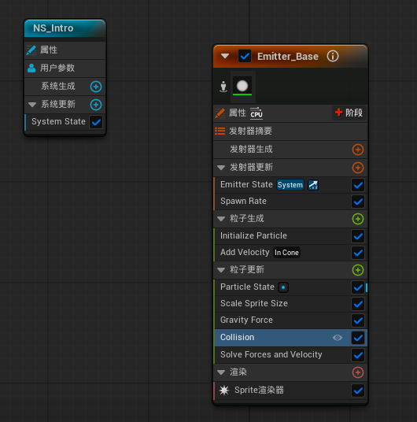
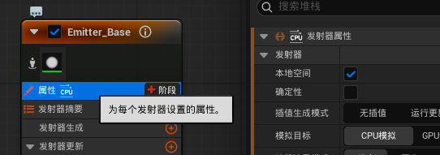

# Niagara简介

创建Niagara系统

发射器更新模块：
- 可以设置发射的粒子数量

粒子生成模块：
- 创建粒子时调用一次
- 设置粒子的生命周期
- 设置粒子的初始速度

粒子更新模块：
- 粒子生成后每帧的更新
- 大小变化：设置粒子慢慢变大后快死亡后缩小。0-1是生命周期归一化处理。
    
- 重力
- 碰撞等

设置为本地空间后相当于把生成的粒子和粒子发射器绑定，在场景中拖动发射器，粒子也会随发射器移动。
如果不勾选，粒子发射后，拖动发射器后粒子不受发射器位置影响。

