# 沙漠怪物

- 创建一个Niagara空白系统命名为NS_沙漠怪物。
- 在mixamo网站下载一个人物模型。

## 最小发射器

NS中先创建一个最小发射器，将其作为后续烟雾发射器的发射源，设置例子的发射率、粒子发射源改为网格体。

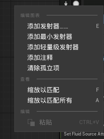

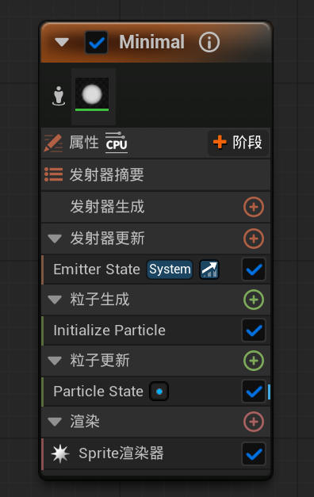

发射器属性处选择使用GPU，计算边界选为固定。

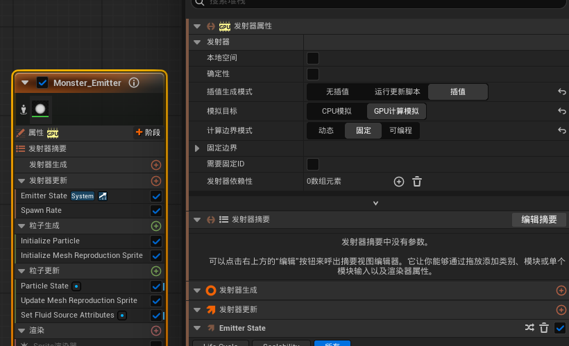

发射器更新模块：
1. spawn rate组件，设置粒子的生成速率
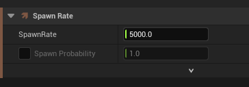

粒子生成模块:
1. Initialize Particle组件，初始化粒子组件中设置生命周期为5s，设置sprite颜色为土黄色。
1. Initialize Mesh Reproduction Sprite组件，指定网格体，需要配合例子更新模块的update mesh reproduction sprite
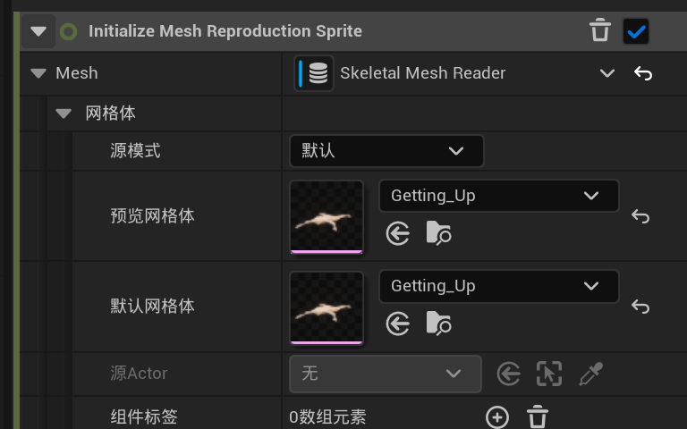

粒子更新模块：
1. update mesh reproduction sprite组件，指定网格体
1. set fluid source attributes组件，为粒子添加流体效果
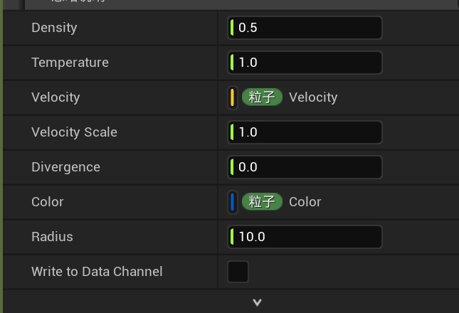

## Grid3D_Gas三维网格气态流体

创建一个发射器，选择UE提供的Grid3D_Gas，提供了发射摘要，显示一些主要使用的参数。

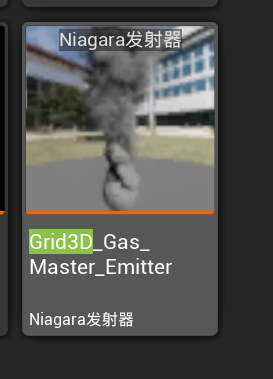

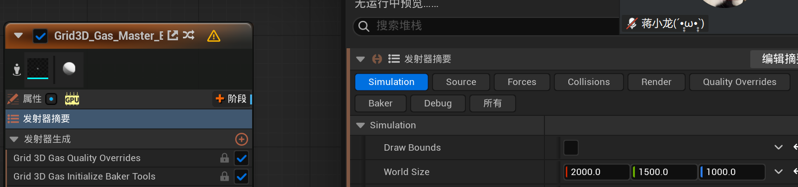

Simulation：
1. draw bounds、world size、pivot，设置绘制区域，当所指定的网格体位置不在区域时就不会发射粒子。
1. resolution max axis，简称分辨率
1. pressure solve iterations，越高越精细、
1. gravity，设置重力
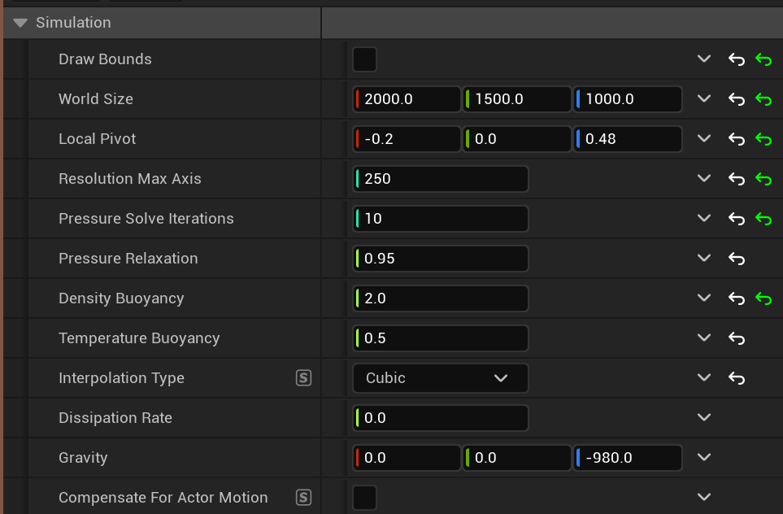

Source：
1. 最后一列，取消原先的球体发射源
1. use emitter source，勾选后设置emitter下的particle reader的发射器绑定为原先的最小发射器
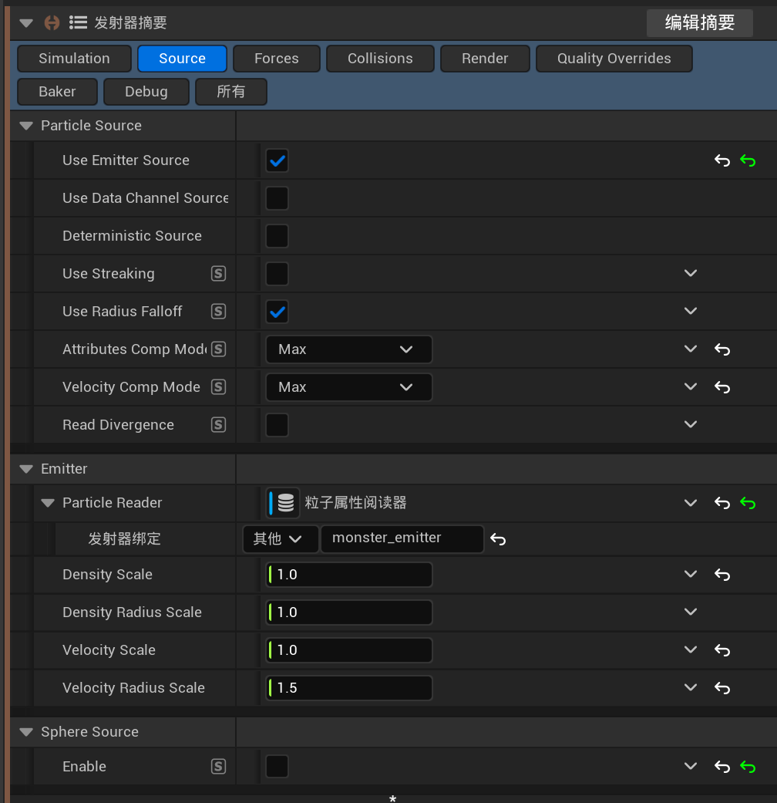

Forces：
1. Turbulence1，启用湍流。
    - turbulence frequency越小，大团缓慢翻滚，越大，细碎小波纹。
    - Gain，湍流强度增益，越高流体扭曲、翻滚幅度越大
1. Wind，启用风力。设置风向和模长（强度）。

Collisions：
1. Collide Against，取消网格体碰撞和距离场。
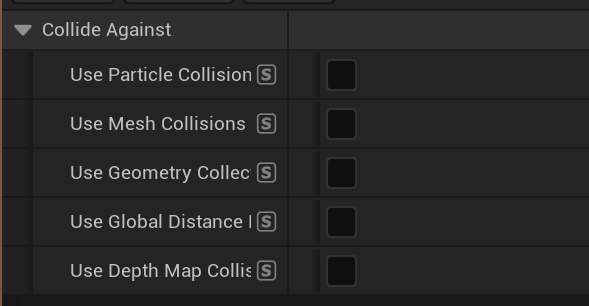
1. Boundary,勾选后流体可以穿过边界，穿过后消失，取消后，流体会与表面反弹。

Render：
1. Render Color，颜色设置。
1. Render Density，浓度设置。

