# 闪电火花

## 闪电

使用最小发射器

### 发射器更新

#### Emitter State

- Life Cycle Mode：设置为self，发射器拥有独立生命周期。
- loop behavior，设置无线循环
- loop duration，间隔时间

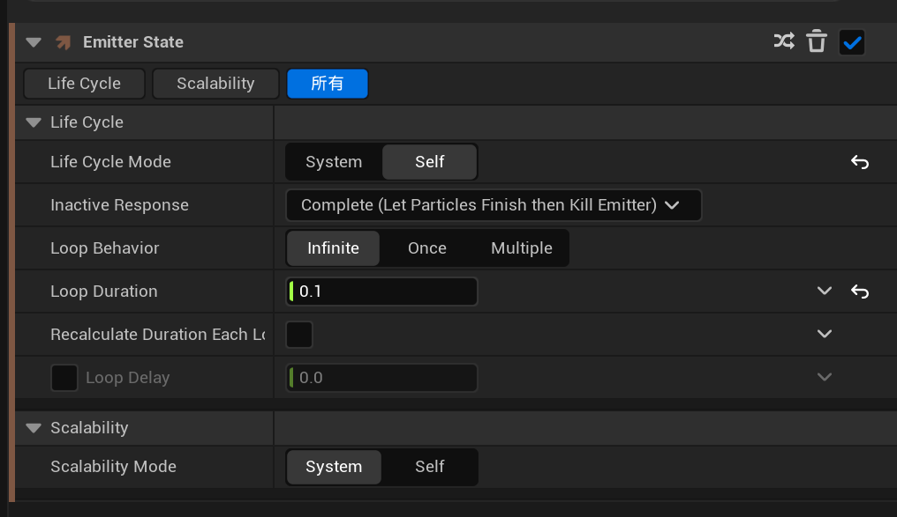

#### Spawn Burst Instaneous 瞬时爆发生成模块
指定时间点一次性批量生成粒子，多用于爆炸、冲击、瞬间喷发。

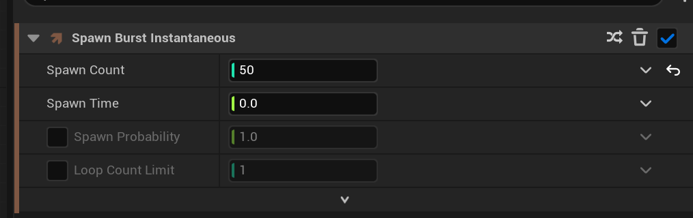

- spawn count，生成数量
- spawn time，发射器生命周期第0秒执行

#### Beam Emitter Setup 光束发射器初始化模块

让闪电在每帧都出现在不同的范围位置。

- 起始点设置，设置为随机采取位置、起点每帧算一个起点。
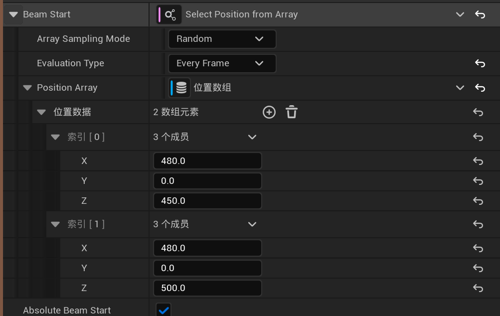
- 结束点设置，与其实点相同。

### 粒子生成

#### Initialize Particle

- 生命周期设置为0.25s
- 颜色设置为闪电蓝
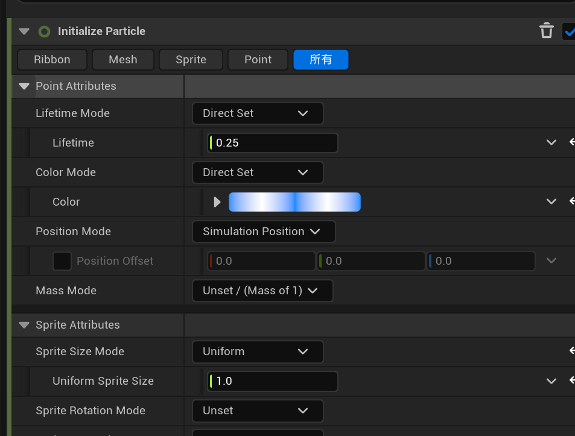

#### Spawn Beam
搭配光束发射器使用

#### beam width
设置光束的长度为中间宽，两端窄

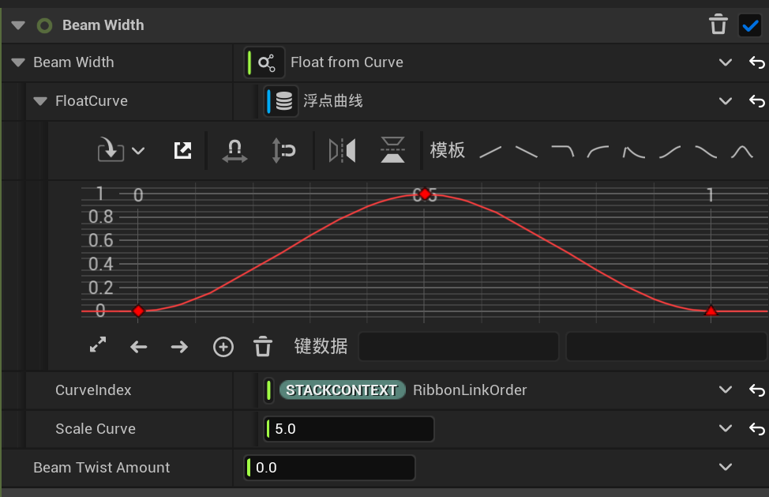

### 粒子更新

#### jitter position
多用于丝带、光束，给链条上每个分段粒子增加随机偏移扰动。

- 两边起伏小，中间起伏大

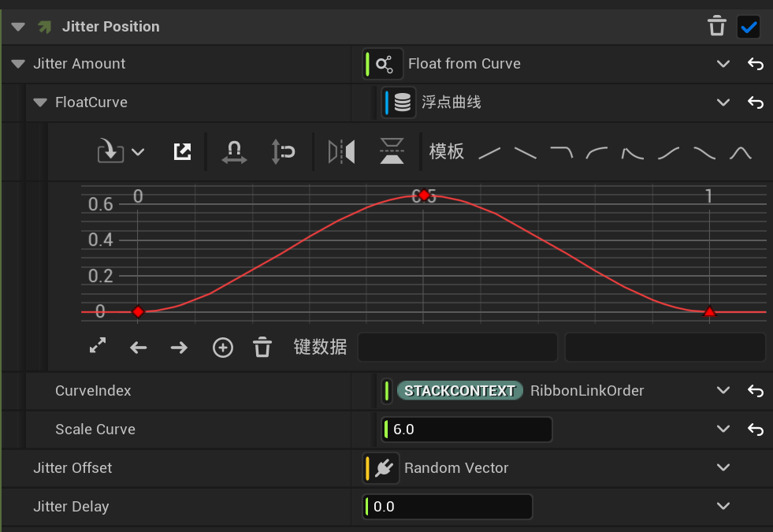

### 渲染

#### 条带渲染器

使用的材质时两边透明，中间不透明

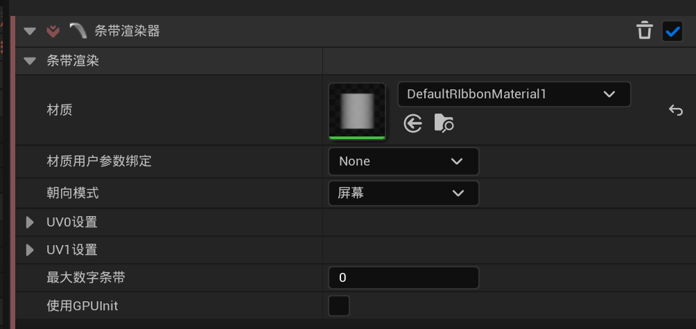

## 火花

### 粒子生成

#### initialize particle

- 设置生命周期3-6秒
- 颜色设置为红色到血红色之间随机
- 粒子大小也设置随机范围
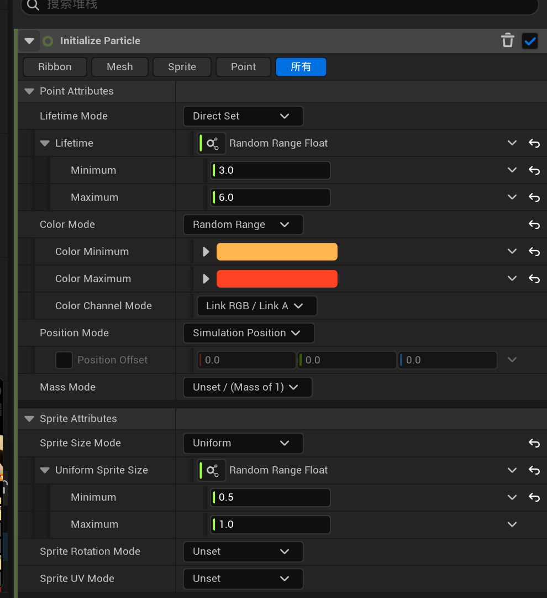

#### shape location

- 设置为圆柱体，搭配闪电长条，实现闪电下面落电火花
- 高度和半径设置，midpoint为0.5即为中心点，设置渲染使其从竖着变为横着
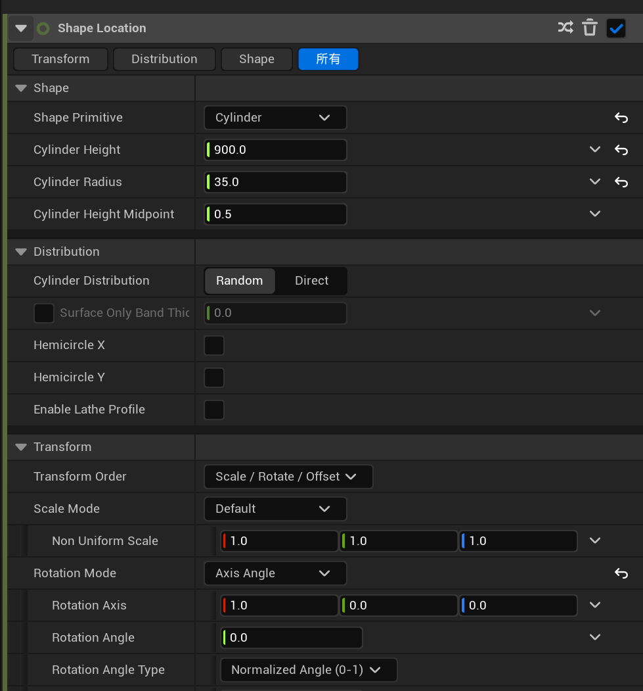

#### add velocity

- 锥形模式，速度动态变化
- 锥形设置为z正方形，且范围为45度，后续通过重力使其下落。

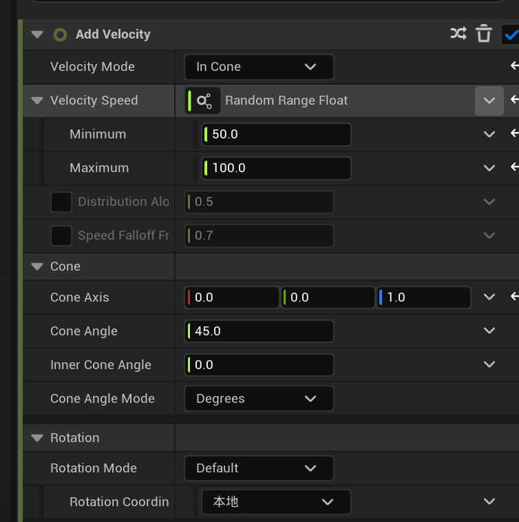

### 粒子更新

#### scale sprite size

- sprite设置为短时间内变为最大，然后持续一段时间，急速变小，实现落地后熄灭的效果。

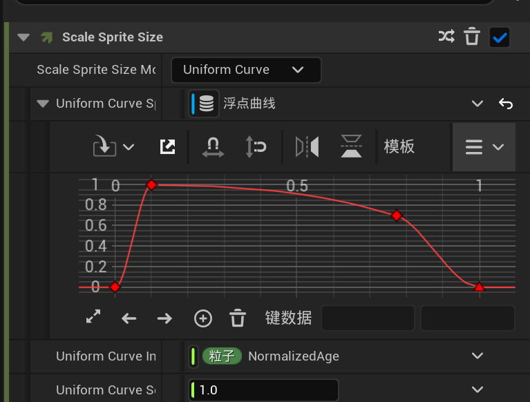

#### gravity force

- 在指定范围中随机选择重力值，设置为z负方向

#### curl noise force 卷曲噪声力场

通过噪声强度和噪声率模拟火花尘埃无序飘动

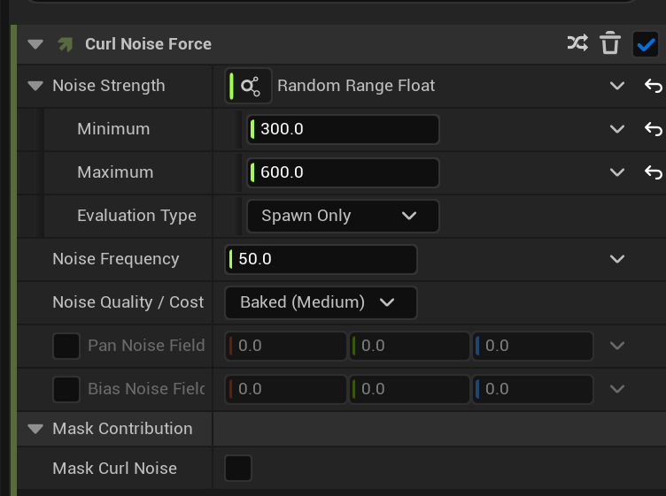

#### collision

给 Sprite 面片粒子开启光线追踪碰撞，实现粒子碰到场景物体后吸附、减速、不穿透模型的效果，适合烟尘、碎片、火花落地。

- bounce，设置反弹系数为0，即落到雪地不会反弹的效果
- friction，使用简易摩檫力，设置强度为10

#### slove forces and velocity

修复自动启用的。

#### scale color

分别设置scale和color。

- 设置颜色亮度随时间变暗，同时颜色亮度值出生时随机亮度倍率

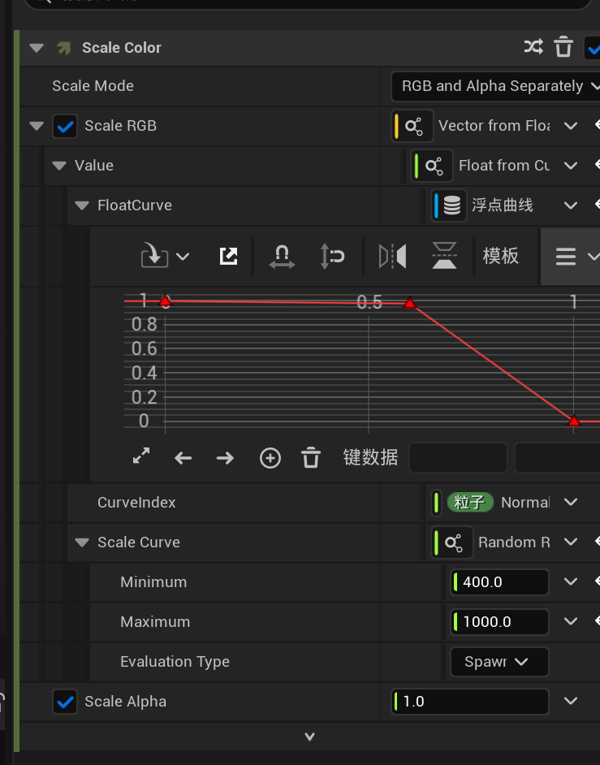

### 渲染

#### 光线渲染器

- 使粒子具有光源效果

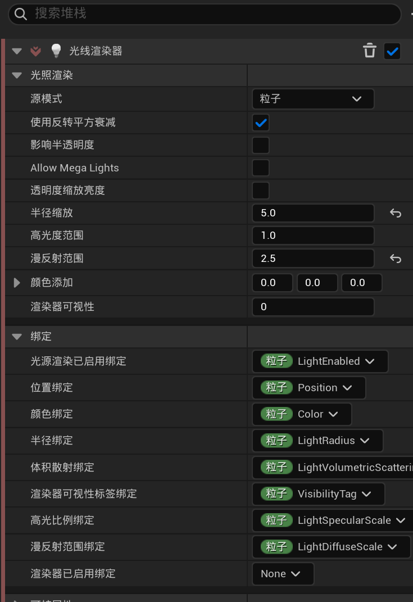

