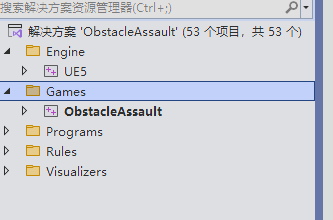
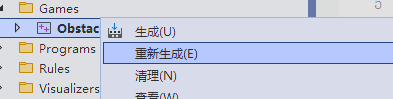

# VS和UE引擎使用

## Visual Studio开发

### 解决方案目录： 

关注Games下的项目文件夹，C++代码在这里面完成。

### 构建（生成、build）项目：

右键项目选择重新生成即可，推荐每次结束或者开始时使用重新生成。

### 实时编码 live coding

快捷键：Ctrl+Alt+F11

按钮：UE编辑器右下角

推荐使用场景：处理纯逻辑变更，不改变内存或反射系统的修改
- 修改.cpp中的bug
- PIE(play in editor)期间调式：在编辑器运行时，可以直接修改cpp文件，然后使用实时编码后，修改会在运行中的游戏直接生效。
- 实现.h头文件中已经写好的函数声明。

不建议场景：必须关闭编辑器并重新构建
- 修改宏定义
- 改变内存布局：头文件中添加或删除成员变量
- 修改函数签名：头文件中
- 构造函数变更
- 添加新类：新创建.h、.cpp文件必须通过IDE重新编译才能被编辑器识别

专业开发者的工作流:建议遵循以下流程：

1. 涉及 .h 的结构改动：
    - 关闭编辑器。
    - 在 Visual Studio 或 Rider 中编译。
    - 重新启动编辑器。

1. 涉及 .cpp 的逻辑改动：
    - 保持编辑器开启。
    - 修改代码。
    - 按下快捷键 Ctrl + Alt + F11。

1. 遇到崩溃或编译错误时：
    - 如果实时编码提示失败，不要强行运行。关闭编辑器，在 IDE 中清理（Clean）并重新构建（Rebuild）项目。

要安全地删除一个 C++ 类，请务必按照以下步骤操作，以消除 (Eliminate) 编译报错或产生“僵尸文件”的风险：

1. 关闭程序

    在操作文件之前，请关闭：
    Unreal Editor（虚幻编辑器）
    Visual Studio
2. 在磁盘上手动删除

    打开你的项目根文件夹（包含 .uproject 文件的位置）。
    进入 Source/[项目名称]/ 文件夹。
    找到对应的 .h 和 .cpp 文件，选中并删除它们。

3. 清理缓存文件夹

    为了防止旧的编译中间件干扰，建议手动删除项目根目录下的以下文件夹（它们是自动生成的）：Binaries、Intermediate。

4. 重新生成项目文件（核心步骤）

    这一步会更新 .sln 文件，移除对已删除文件的引用：在项目根目录，右键点击 [项目名].uproject。
    选择 “Generate Visual Studio project files”。
    等待生成完成。

5. 重新编译

    双击 .sln 重新打开 Visual Studio。此时你会发现该类已从列表中消失。点击菜单栏的 生成 (Build) -> 生成解决方案。

## 编程规范

Q:

-----

为什么C++代码的变量是每个单词都首字母大写，类似于FindRotation？和Java中的findRotation不太一样

-----

A:

-----

1. 虚幻反射系统与 UHT 的强制要求

虚幻引擎拥有一个强大的“反射系统”，允许 C++ 代码与编辑器、蓝图（Blueprints）进行交互。

Unreal Header Tool (UHT)：当你编译代码时，UHT 会扫描你的 .h 文件。如果你使用了 UPROPERTY() 或 UFUNCTION()，UHT 期望看到规范的命名。

蓝图兼容性：在蓝图中，变量名会被自动拆分。例如，C++ 中的 LookAtRotation 在蓝图节点里会显示为 Look At Rotation（自动加空格）。PascalCase 这种结构最容易被引擎解析并转化为友好的用户界面文字。

2. “代码就像一个人写的”

Epic Games 的开发原则之一是：无论有多少人参与，整个引擎的代码库看起来应该像是由同一个人编写的。

一致性：由于引擎底层代码全部采用了 PascalCase，如果你在自己的项目中使用 lowerCamelCase 或 snake_case，代码会显得格格不入，且在调用引擎 API 时（如 GetActorLocation()）会频繁切换输入法大小写，降低效率。

3. 类型前缀系统

在 UE 中，变量和类的命名通常伴随着特定的前缀，这能让你一眼看出变量的性质。UHT 会利用这些前缀来验证代码正确性：

A：派生自 AActor 的类（如 ALookAtActor）。

U：派生自 UObject 的类（如 ULookAtComponent）。

F：纯 C++ 结构体或非 UObject 类（如 FVector）。

E：枚举类型（如 ENetMode）。

b：布尔值（这是唯一的小写前缀，用于区分布尔变量，如 bIsActive）。

4. 消除 (Eliminate) 歧义

变量与函数区分：PascalCase 让变量名（名词）和函数名（动词）在视觉上保持统一。

避免缩写：Epic 鼓励使用清晰、无歧义的全称（如 CurrentExperiencePoints 而不是 currXP），PascalCase 能让长变量名依然保持良好的可读性。

-----

### 参考链接

[代码规范](https://dev.epicgames.com/documentation/unreal-engine/epic-cplusplus-coding-standard-for-unreal-engine)

[GameplayClasses](https://dev.epicgames.com/documentation/unreal-engine/gameplay-classes-in-unreal-engine)