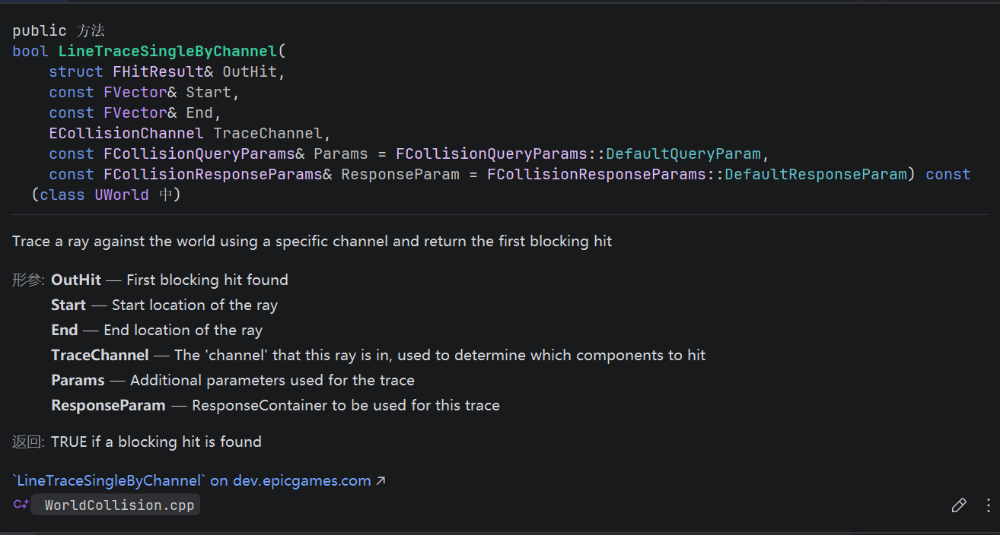
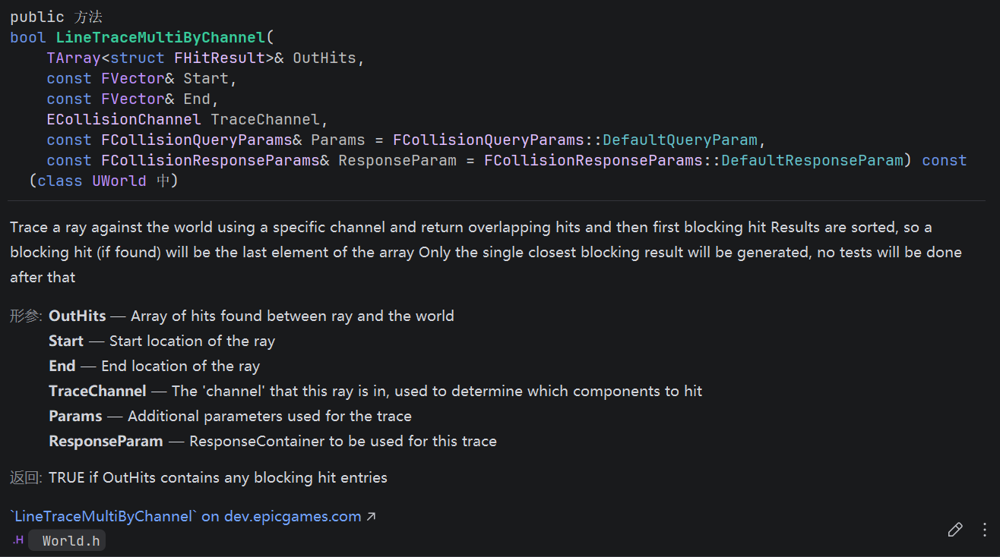
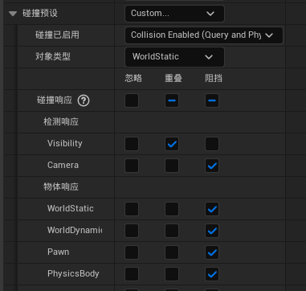

# 射线检测

## LineTraceSingleByChannel

使用指定通道向世界发射一条射线追踪，并返回第一个阻挡命中。

- OutHit：返回射线命中的Actor
- Start：起始位置
- End：终止位置
- TraceChannel：检测通道，ECC枚举值（常见有ECC_WorldStatic、ECC_WorldDynamic、ECC_Visibility）
- Params：追踪的附加参数。

## LineTraceMultiByChannel

与Single不同的是，返回的是一个数组。数组的最后一个是阻挡该射线的Actor，其余是被Overlap重叠的Actor。

比如角色枪口对准了一个门、门后有一个敌人，敌人后面是地图墙体。射线追踪结果即是[门、敌人、墙]。

其中门和墙的碰撞预设，在碰撞相应的Visibility处需要设置为阻挡。

## ByChannel

ECC_Visibility是指以这个身份进行检测，如果想要让射线检测到碰撞还是重叠，在碰撞预设的检测响应的Visibility处设置。

决定是否可以被检测到，由物体端指定。

## ByObejectType

检测端参与决定，设置ECC_WorldStatic表示要查询的对象类型。

