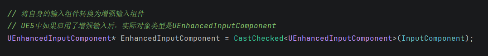
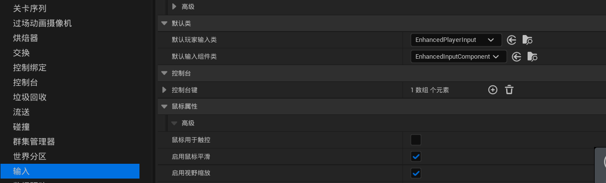
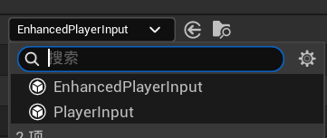
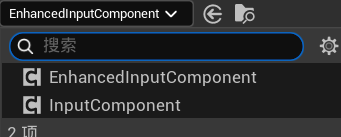
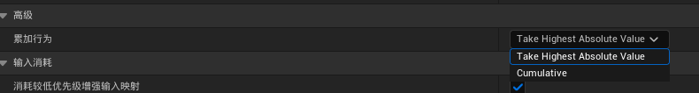

# 笔记

零碎小记

## UEnhancedInputComponent

当UE5启动增强输入后，可以在C++的玩家控制器中获取默认玩家输入组件：

编辑器的项目设置中的输入一栏可以找到：

所以C++中要用的话可以转为该类型，因为该对象被创建时就是EnhancedInputComponent类型。

### InputAction

如果设置AD分别左右移动，当Take Highest ... 选项会导致IMC中后出现的占据优先权，即D在A后同时按向右方向走。

设置为Cumulative，则是相互抵消，表现为静止。