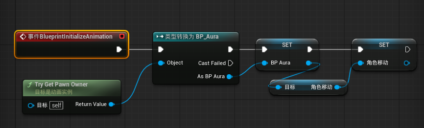
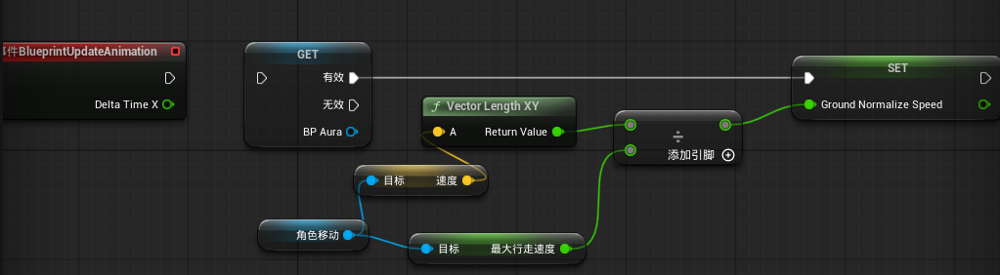
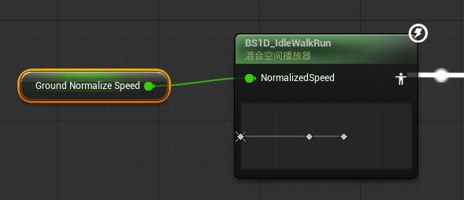
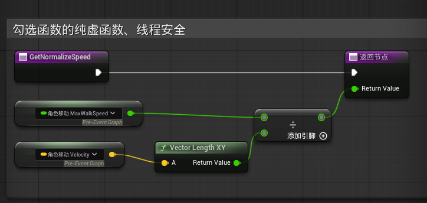
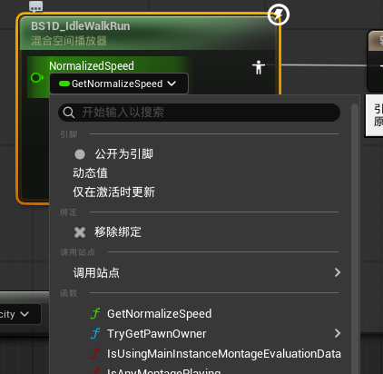

# 蓝图小记

## 动画蓝图之属性访问Property Access和函数绑定

### 功能介绍

当前有一个混合空间1D根据传入的Speed来切换Idle、Walk、Run的动画，Speed是一个归一化的值，需要获取角色的运动组件，通过其最大行走速度和角色当前地面(XY坐标)速度来获得。

### 传统操作

大致步骤如下：

事件图表：

1. 保存角色及其运动组件引用：蓝图初始化动画时将动画拥有者的对象及其运动组件保存为变量引用
    
1. 更新Speed：创建一个本地Speed变量，蓝图更新动画时通过运动组件，获取最大速度和当前速度，相除获取所需Speed并更新本地变量Speed
    

动画图表：

1. 将本地变量Speed传给混合空间的输入
    

### 存在弊端

在 UE5 中，动画更新通常运行在工作线程（Worker Thread）而非主线程（Game Thread）。如果你在“事件图表”中写逻辑，引擎必须在主线程执行完逻辑后将数据同步给动画线程，这会产生性能开销并可能阻碍并行化。

### 优化：使用属性访问

优势：
- 性能优化：它会在动画更新开始前对数据进行“快照”，避免了在更新过程中频繁跨线程通信。
- 安全性：它内置了空引用检查。即使角色中途被销毁，属性访问也会安全地返回默认值，而不会导致蓝图报错。
- 架构清晰：它让 AnimGraph 直接与数据源对接，减少了事件图表（Event Graph）中杂乱的连线。

大致步骤如下：

事件图表：
1. 保存角色及其运动组件引用：这一块保持一样
1. 创建一个函数勾选线程安全、纯虚函数，并在该函数计算并返回所需的Speed值
    
    

动画图表：
1. 点击混合空间，在细节面板处设置Speed为绑定,然后选择前方实现的函数即可
    

### 属性访问相关注意事项（AI生成，2已验证）

#### 1、引用选择：保持“角色对象”还是“运动组件”？

最佳实践：建议在初始化时同时缓存两者，但在计算中优先使用“运动组件”引用。

原因：虽然 Character 引用可以让你访问自定义逻辑，但动画系统 90% 的物理数据（速度、地面摩擦力、下落状态等）都直接存储在 CharacterMovementComponent 中。
性能建议：在 Blueprint Initialize Animation 中执行一次类型转换（Cast），分别存为 Character 变量和 MoveComponent 变量。这能消除 (Eliminate) 掉后续每帧在不同对象间跳转的开销。

#### 2、 为什么你的纯函数在绑定列表中“不可见”？
Property Access（属性访问）引擎对可绑定函数有以下三个刚性要求。如果漏掉任何一个，函数都不会出现在下拉列表中：

- 必须勾选 Is Pure (纯函数)：这意味着函数不改变数据状态。
- 必须勾选 Thread Safe (线程安全)：这是并行计算的要求。
- <b style="color:#e53935">输出引脚命名限制</b> (核心关键)：函数的输出引脚名称必须精确命名为 ReturnValue（区分大小写）。如果命名为 Speed 或其他名称，绑定系统将无法识别它。

#### 3、 “纯函数内更新变量并绑定”的方案可行吗？
不推荐。 这种方案违背了 UE5 的架构意图：

副作用错误：纯函数（Pure）在定义上不应该有“副作用”（即不应该执行 Set 变量操作）。纯函数应该是“只读逻辑”。
时序问题：属性访问（Property Access）是直接提取值的映射，如果你在函数里 Set 变量再读变量，会造成不必要的内存读写。
推荐方案：无需创建中间变量。创建 线程安全纯函数 计算归一化速度，然后直接在 AnimGraph 引脚上 Bind (绑定) 该函数。

##### 4、 线程安全、纯函数与属性访问的价值
线程安全 (Thread Safe)：UE5 的动画更新运行在多个工作线程。如果函数不是线程安全的，可能会导致动画在计算时与游戏主线程发生冲突，引发崩溃或卡顿。
属性访问 (Property Access) 的优势：
性能：它通过高效的底层路径（C++ 指针偏移）直接提取数据，比蓝图虚拟机执行事件图表节点快得多。
快照机制：它在每一帧更新开始前会自动给主线程数据拍个“快照”，确保动画线程在计算时数据是稳定的，不会因为主线程突然修改了速度而导致动画抖动。

#### 5、 线程安全函数内部：使用属性访问节点还是直接引用？
关键结论：必须在函数内部使用 Property Access 节点来访问你保存的引用。

虽然你在初始化时保存了“运动组件引用”，但在一个勾选了 Thread Safe 的函数内部，传统的直接拖入变量（Getter）有时是被限制的，或者具有不确定性。