# 踩坑笔记

## 蓝图BeginPlay初始化变量

使用UE5.8。

问题描述：如果在蓝图BeginPlay中初始化一个私有变量a，在运行时修改了该蓝图的对象的其他可编辑实例变量时，会导致这个私有变量变为默认值。

可编辑实例变量：

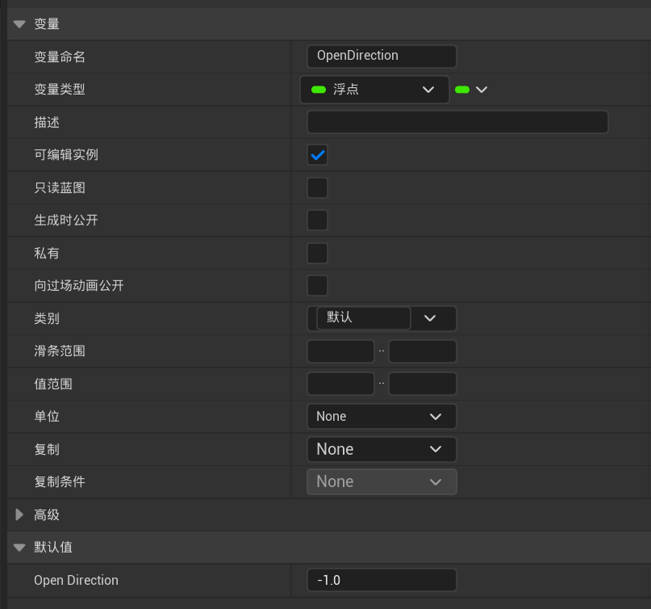

私有变量：

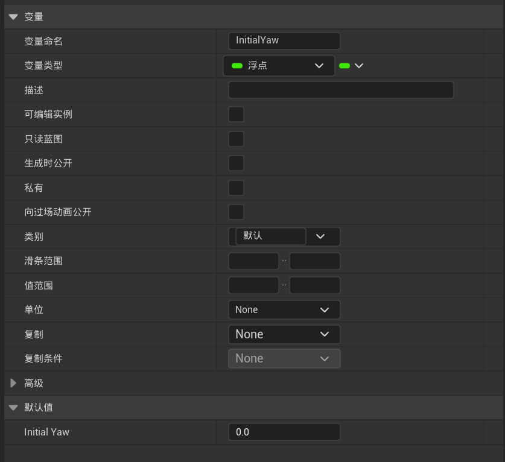

BeginPlay事件中初始化私有变量：

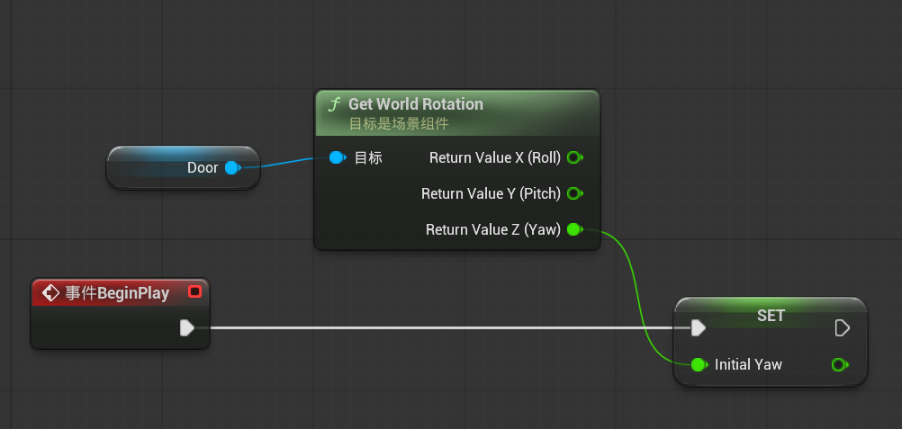

复现操作：

<video controls src="assets/stg_2026-08-25_17-28-11.mp4" title="Title"></video>


## C++中LineTraceMultiByObejectType的API注释错误

使用UE5.8

### API 注释

大致意思是返回的结果数组，最后一个是阻挡命中，其余是重叠命中，和LineTraceSingleByObject一样。

实际测试下来是返回射线命中的所有结果，没有重叠阻挡一说。

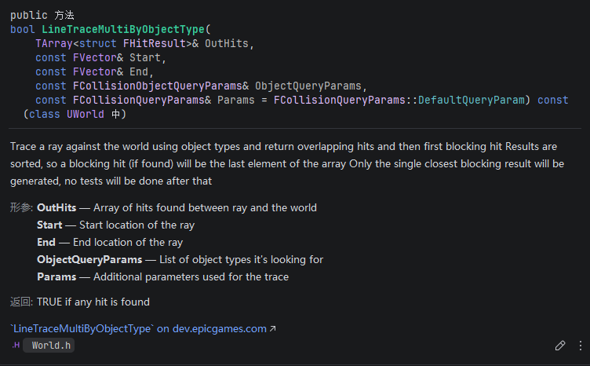


### 实操测试的正确结果

如果说返回的是[重叠Actor1，重叠Actor2,...，阻挡Actor]，那下面两者则矛盾了，如果门是阻挡，那第二张图不可能再检测到门后的物体。

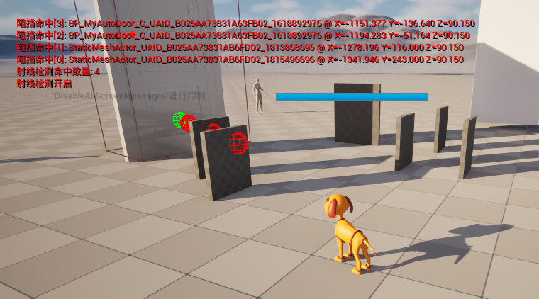

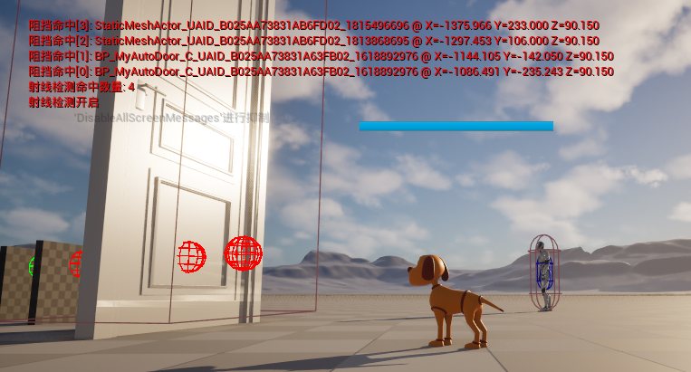

#### 大模型测试

问题：

```bash
bool LineTraceMultiByObjectType(
    TArray<struct FHitResult>& OutHits, 
    const FVector& Start, 
    const FVector& End, 
    const FCollisionObjectQueryParams& ObjectQueryParams, 
    const FCollisionQueryParams& Params = FCollisionQueryParams::DefaultQueryParam)

介绍一下这个函数的OutHits返回的是什么，其中每个对象的BlockingHit的值是什么
```


### UE的AI助手：正确
使用UE自带的AI助手询问的结果，返回结果包含射线上指定类型的所有Actor，不在乎该Actor的碰撞预设。

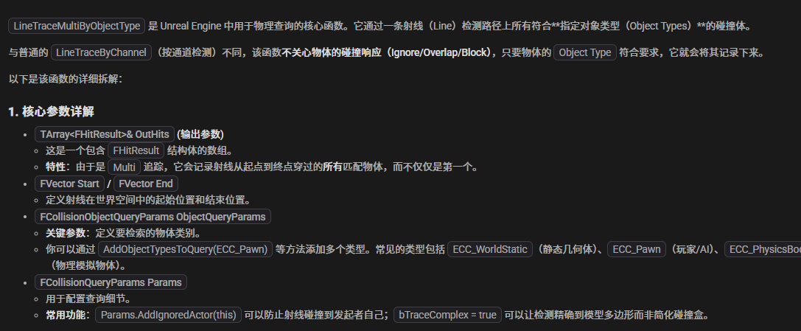


### DeepSeek：正确，但MultiByChannel的错了
关于MultiByObjectType是正确的

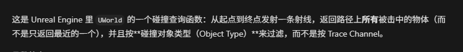

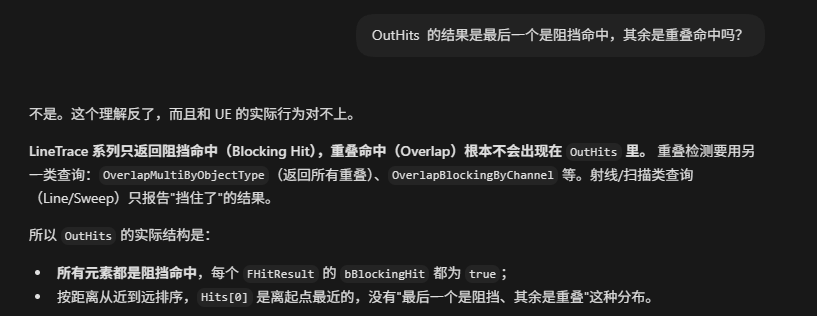

但关于MultiByChannel是错误的，正确应该是返回数组，最后一个是阻挡命中，其余都是重叠命中。

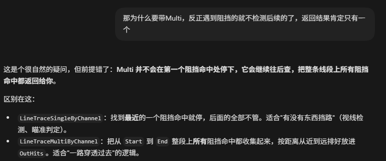

### Hy4：错

### 千问：官网的正确，软件的错误....

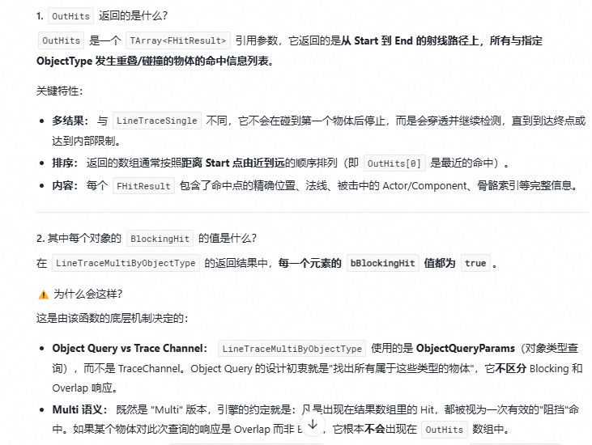

基本模型都是错的，毕竟官方文档API也是错的....