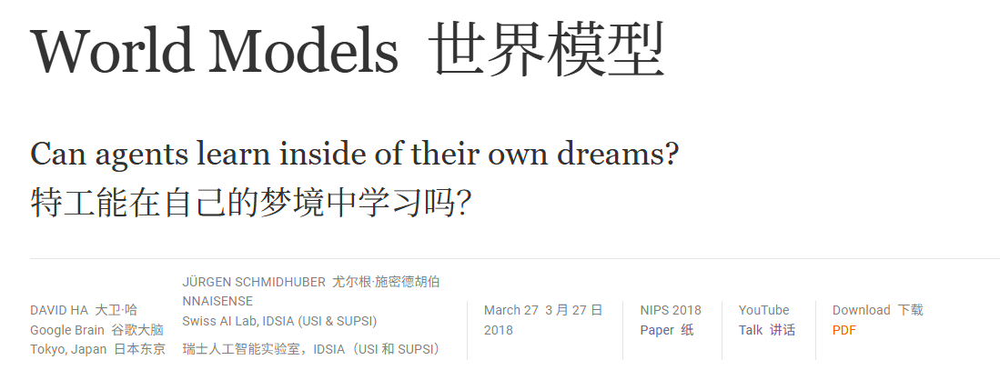
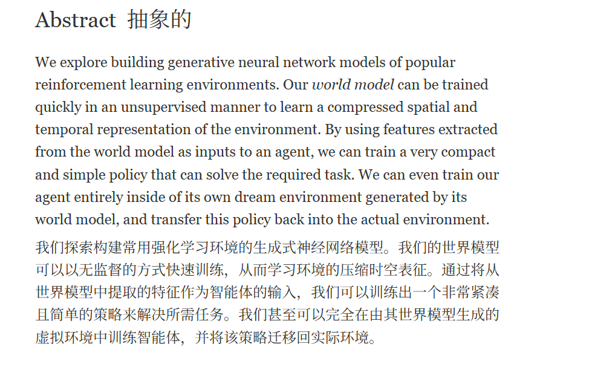

# 论文阅读方法

## 相关网址
[arxiv](https://arxiv.org/abs/1803.10122)  
[github](https://worldmodels.github.io/)

## 论文题目

## 摘要

- 从摘要看是世界模型是一个一个**生成式**神经网络模型，它可以以无监督的方式快速训练，学习环境的压缩时空表征。  
- 从世界模型提取出的特征可作为智能体的输入，以此来训练智能体。