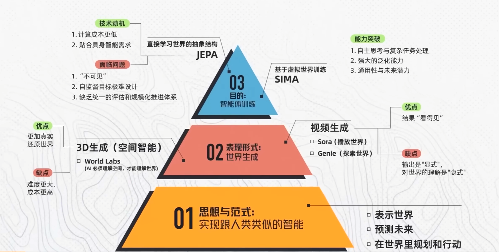

# 世界模型相关资料

世界模型三层架构：

- 世界模型第二层的表现形式：世界生成
    - 视频生成（sora、genie 3）  
    优点：结果可见；缺点：输出是显式的，对世界的理解是隐式的。  
    比如预测的画面的车的长宽高，sora本质是不知道的。
    - 3D生成/空间智能(李飞飞World Labs)  
    优点：更加真实还原世界；缺点：难度大成本高  

- 世界模型第三层：
    - 基于虚拟世界训练  
    谷歌SIMA，能力突破：自主思考与复杂任务、强大的泛化能力、通用性与未来潜力
    - 直接学习世界的抽象结构  
    JEPA，直接学习世界

- [李飞飞World Labs](https://www.worldlabs.ai/)  
- [大理石实验室](https://marble.worldlabs.ai/)

- [谷歌Genie 3](https://deepmind.google/models/genie/) (生成的视频包含3D场景信息，可交互操作)

- [谷歌SIMA](https://deepmind.google/blog/sima-2-an-agent-that-plays-reasons-and-learns-with-you-in-virtual-3d-worlds/)

- [A-JEPA](https://arxiv.org/abs/2311.15830)
- [V-JEPA](https://arxiv.org/abs/2506.09985)
