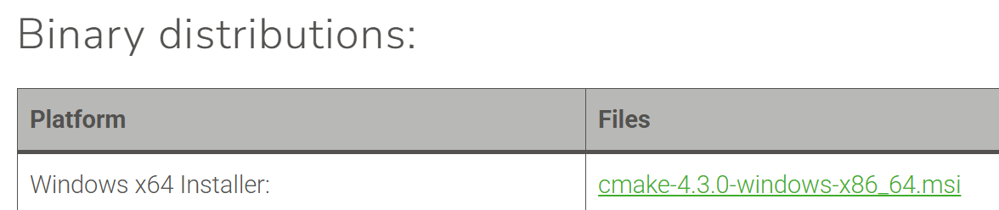
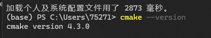
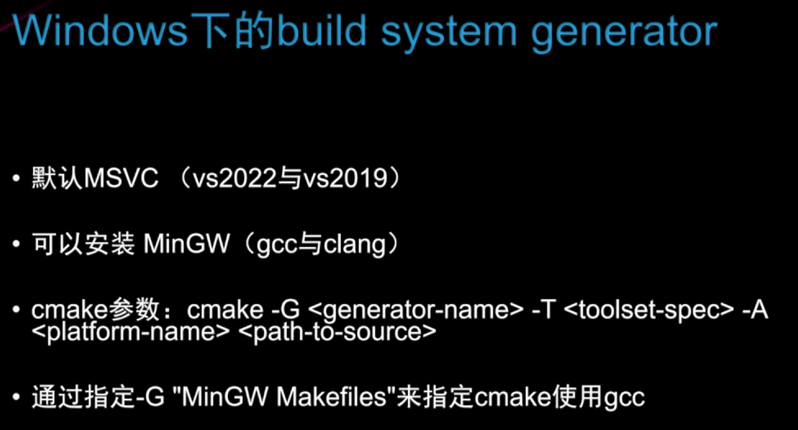
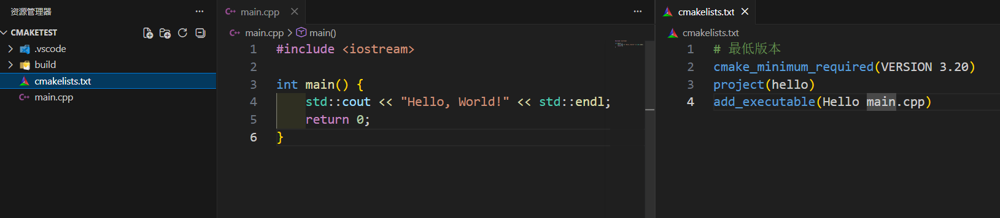
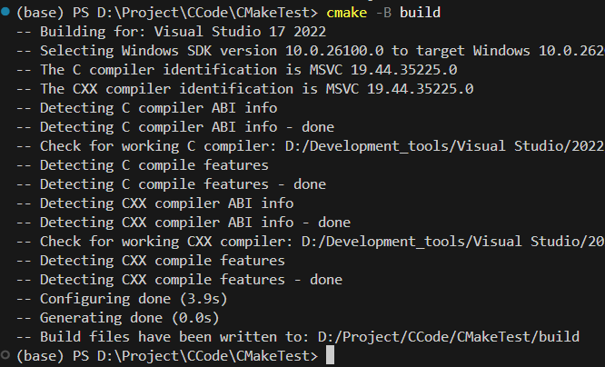
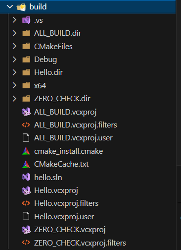
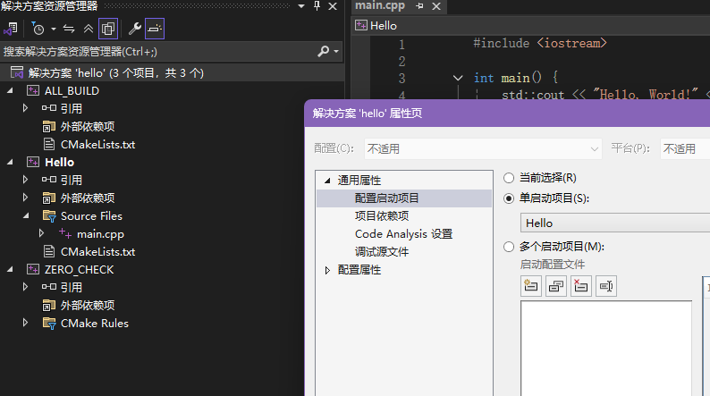
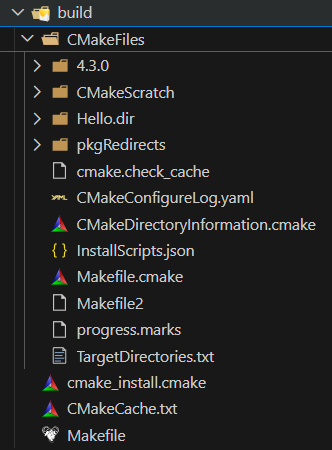
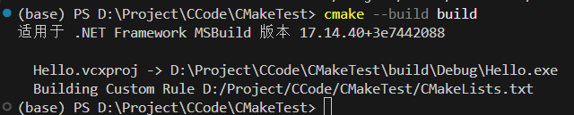
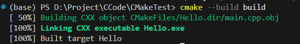

# windows下构建项目

## 一、下载
- 推荐下载二进制发行版(Binary distributions)  

- 验证  


## 二、build system generator


## 三、文件目录如下


## 四、运行命令 cmake -B build 构建项目
```bash
cmake -B build
```  
1. 使用默认的MSVC构建
  

    - 生成的build目录内容  
      

    - 可以使用VS打开或者点击.sln文件打开项目  
      
    注意配置启动项需选择项目名称

1. 使用MinGW构建 cmake -B build -G "MinGW Makefiles"  


## 五、运行命令 cmake --build build 生成可执行文件
```bash
cmake --build build
```
MSVC构建项目  


MinGW构建项目  
