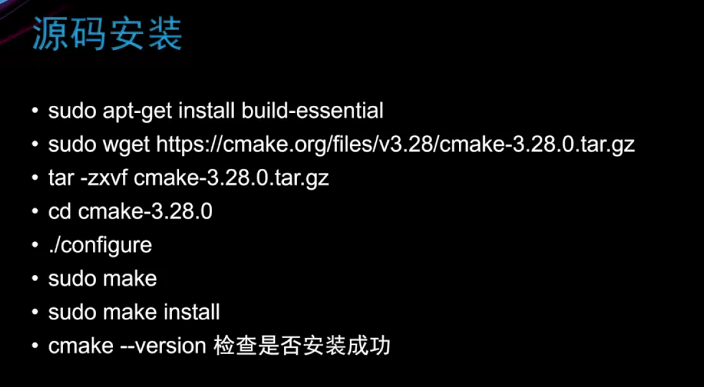
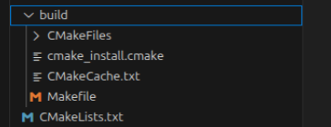
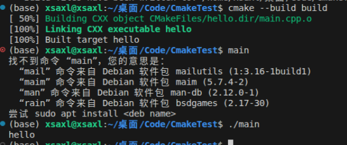

# linux下构建项目

## 一、安装cmake

```bash  
sudo apt install cmake
```
源码安装(可选)  


## 二、运行命令 cmake -B build 构建项目
```bash
cmake -B build
```




## 三、运行命令 cmake --build build 生成可执行文件
```bash
cmake --build build
```
