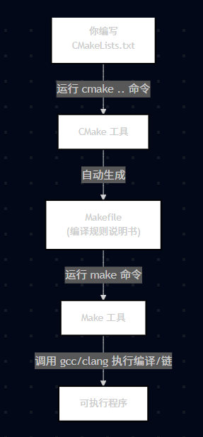
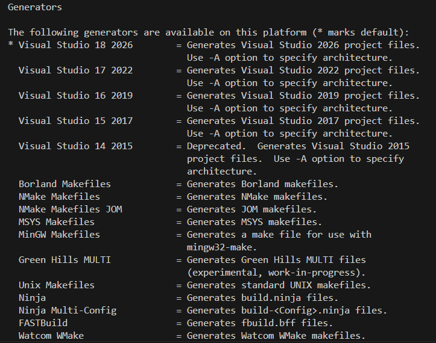

# CMake初体验

- CMake是一个开源、跨平台的自动化构建工具，通过CMake可以轻松管理项目。
- 注意：
    - CMake不是包管理工具
    - CMake并不只支持C/C++
    - 掌握CMake是学习C++的必经之路

## 一、优缺点
- 优点
    - 操作透明而细腻
    - 专注于现代C++现代化，专注于支持C++现代编译器和工具链
    - 真正的跨平台，支持windows、macOS、Cygwin等
    - 支持生产几乎所有主流IDE的项目
- 缺点 
    - 仍在成长中，仍然存在一些不稳定的特性和功能
    - 是一门语言，需要专门学习

C/C++更关注底层和构建其他的编程语言，因此CMake解决的问题往往和其他编程语言不通。CMake相比其他构建工具更复杂，但CMake的出现拯救了C++。

## 二、C/C++源文件是怎么生成可执行程序的toolchain流程
1. 预处理  
处理源代码中的 “预处理指令”（以#开头的指令），生成纯净的、无预处理指令的 C/C++ 代码。  
    ```bash
    # 只执行预处理，生成main.i
    gcc -E main.c -o main.i
    ```
1. 编译  
把预处理后的纯文本代码（.i文件）翻译成汇编语言代码（人类可读的低级指令）。  
    ```bash
    # 从预处理文件编译生成汇编文件main.s
    gcc -S main.i -o main.s
    # 也可以直接从.c文件跳过手动预处理，直接生成.s
    gcc -S main.c -o main.s
    ```
1. 汇编  
把汇编语言代码翻译成 CPU 能直接识别的二进制机器指令，生成目标文件。  
    ```bash
    # 汇编main.s生成目标文件main.o
    gcc -c main.s -o main.o
    # 直接从.c文件生成.o（自动完成预处理+编译+汇编）
    gcc -c main.c -o main.o
    ```
1. 连接  
把多个目标文件（.o）和系统库（比如libc.so）合并，修正地址，生成可执行程序。  
    ```bash
    # 链接main.o生成可执行程序（默认a.out，Linux）
    gcc main.o -o myapp
    # 链接多个目标文件+第三方库（比如数学库）
    gcc main.o math.o -lm -o myapp
    ```

## 三、CMake与Makefile、Make的关系
- Makefile并不跨平台，CMake会根据编译器的类型来决定是否生成Makefile，大多情况下CMake会生成Makefile。
- 大型项目不推荐手动编写Makefile。
- Make工具（类似批处理工具）是通过调用Makefile文件中的命令实现编译和连接的。
- 构建流程图
    

## 四、CMake使用流程
- 编写CMakeLists.txt文件，下面是最基本的配置  
    - cmake_minimum_required(VERSION 3.10) 
    - project(MyProjectName)
    - add_executable(MyProjectName main.cpp) 
- cmake -B build
    - 创建一个build并在此目录下生成Makefile或其他文件
- cmake --build build
    - 生成项目
   

## 五、CMake的generator
默认是MSVC，一般选择MinGW Makefiles，可以兼容linux  
手动指定 cmake --build build -G "MinGW Makefiles"  
