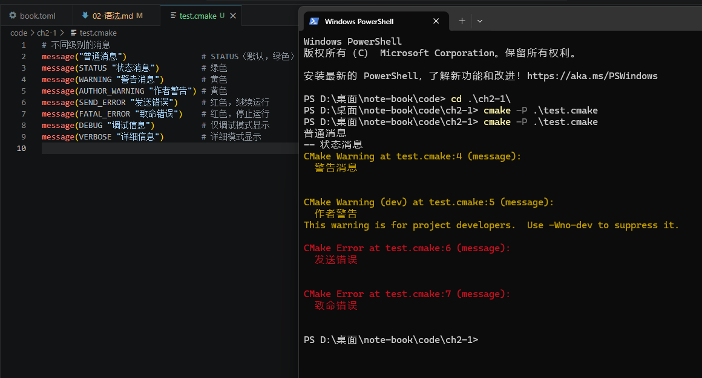

# CMkae语法

## 一、CMake语法概述
- CMake项目的根目录下必须有一个CMakeLists.txt文件，包含了构建项目所需的指令和设置。
- CMake语法类似于函数调用，使用命令和参数来定义构建规则。
- CMake语法支持变量、条件语句、循环等编程结构，使得构建规则可以更加灵活和复杂。
- CMake提供了丰富的内置命令和模块，帮助开发者轻松管理项目的构建过程。


## 二、message命令
message是 CMake 的输出命令，用于在配置过程中向用户显示信息、警告、错误等。它是调试和用户交互的主要工具。

```bash
# 不同级别的消息
message("普通消息")                # STATUS（默认，绿色）
message(STATUS "状态消息")         # 绿色
message(WARNING "警告消息")        # 黄色
message(AUTHOR_WARNING "作者警告") # 黄色
message(SEND_ERROR "发送错误")     # 红色，继续运行
message(FATAL_ERROR "致命错误")    # 红色，停止运行
message(DEBUG "调试信息")          # 仅调试模式显示
message(VERBOSE "详细信息")        # 详细模式显示
```

## 三、不通过CMakeLists.txt运行CMake
```bash
cmake -P *.cmake
```

方便学习时使用
