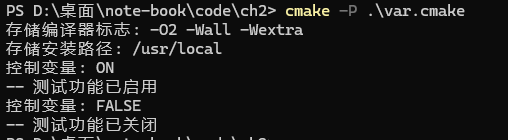

# 变量

## 变量是什么？
变量是 CMake 中存储数据的容器，可以保存字符串、列表、路径等信息。变量用于在 CMake 脚本中传递参数、存储配置选项、记录中间结果等。  

## 变量的主要作用
- 存储配置：保存编译选项、路径、开关等

- 参数传递：在不同作用域间传递信息

- 条件控制：作为条件判断的依据

- 代码复用：通过变量实现配置重用

## 具体用法

```bash
# 1. 存储配置信息
set(CMAKE_CXX_FLAGS "-O2 -Wall -Wextra")  # 存储编译器标志
set(INSTALL_PREFIX "/usr/local")          # 存储安装路径

message("存储编译器标志: ${CMAKE_CXX_FLAGS}")
message("存储安装路径: ${INSTALL_PREFIX}")

# 2. 控制编译选项
set(ENABLE_TESTS ON)  # 布尔变量，控制测试是否开启

message("控制变量: ${ENABLE_TESTS}")

if(ENABLE_TESTS)
    message(STATUS "测试功能已启用")
endif()

set(ENABLE_TESTS "FALSE")  # 布尔变量，控制测试是否开启

message("控制变量: ${ENABLE_TESTS}")

if(NOT ENABLE_TESTS)
    message(STATUS "测试功能已关闭")
endif()

# 3. 存储文件列表
set(SOURCE_FILES
    src/main.cpp
    src/utils.cpp
    src/logger.cpp
)

# 4. 路径处理
set(PROJECT_ROOT "${CMAKE_CURRENT_SOURCE_DIR}")
set(INCLUDE_DIR "${PROJECT_ROOT}/include")

# 5. 环境变量访问
set(OLD_PATH "$ENV{PATH}")  # 读取系统环境变量
set(ENV{LD_LIBRARY_PATH} "/usr/local/lib")  # 设置环境变量
```

  
