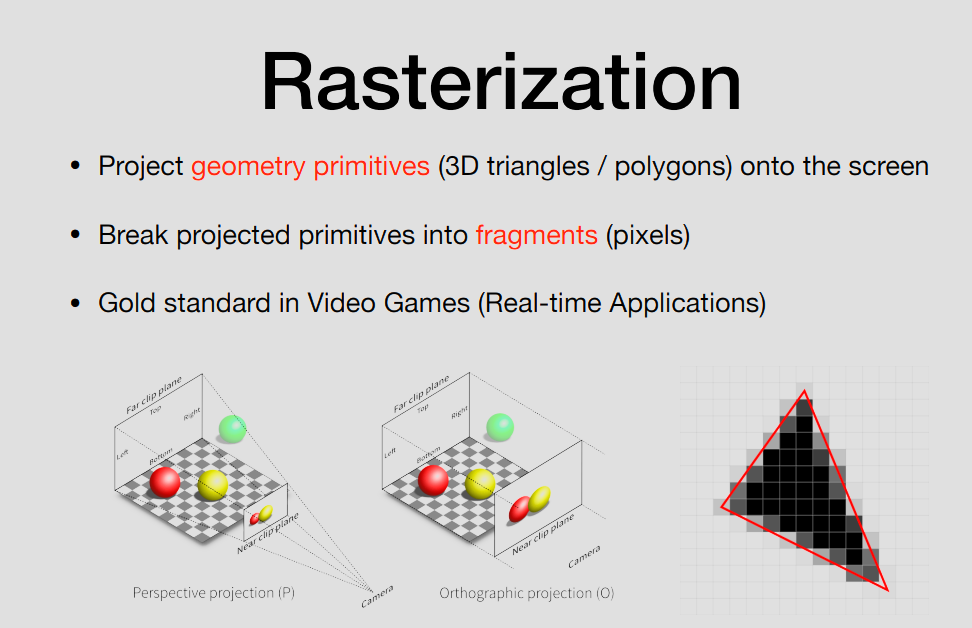
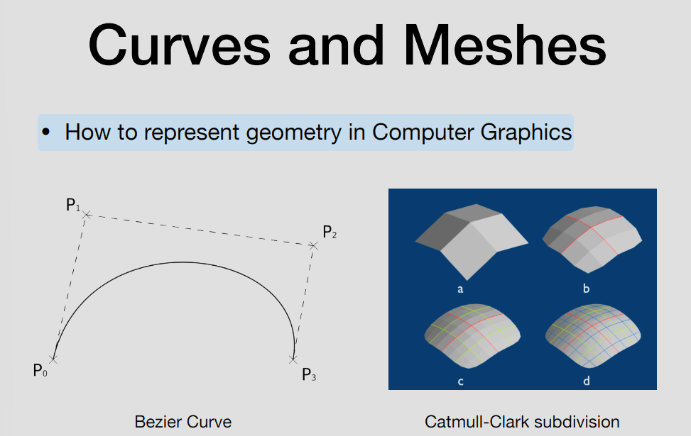
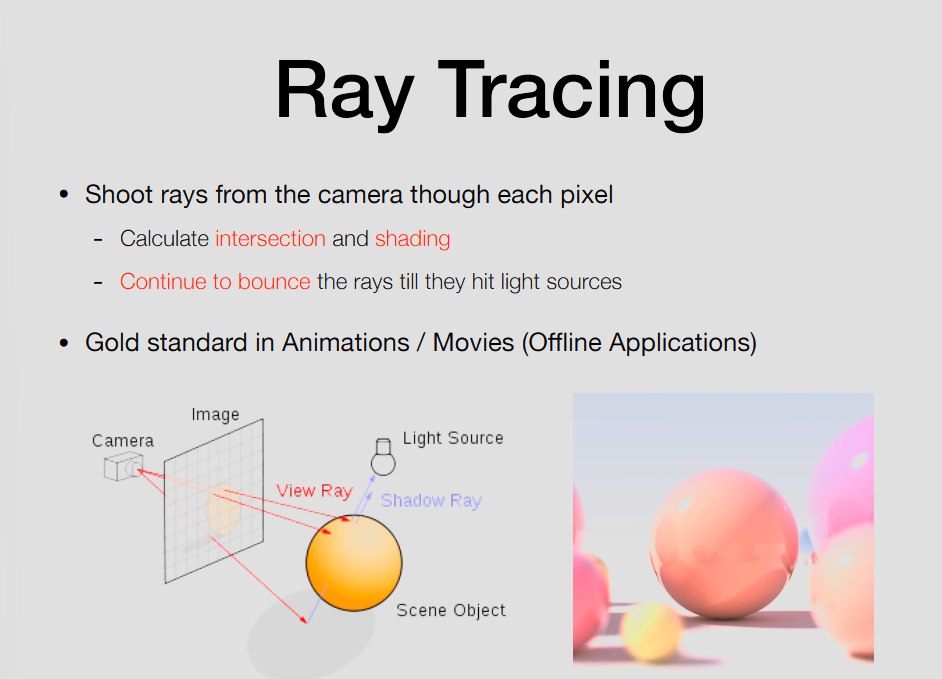
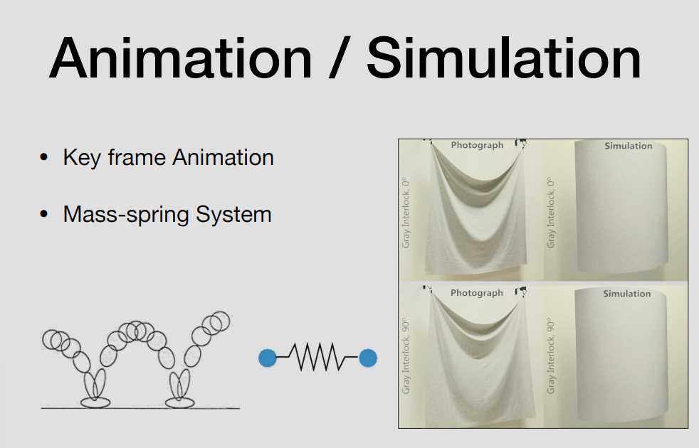

# 1 计算机图形学概述

## 课程主题
1. Rasterization 光栅化
1. Curves and Meshes 曲线和网格
1. Ray Tracing 光线追踪
1. Animation / Simulation 动画/模拟

## Rasterization 光栅化

光栅化（Rasterization）是计算机图形学中的核心概念之一，它是将三维（3D）几何图形转换为二维（2D）屏幕像素的主要算法，也是现代实时图形渲染的基石。

- 投射（Projection）：将3D空间中的几何图元（通常是三角形）通过特定的投影矩阵映射（Project）到2D屏幕上。
- 图元分解（Primitive Breakdown）：将投影到屏幕上的连续几何图形打散（Break），转化为离散的片段（Fragments，即像素）集合。
- 电子游戏（实时应用）中的黄金标准

## Curves and Meshes 曲线和网格

在计算机中如何表示曲线。

## Ray Tracing 光线追踪

从相机向每个像素发射光
- 计算交点和着色
- 继续反弹 光线直到击中光源
- 离线应用中的黄金标准

## Animation / Simulation 动画/模拟

- 关键帧动画
- 质点弹簧系统