# 向量与线性代数

## 向量

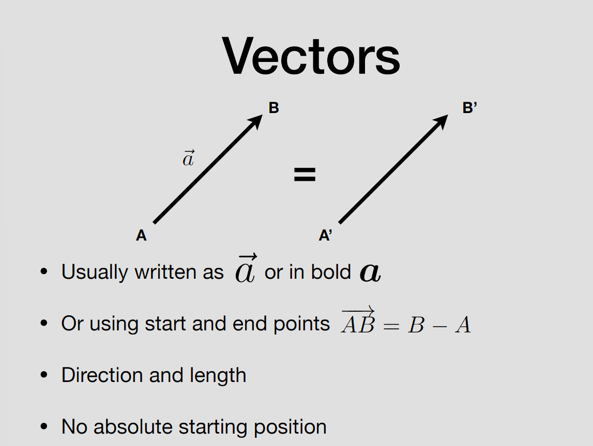

表示方向和长度，没有具体的起点。

### 向量归一化

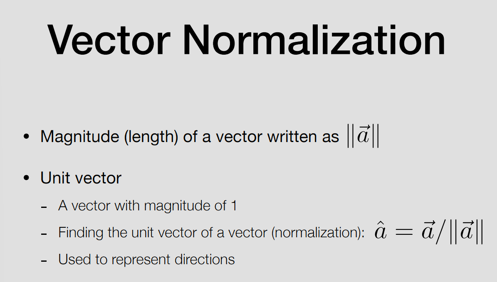

向量除自身的长度得到的新向量既是归一化后的单位向量，长度为1。

### 向量相加

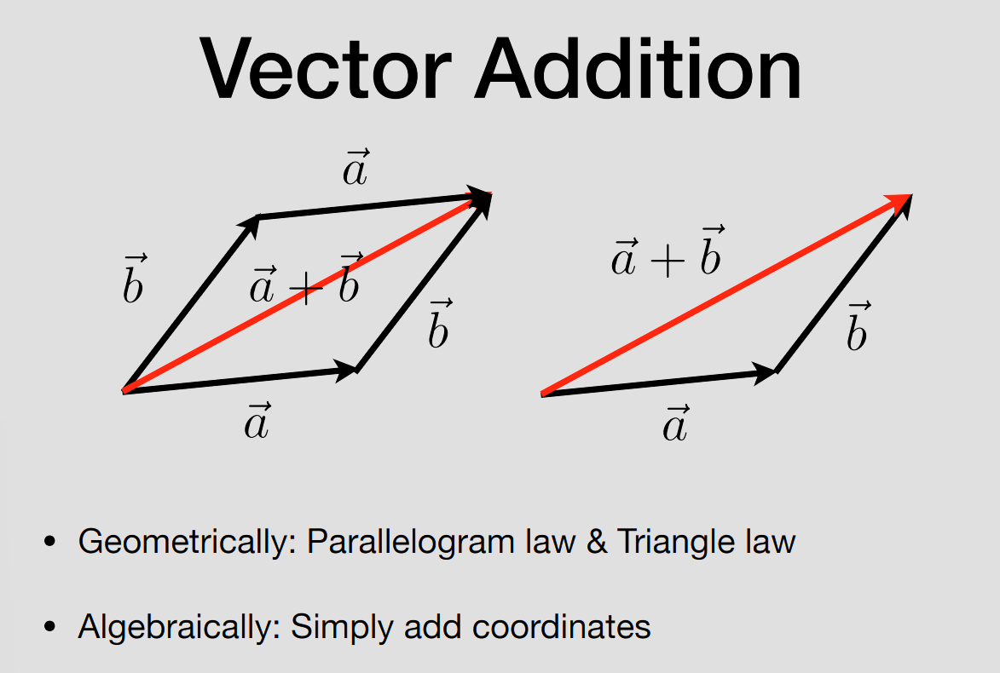

三角形法则或平行四边形法则。

### 笛卡尔坐标系（Cartesian Coordinates）

由互相垂直的坐标轴组成，通过每个轴上的数值即可确定一个点的位置。

2D：(x,y)

3D：(X,Y,Z)

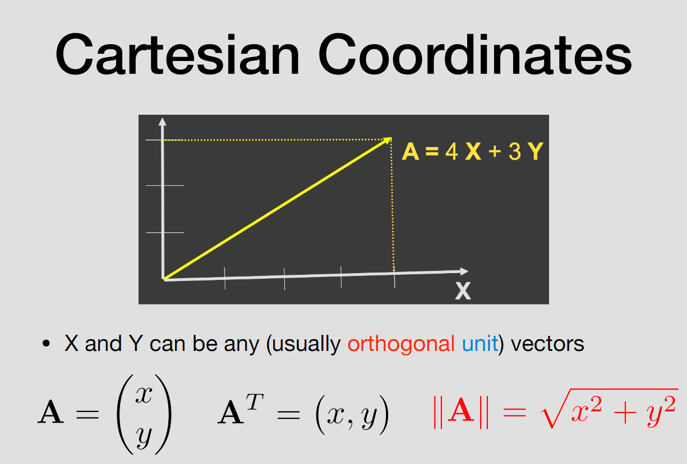

## 向量的乘法

- 点积（dot product）
- 叉积（cross product）
- 标准正交基与坐标系（orthonormal bases and coordinate frames）

### 点积

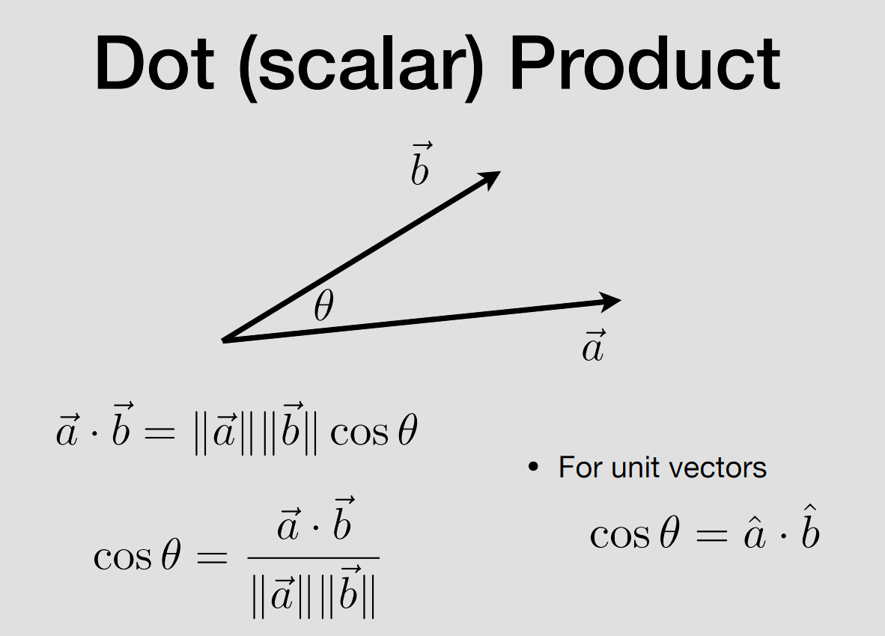

点积的值 = 向量各自的长度和向量的夹角的余弦值相乘，得到的是一个标量。

符合交换律、分配率、数乘结合律。

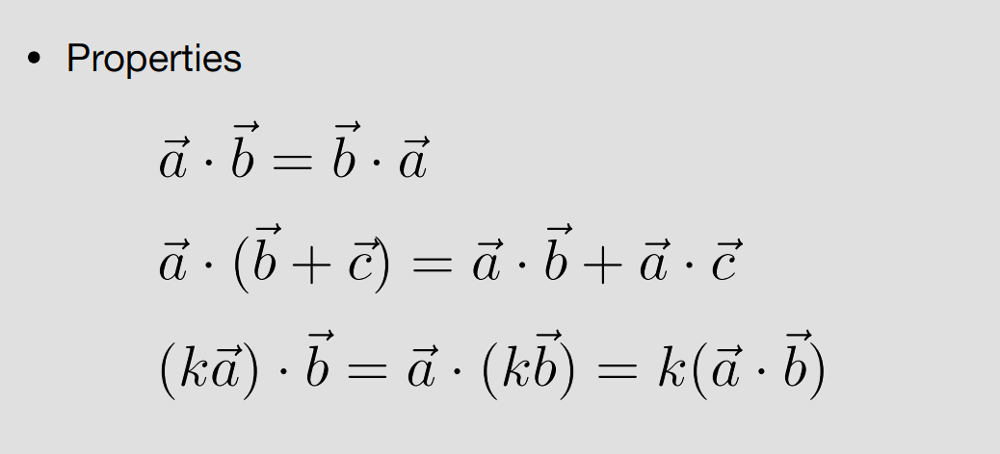

#### 笛卡尔坐标系中的计算

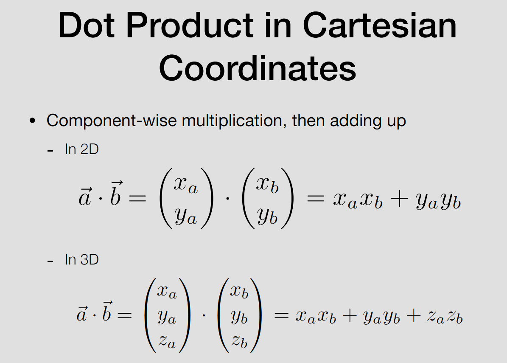

点积的值 = 不同轴上各向量的值相乘的和

#### 在图形学中的应用

- 计算向量之间的夹角
- 找到向量在另一个向量上映射

实践1：用于判断自动门的开门方向

自动门，可以根据值 OpenDirection 为 1 时朝正向开门，为 -1 时朝反向开门。

<video controls src="assets/视频-26-08-25-59-35.mp4" title="Title"></video>

- 向量a：门的正方向箭头的前向量
- 向量b：门的中心位置 - 角色的位置
- 为正则说明角色走向门和门的正向的角度小于90度，即门需要朝正向开门。

实现效果:

<video controls src="assets/视频-26-08-25-16-09.mp4" title="Title"></video>

### 叉积

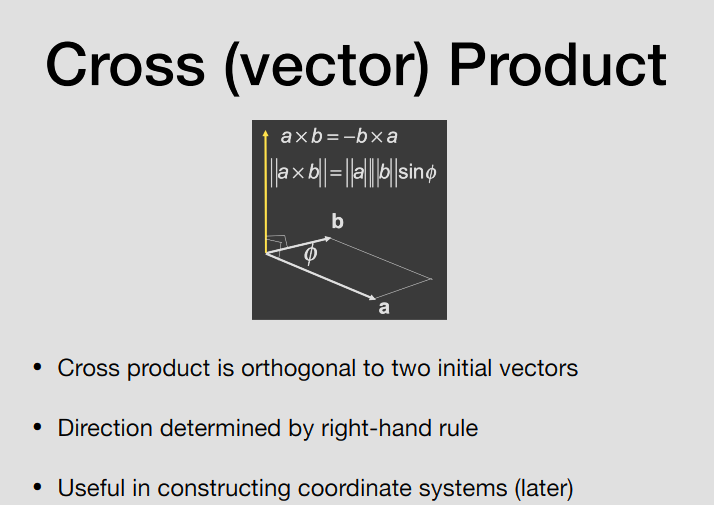

- 叉积的结果是个向量，且垂直于两个初始向量的平面
- 结果向量由右手定则决定，a x b，把b的尾部连到a的头部，四个手指的握向是a->b，则大拇指的方向为结果向量的方向。
- 通常用于构造坐标系

不符合交换律，交换位置需要加负号。

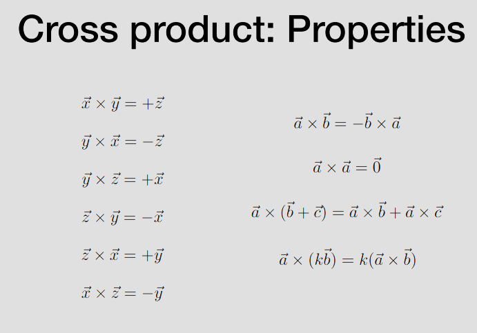

#### 计算公式
也可以将第一个向量转换为矩阵达到同样的计算结果。

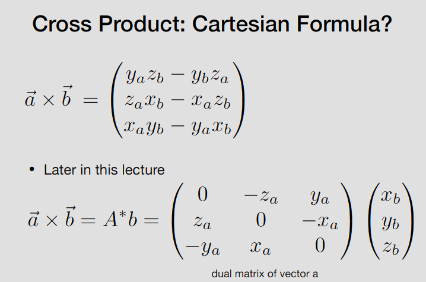

#### 用处

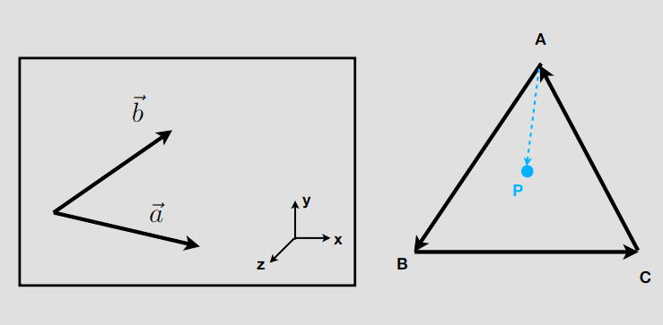

- 判断左/右

    将两个向量尾部放在一起，a往左旋转不超出180度能和b一样，则说明在左侧。

- 判断里/外
    使用 AP x AB、BP x BC 、CP x CA。如果AP、BP、CP分别在AB、BC、CA的同侧(左/右)，说明P在内侧。

