# 变换（Transformation）

## 为什么需要变换Transformation

比如动画中I的模型缩放。

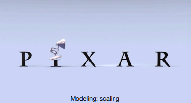

3D世界 映射到 2D屏幕

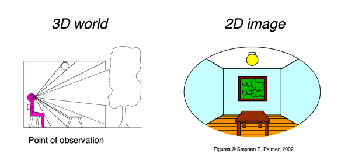

## 2D变换Transformations：旋转Rotaion、缩放Scale、剪切Shear

### 缩放

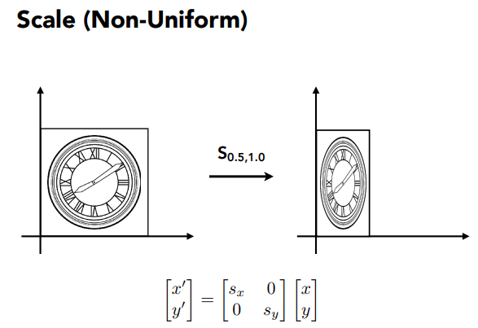

如图可知，对一个图像进行缩放，本质是对每一个点的坐标进行矩阵运算。

且对角线上对应着不同轴的缩放值，其余是0。

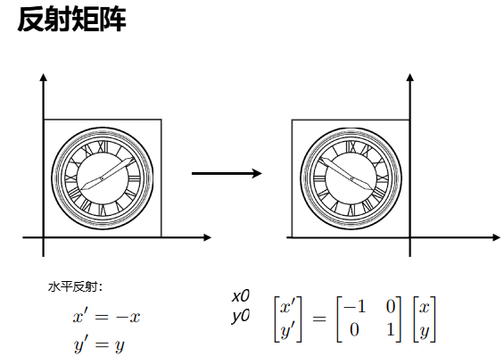

反射矩阵Reflection Matrix：反射哪个轴，该对角线所在位置为-1。

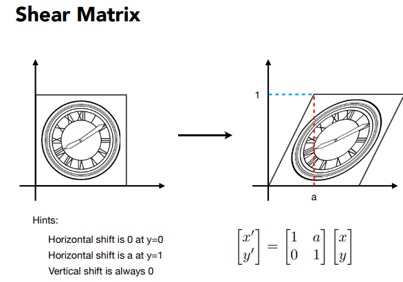

剪切矩阵Shear Matrix：可以理解为矩形，上下、左右的边永远是平行的。

如果只在一个轴（如图X轴），代入(0,0)、(a,1)，即可确定矩阵的值。

### 旋转Rotate

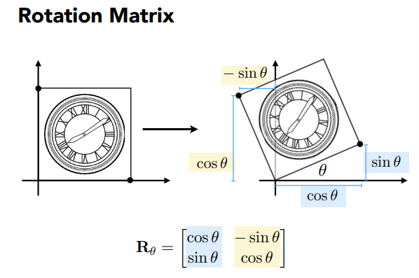

旋转默认是按原点，逆时针为正方向。通过简单代入两个点，即可得出所需的矩阵。

规律：(0,1)旋转后的点坐标(cos,sin)就是第一列的值，同理(0,1)旋转后的坐标(-sin,cos)是第二列的值。

### 线性变换

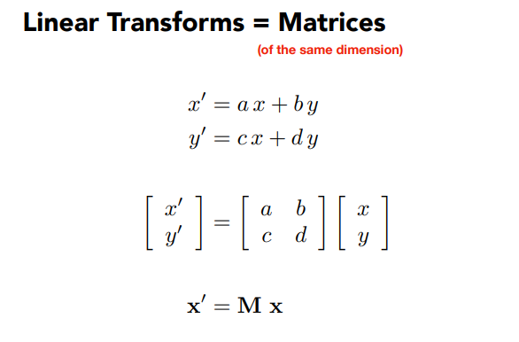

以上缩放、旋转、剪切、反射都是线性变换。即满足f(x,y)当x、y=0，结果也是0。

## 齐次坐标系Homogeneous coordinate

### 平移Translation

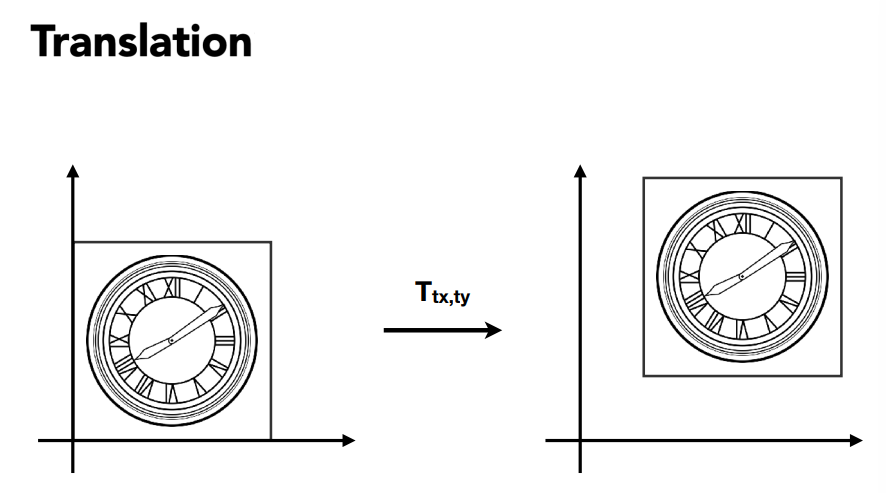

很明显，对于一个点只需分别加上平移的距离，即可得到平移后的点，但这不属于上面提到的线性变换。

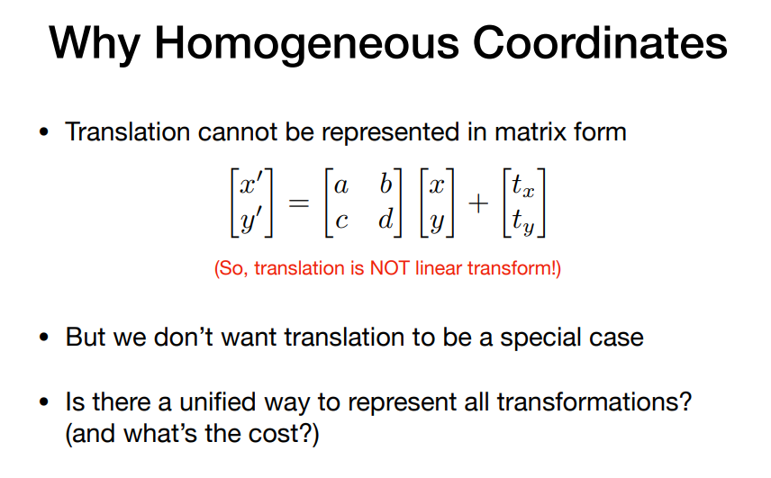

那目前来看，变换其实得表示成线性变换+平移矩阵。这是两种不同的运算和表达方式。

因此为了避免这种特殊情况，提出齐次坐标。

### 齐次坐标系Homogenous Coordinates

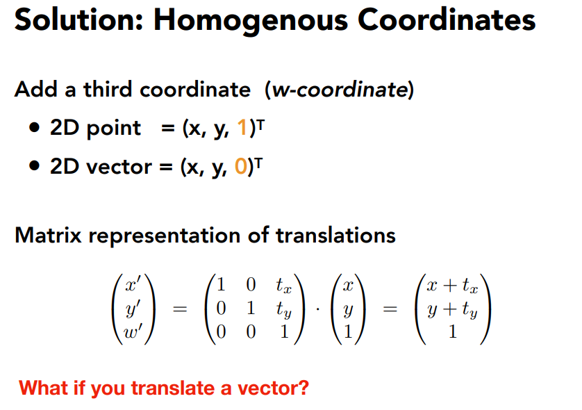

添加一维，为1表示点，为0表示向量。

再次基础上，原先的平移可以改写为矩阵相乘，平移的量在第三列，不影响原先的前两列前两行的旋转、缩放等。

变换矩阵第三行为固定的（0,0,1），确保了点在缩放、旋转、平移，第三维也永远是1。

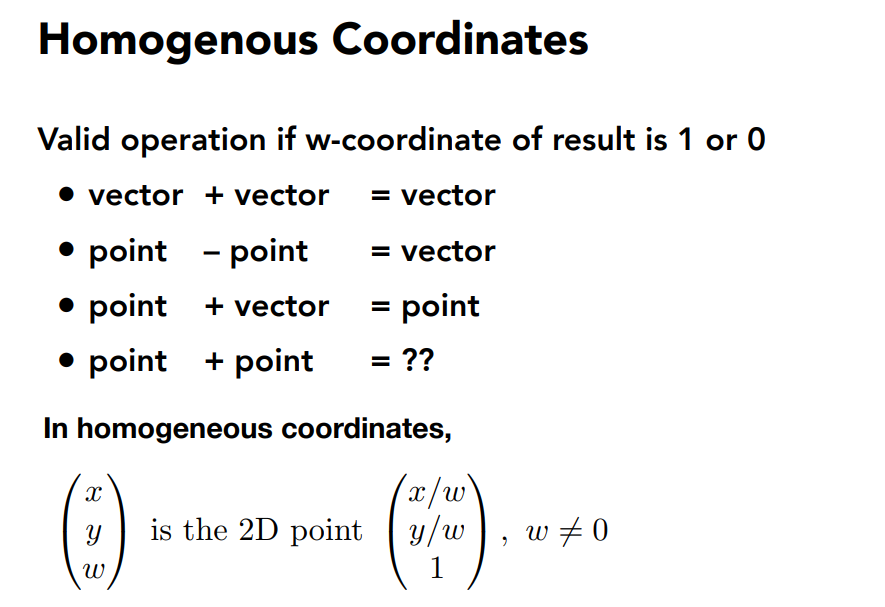

同时支持以下有效操作：
- 向量相加仍然是向量
- 两点之减是向量
- 点+向量=点
- 点+点=两点连线的中点。

### 放射变换Affine Transformations

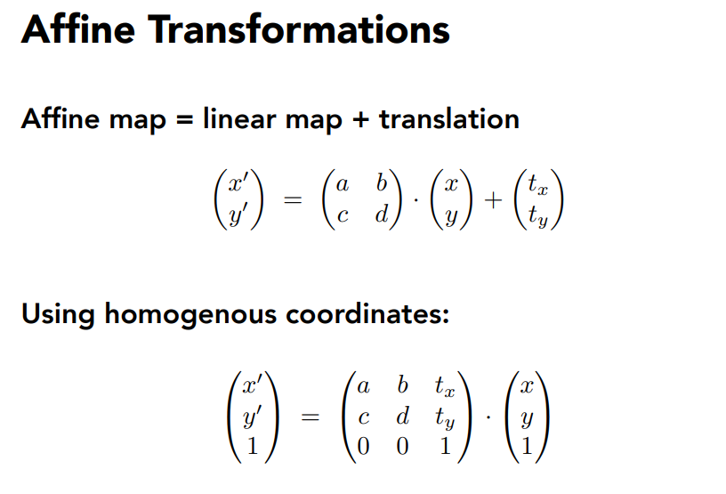

仿射变换 = 线性变换 + 平移

使用齐次坐标即可用一个矩阵来表示仿射变换

### 2D变换的规律

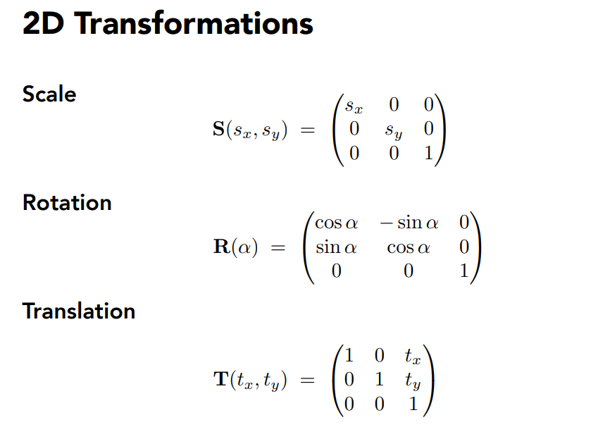

可以看到不同变换的特征很明显，很多都是固定值，不会带来多大存储开销。

### 逆变换Inverse Transform

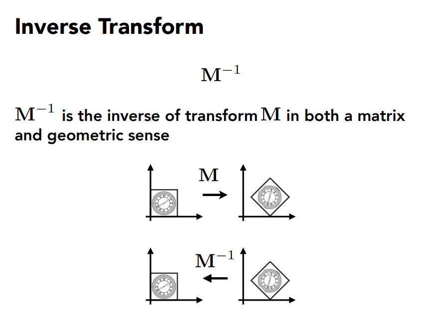

几何意义，图形经过M变换，要让他通过变换恢复原状态，再进行M的逆矩阵的变换。

## 组合变换Composing transforms

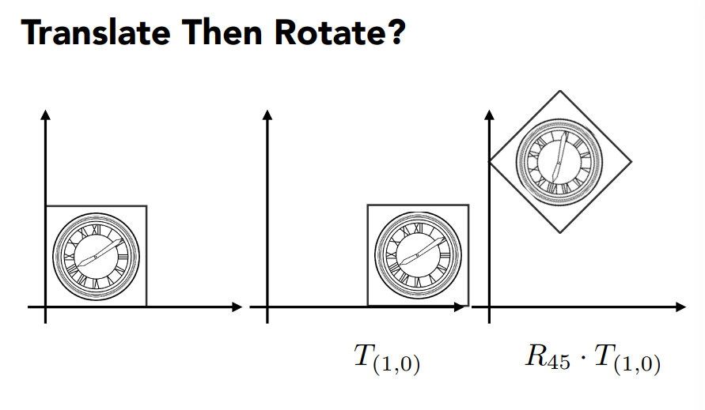

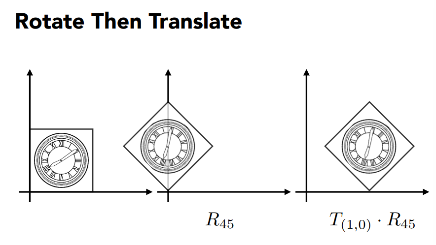

令旋转矩阵为R，平移矩阵为T，则先旋转再平移和先平移再旋转，几何意义是不同的，即最后变换的新图形是不一样的。原因主要在于旋转是将图形按原点进行的，平移前和平移后旋转是不一样的。

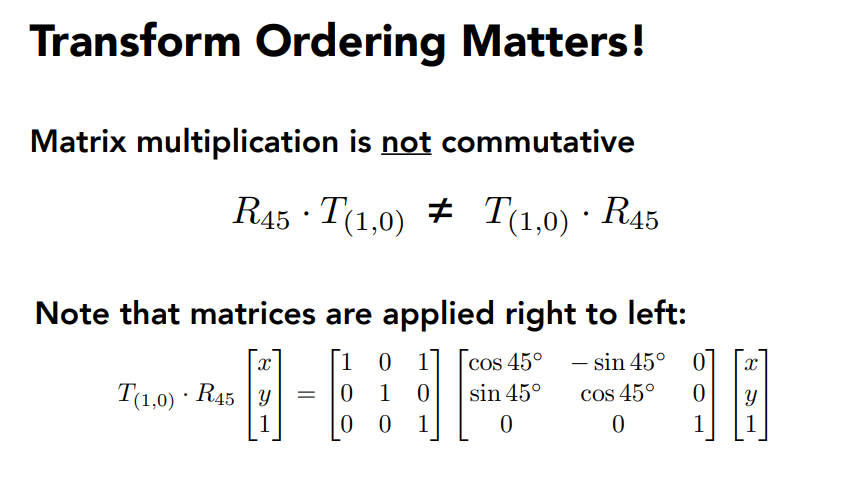

因此变换的矩阵乘法顺序是不可交换的。

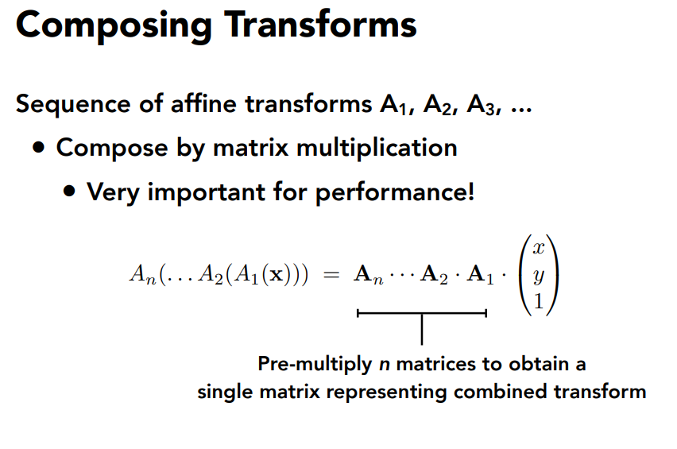

简单总结，如果做变换的顺序是从A1,A2,A3....，那最后的乘法就是 ...A3·A2·A1 (x,y,1)T

#### 分解复杂变换

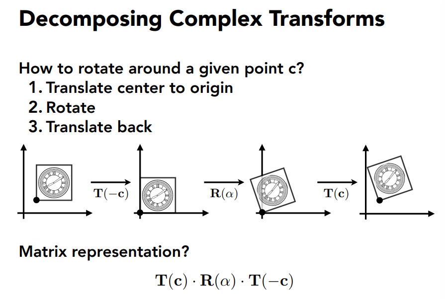

让图形按指定中点C来进行旋转。
1. 将点和图形看成整体，进行平移操作，将指定中点C移到原点上。
1. 旋转，因为指定中点C与原点重合，即旋转是以C进行旋转的。
1. 第一步的逆变换，将其平移回去。

## 3D变换Transformations

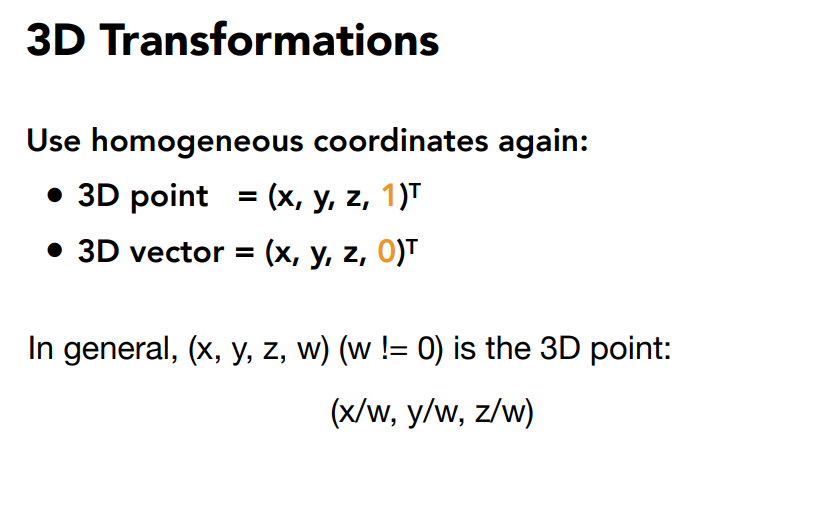

3D变换也可以使用齐次坐标系，增加一维，0表示向量，1表示点。

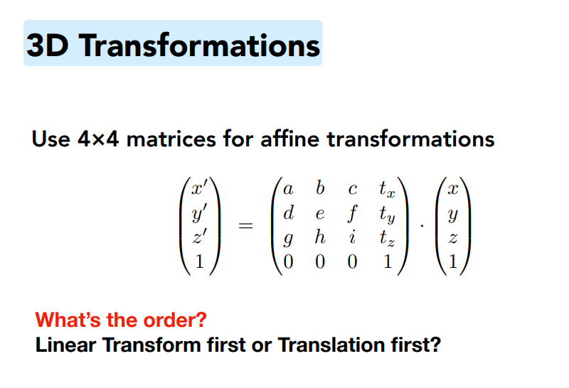

仿射变换矩阵也有类似的特点。
