# 基础课

## 材质
1. 后缀(A)ORM，利用RGB通道来存储相关数据,下面是常规对应关系
    - R: AO-环境光遮蔽
    - G: Roughness-粗糙度
    - B: Metallic-金属度
    
2. UE中使用的材质节点界面

3. 材质实例  
对于材质，可以将某些节点参数化，该参数可能是会改变的值。但材质的参数更改会导致重新编译。而材质实例则是对材质的一种引用，不会重新编译。下图为材质实例，材质中的高光度被参数化
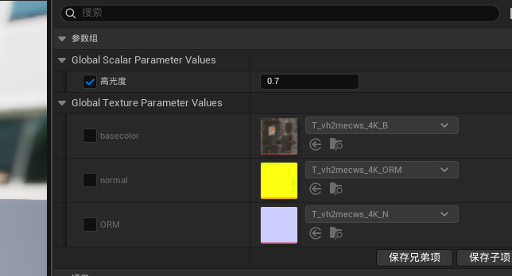  
下图为材质的参数分组，排序优先级，越小越靠前

4. 美术资产
在移动时，会在源目录下创建一个重定向器，在过滤器选择重定向器可以查看，右键源资产目录，选择更新重定向器，此时正在移动资产了。

5. 地形材质混合  
    - 创建一个材质，最终实现如下  
      
      
    - 先分别将不同的材质的纹理、法线、高度图导入，通过setMaterialAttribute来设置相关参数
    - 再新建一个Landscape Layer Blender节点,  
    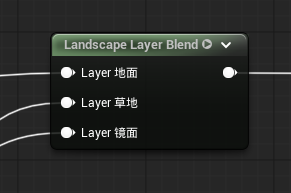  
    在该节点新建图层,索引越小,优先级越高  
    
    - 新建材质实例，将材质实例设置为地形的地形材质  
    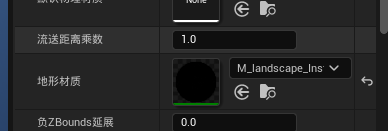
    - 左上角选择地形模式，并点击绘制，点击从指定材质创建层  
    
    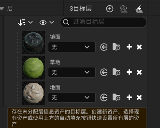
    - 右键材质，可选择一个作为最底层的材质，由于优先级，所以一般最大索引作为最底层
    - shift+左键为擦除
    - 权值混合和透明混合的区别，后者将图层分为三层（当前示例）来绘制，并根据优先级显示。前者则是一层，根据绘制顺序来显示。

## 光照
1. 快速添加*定向光源*、*天空*和*体积云*：左上角的快速添加
1. *后期处理体积*中设置曝光，在Exposure中设置，开启*计量模式*(设置为手动)、和*曝光补偿*,可开启*无限范围*
1. 只定向光源下（无lumen即全局光照即间接光照），物体的背光面和影子是纯黑色,地面也是纯黑色  
    
1. 添加天空光照，此时物体被光面的颜色是天空给予的  
      
    修改天空颜色的效果  
    
    开启lumen的效果，背面含有地面的颜色
    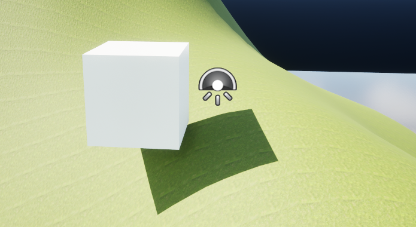
    没有lumen实现lumen的方法：将天空光照的较低半球的颜色设置为大地颜色 
    
    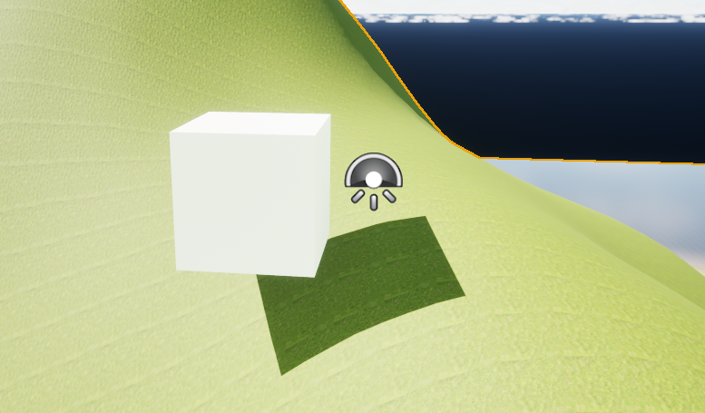
    lumen的好处，可以实时捕获场景中的镜像，不用手动设置
    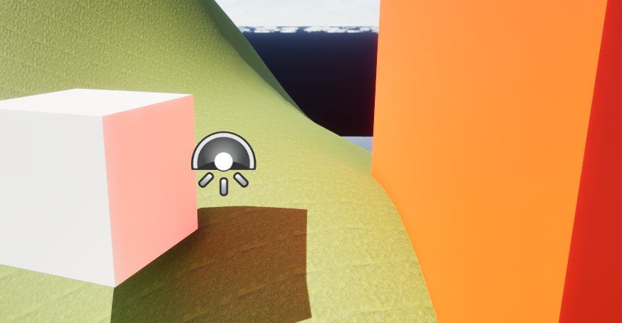
1. 调整太阳光：关注一下属性  
    
1. 体积云（打开材质实例）  
    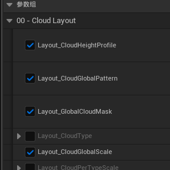  
    调整云的大小：
    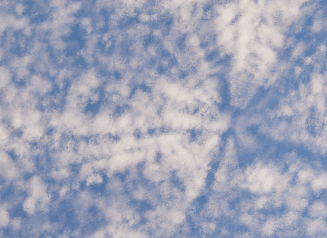
    
    调整云的数量：  
    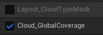  
      
    调整云的速度：    
      
    调整云的密度：    
    

## 植被系统
1. 创建静态网格体植物
    - 右键植被=>创建静态网格体植物
    - 选择一个静态网格体
    - 左上角进入植被模式后，可将刚才的静态网格体添加到植被中  
    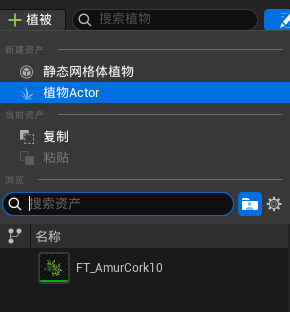  
    或者将静态网格体直接拖入上面的地方，会自动创建静态网格体植物
2. 绘制静态网格体植物时的常见参数  
    - 勾选左上角为选中  
      
    - 高级中的计算世界位置偏移：树叶不会随风移动，减少性能开支  
    - 绘制时参数     
      
    密度、半径、缩放X、Z偏移、对齐到法线、对齐到最大角度、随机Yaw
    - 单个时参数  
    单实例重载半径：选择的范围内只创建一个实例，已有则不会绘制  
    地面斜面角度：斜坡角度过大则不会生成
    - 调整单个静态网格体植物的参数只对自己起作用，可以右键拷贝部分属性，用于快捷拷贝到其他植物
    - 单个模式：不要勾选多个静态网格体植物，否则会将多个植物重叠生成在一起   
    循环选中项：循环添加单个植物
      
3. 抹除
    - 只抹除勾选的植物
    - shift+左键为擦除
4. 植物剔除
    - 选中植物（shift+左键连选 ）   
    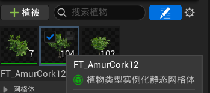
    - 找到剔除距离  
      
    - 最大距离设置为1500，虚幻100单位是1米。此效果比较突兀  
    
    - 实现淡出的效果  
    找到植物的静态网格体，进入界面快速定位树叶和树枝的材质  
    
    在各自的材质实例中，勾选 UseSolftCulling使用软剔除    
    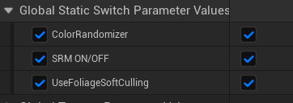
    结合最小剔除距离的设置，实现淡入淡出的效果  
    
    上述是在材质实例节点初实现了相关功能的结果  

    - 在材质实例节点中实现    
    最终实现的逻辑如下：  
    在材质节点的层级处  
      
      
    - 函数相关的介绍  
        - `PerInstanceFadeAmount` 
        表达式根据应用于实例化静态网格体（例如树叶）的剔除距离，输出一个介于 0 到 1 之间的浮点值。该值是常量，但对于网格体的每个实例，其数值可以不同。该节点通常用于使树叶逐渐淡入淡出，而不是在达到 ` InstancedFoliageActor` 的剔除距离时，树叶突然出现在场景中或消失。  
        将`PerInstanceFadeAmount`的输出取反，输出到材质的基础颜色。颜色越白说明PIFA函数越接近1，距离越远。颜色为1是指三原色的和，所以为白光。
        - 裁剪展示
        这里使用1-x的原因是，当前只改变叶子的颜色，不使用时叶子为白色，但树枝是黑色，会影响展示。
        
        下面图片可以看出，超过最大剔除距离的为白色，剔除距离之间的为灰色，剔除距离以下的为黑色。因此可以考虑将灰色部分进行透明度调整，而不是直接将灰色部分设为透明。
        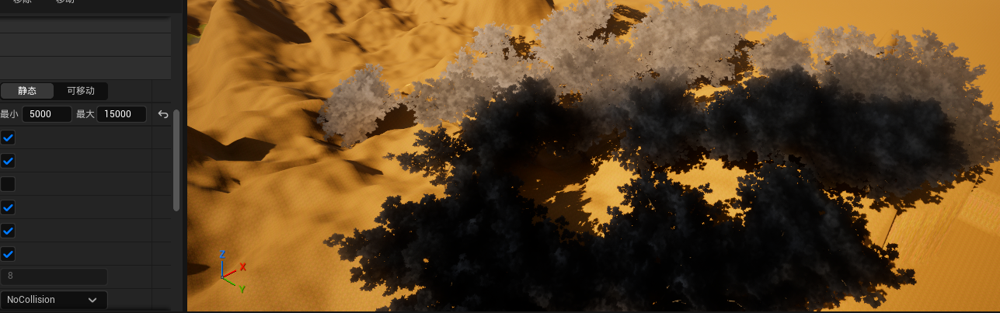 
        - 材质结果节点的输入参数显示
        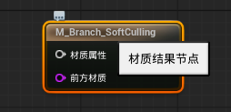
        取消勾选显示材质属性
        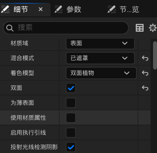
        结果
        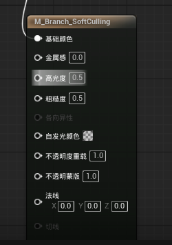
        - 材质结果节点的不透明蒙版
        不透明蒙版只有两种值：透明和不透明，当给的值超过剪切值时视为1，否则视为0。对于某一个像素，不透明蒙版值>=剪切值，保留像素。勾选颤动不透明蒙版效果更好。
        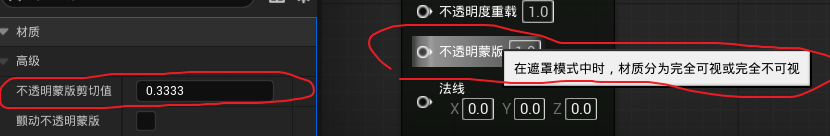
        - 材质的不透明遮罩
        
        应该将具体的叶子部分（即白色部分）与PIFA函数进行透明度调整，直接将整个矩形会造成如下结果：叶子旁边本应该是透明的被设置成为了不透明的颜色。
        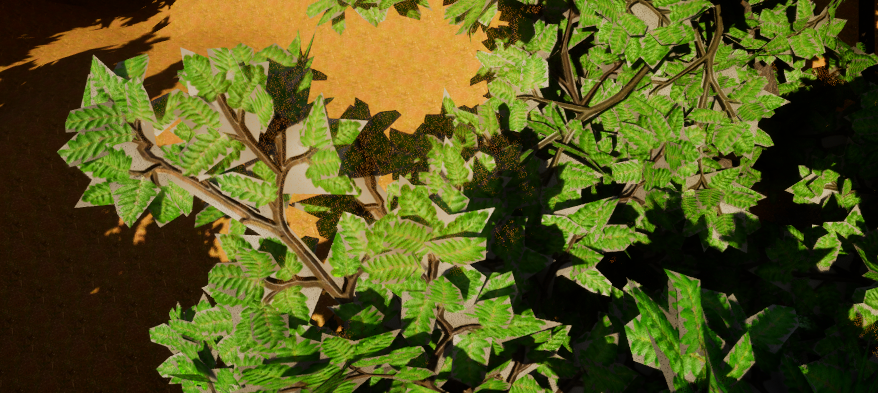
        - `StaticSwitchParameter   静态开关参数`函数
        将该值设置为参数，实例化后的材质实例可以选择是否开启软剔除。
        
        接受两个输入，参数为True时输出连接True的输入，否则输出连接False的输入。
        这是一个静态方法，在运行时无法改变。将材质实例化为材质实例后，只能在材质实例处修改，以此来开启和关闭使用使用FoliageSoftCulling植被软剔除。
        - `DitherTemporalAA` 
        抖动函数，让值变化。
    - 不剔除 `->` 硬剔除 `->` 软剔除
        1. 不使用软剔除时，是直接将下面的值(A通道)传给不透明蒙版。白色(叶子)部位像素的不透明蒙版值为1，大于不透明蒙版剪切值(0.3333默认),所以叶子保留像素；而黑色部位不透明蒙版值为0，小于剪切值，此部分为透明。
        
        1. 不设置剔除距离时效果，任何距离植被不会被剔除。
        <video controls src="assets/video_2026-03-31_04-01-17-1.webm" title="Title"></video>
        1. 设置剔除距离，当植被超出剔除距离时，直接剔除，比较突兀。
        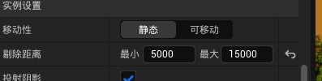
        <video controls src="assets/video_2026-03-31_04-05-44.webm" title="Title"></video>
        1. 使用软剔除：在设置不透明蒙版时，将最小和最大剔除距离之间的像素进行值的抖动，实现淡入淡出的效果。注意的是通过 `PerInstanceFadeAmount`函数获取的值需要与A通道进行乘法运算，以确保非叶子部分的值永远为0，不会让非叶子部分显示。
        
    - 为树干实现软剔除，因为树干不需要镂空，所以不使用软剔除时的默认值为1即可。
    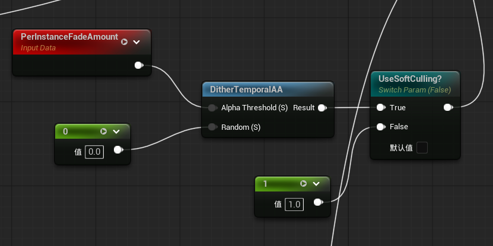
