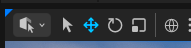

# 快捷操作

### 书签功能
通过在场景中设置书签，可以快速访问设置的位置。 
```
设置：Ctrl+左侧数字键  
使用：左侧数字键
```
### 视口移动
```
鼠标右键按住  + 
- WASDEQ(移动) 
- 鼠标滚轮(调节移动速度)
```
### 内容侧滑菜单
```
Ctrl + 空格
```

### 默认地图
```
项目设置 => 地图和模式，设置编辑器和游戏的默认打开地图
```
### 物体相关操作  

1. #### 聚焦选中物体
```
F键
```
2. #### 选择|平移|旋转|缩放
  

```
Q W E R
```


3. #### 观察物体
使用前先F聚焦选中物体
```
按住Alt
- 鼠标左键(环绕)
- 鼠标右键(距离)
- 鼠标中键(当前面移动)
```
4. #### 对齐地面
```
End键
```

5. #### 移动并保持物体在视口的相对位置不变

```
按住shift + 移动操作
```
6. #### 操作并复制物体

```
按住Alt
```

7. #### 快速查询物体的内容位置
```
Ctrl + B
```

## 材质节点界面
1. #### 创建TextureSample节点
```
按住T + 左键单击
```

2. #### 创建已有资产的节点

```
将资产直接拖入
```

3. #### 去掉已连接的节点
```
按住Alt + 左键单击连接线
```

## 地形模式
1. #### 绘制
擦除已绘制的区域
```
按住Shift + 左键单击 
```